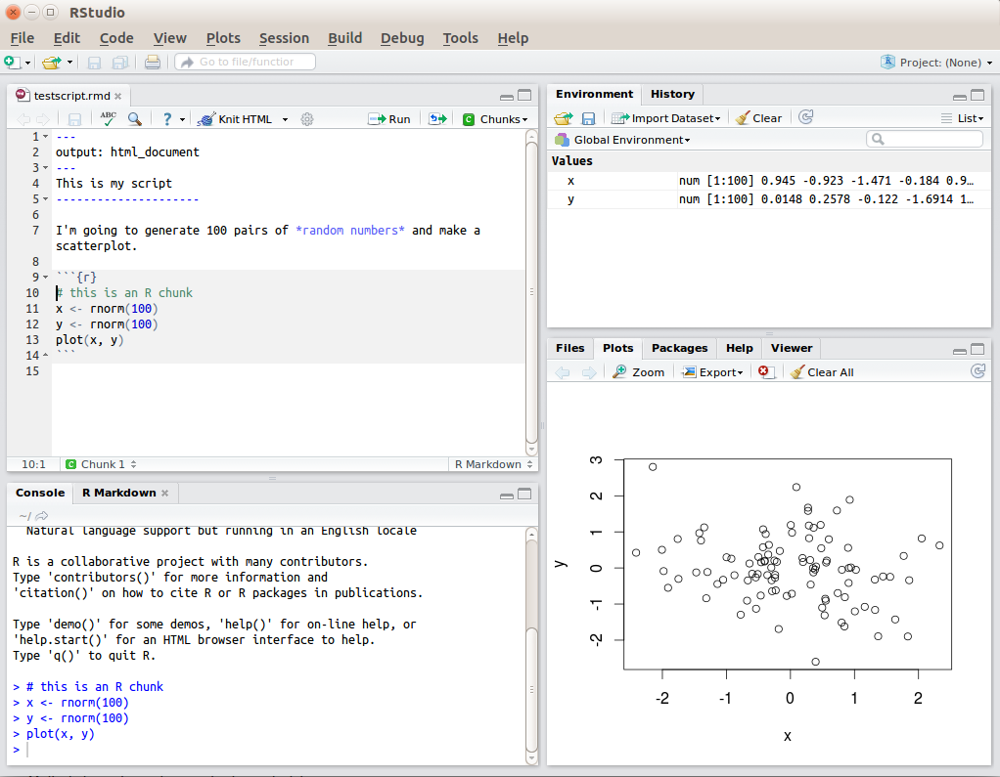
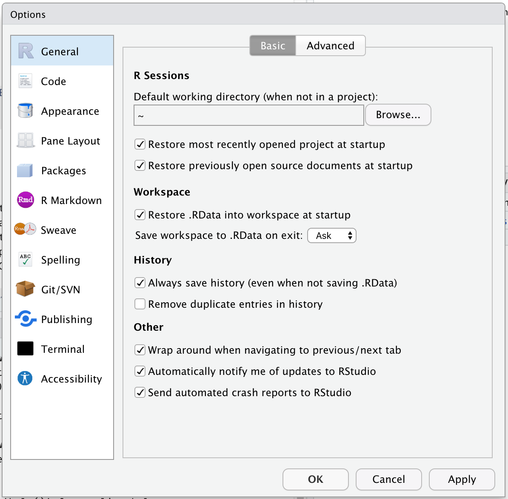
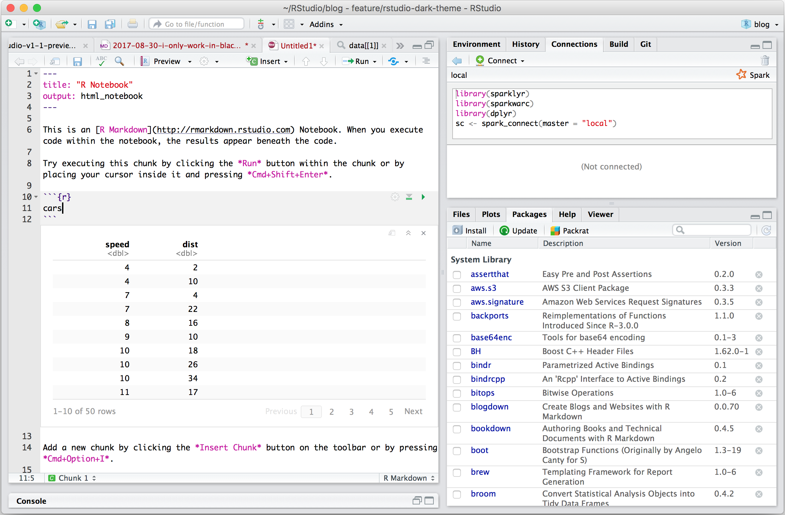
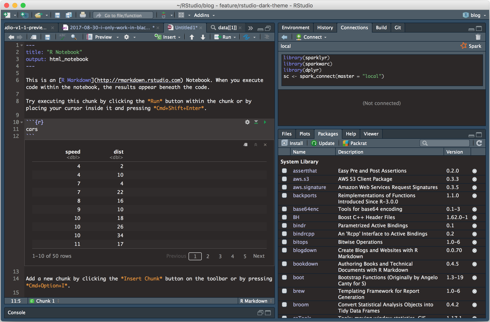
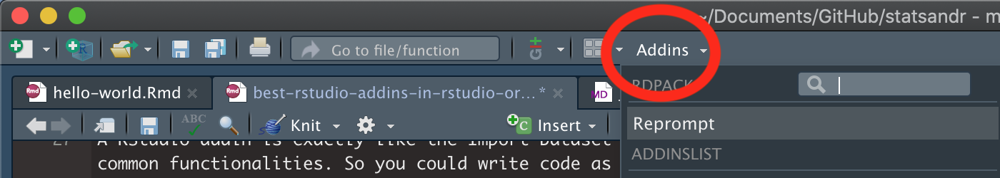
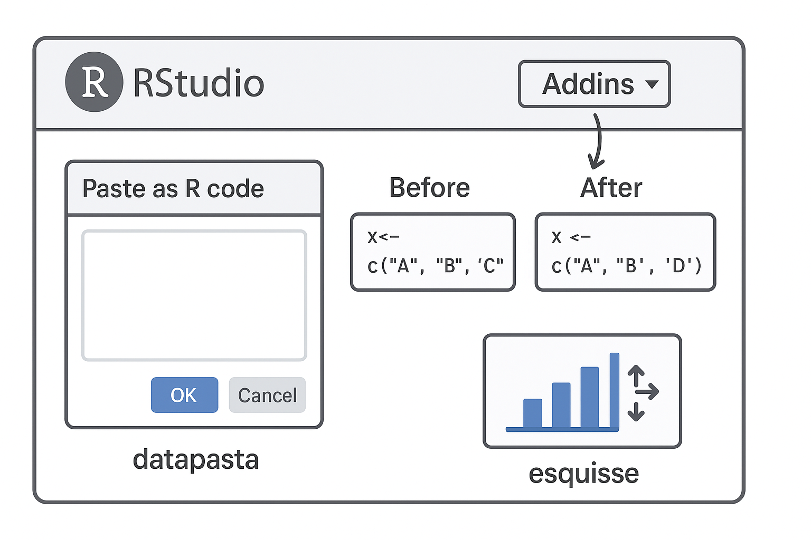

#  R Studio Basics {#sec-basicstudio}

```{r, include = FALSE}
source("R/booktem_setup.R")
source("R/my_setup.R")
library(tidyverse)
library(here)
```

-   R is the name of the programming language we will learn on this course.

-   RStudio is a convenient interface which we will be using throughout the course in order to learn how to organise data, produce accurate data analyses & data visualisations.

R is a programming language that you will write code in, and RStudio is an Integrated Development Environment (IDE) which makes working with R easier. Think of it as knowing English and using a plain text editor like NotePad to write a book versus using a word processor like Microsoft Word. You could do it, but it wouldn't look as good and it would be much harder without things like spell-checking and formatting. In a similar way, you can use R without R Studio but we wouldn't recommend it. The key thing to remember is that although you will do all of your work using RStudio for this course, you are actually using **two** pieces of software which means that from time-to-time, both of them may have separate updates.


## Getting to know RStudio

R Studio has a console that you can try out code in (appearing as the bottom left window), there is a script editor (top left), a window showing functions and objects you have created in the "Environment" tab (top right window in the figure), and a window that shows plots, files packages, and help documentation (bottom right).

```{r img-rstudio, echo=FALSE, fig.cap="RStudio interface"}



```

You will learn more about how to use the features included in R Studio throughout this course, however, I highly recommend watching [RStudio Essentials 1](https://rstudio.com/resources/webinars/programming-part-1-writing-code-in-rstudio/) at some point. 

The video lasts \~30 minutes and gives a tour of the main parts of R Studio.

### Source and Console

* The **Source** window is the place to enter and run code so that it is easily edited and saved for future use. Often this is a .R script and it is shown at the top left in RStudio. If this window is not shown, it will be visible *if* you open a previously saved R script, *or* if you create a new R Script. You create new R Script by clicking on File > New File > R Script in the RStudio menu bar.

* To execute your code in the R script, you can either highlight the code and click on Run, or you can highlight the code and press CTRL + Enter on your keyboard.

* The **Console**: you can enter code directly in the Console Window and click Enter. The commands that you run will be shown in the History Window on the top right of RStudio. Though it is much more difficult to keep track of your work this way.

### Environments

The **Environment** tab (top right) allows you to see what objects are in the workspace. If you create variables or data frames, you have a visual listing of everything in the current workspace. When you start a new project this should be completely empty.

### Outputs: Plots,Files, Packages, Help

1. **Plots** - The Plots panel, shows all your plots. There are buttons for opening the plot in a separate window and exporting the plot as a pdf or jpeg (though you can also do this with code.)

2. **Files** - The files panel gives you access to the file directory on your hard drive. 

3. **Packages** - Shows a list of all the R packages installed on your harddrive and indicates whether or not they are currently loaded. Packages that are loaded in the current session are checked while those that are installed but not yet loaded are unchecked. We will discuss packages more later.

4. **Help** - Help menu for R functions. You can either type the name of a function in the search window, or use the code to search for a function with the name


```{r labelled, echo=FALSE, fig.cap="RStudio interface labelled"}

knitr::include_graphics("images/rstudio-panes-labeled.jpeg")

```

## Make RStudio your own

You can make RStudio your own by customising its appearance, layout, and default settings, or by structuring your projects to suit your workflow. 
Key customisations include changing themes, adjusting the pane layout, and modifying general options like workspace and history behavior.

```{r themed, echo=FALSE, fig.show = "hold"}



```

### Themes

You can [personalise the RStudio GUI](https://support.rstudio.com/hc/en-us/articles/115011846747-Using-Themes-in-the-RStudio-IDE) as much as you like. 

::: {layout-ncol=2}

```{r light, echo=FALSE, fig.cap="Classic mode"}



```

```{r dark, echo=FALSE, fig.cap="Dark mode"}



```


:::

:::{.task}
::::{.task-header}
Your turn
::::
::::{.task-container}

Set your Rstudio theme to something that works for you: 

* [ ] Go to Tools > Select Global Options > Appearance > Editor Theme

::::
:::

### Add-ins

**RStudio Add-ins** are extensions that provide extra functionality directly within RStudio. They allow you to perform tasks more efficiently via a user-friendly interface, without writing repetitive code. Add-ins can help with data manipulation, styling code, visual exploration, and much more.

Add-ins are installed like any other R package 

```{r add, echo=FALSE, fig.cap="Add-ins toolbar"}



```


```{r, eval = FALSE}
# Install from CRAN
install.packages("datapasta")
install.packages("styler")
install.packages("esquisse")
install.packages("ggthemeassist")

```

> After installing, the add-ins become available in RStudio under Addins → Browse Addins. You can then select the tool you want to use, and a small GUI will open inside RStudio.

### Overview of our three add-ins

| Add-in        | Purpose                                                                             | How it Helps                                                             |
| ------------- | ----------------------------------------------------------------------------------- | ------------------------------------------------------------------------ |
| **datapasta** | Quickly copy and paste data from spreadsheets, tables, or CSV files into R as code. | Saves time converting tables into R-friendly formats.                    |
| **styler**    | Automatically formats your R code according to a consistent style guide.            | Makes code clean and readable, following tidyverse style.                |
| **esquisse**  | Provides a drag-and-drop interface for creating ggplot2 plots.                      | Enables interactive visualization without writing complex plotting code. |
|

```{r overview, echo=FALSE, fig.alt="Add-in outline"}



```

## Get Help!


<!-- There are a lot of sources of information about using R out there. Here are a few helpful places to get help when you have an issue, or just to learn more -->

-   The R help system itself - type `help()`, or `??functionname` and put the name of the package or function you are querying inside the brackets

-   Vignettes - type `browseVignettes()` into the console and hit Enter, a list of available vignettes for all the packages we have will be displayed

-   Cheat Sheets - available at [RStudio.com.](https://www.rstudio.com/resources/cheatsheets/) Most common packages have an associate cheat sheet covering the basics of how to use them. Download/bookmark ones we will use commonly such as ggplot2, data transformation with dplyr, Data tidying with tidyr & Data import.

-   Google - I use Google constantly, because I continually forget how to do even basic tasks. If I want to remind myself how to round a number, I might type something like R round number - if I am using a particular package I should include that in the search term as well

- AI assistance - Check your companies AI policy and make sure you are working within policy for sharing of information.

-   Ask for help - If you are stuck, getting an error message, can't think what to do next, then ask someone. It could be me, it could be a classmate. When you do this it is very important that you show the code, include the error message. "This doesn't work" is not helpful. "Here is my code, this is the data I am using, I want it to do X, and here's the problem I get."


