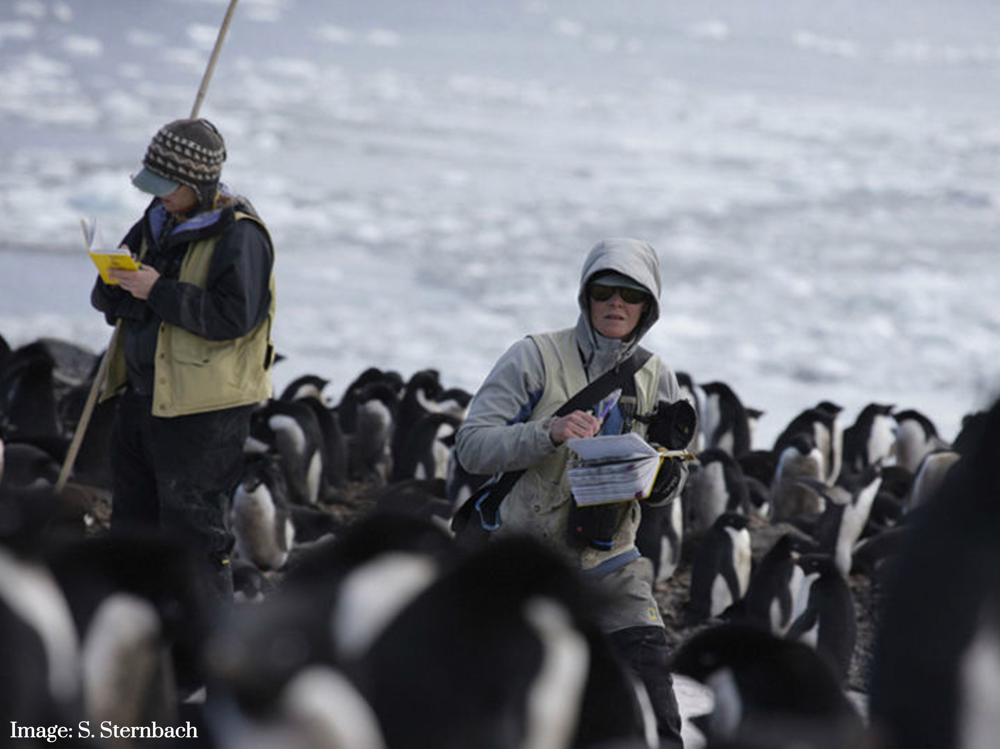
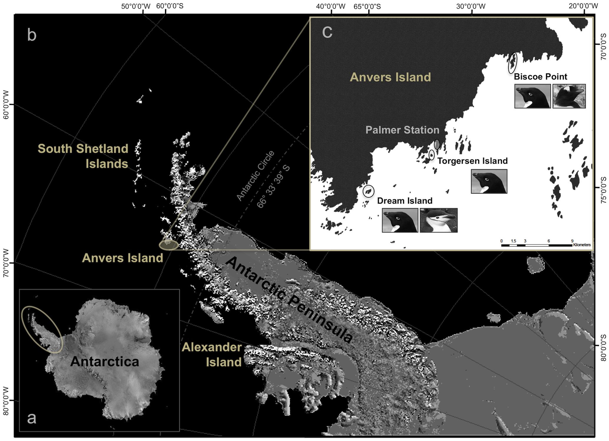

# Meet the Penguins {#sec-penguins}


```{r, include = FALSE}
source("R/booktem_setup.R")
source("R/my_setup.R")
library(tidyverse)
library(here)
penguins_raw <- read_csv(here("files", "penguins_raw.csv"))
```

In this workshop we will work through setting up a project and loading data. Once we have a curated and cleaned the dataset we can work on generating insights from the data.

As a biologist you should be used to asking questions and gathering data. It is also important that you learn all aspects of the research process. This includes responsible data management (understanding data files & spreadsheet organisation, keeping data safe) and data analysis.

In this chapter we will look at the structure of data files, and how to read these with R. We will also continue to develop reproducible scripts. This means that we are writing scripts that are well organised and easy to read, and also making sure that our scripts are complete and capable of reproducing an analysis from start to finish. 

Transparency and reproducibility are key values in scientific research, when you analyse data in a reproducible way it means that others can understand and check your work. It also means that the most important person can benefit from your work, YOU! When you return to an analysis after even a short break, you will be thanking your earlier self if you have worked in a clear and reproducible way, as you can pick up right where you left off.  


## Meet the Penguins

This data, taken from the `palmerpenguins` (@R-palmerpenguins) package was originally published by @Antarctic. In our course we will work with real data that has been shared by other researchers.

The palmer penguins data contains size measurements, clutch observations, and blood isotope ratios for three penguin species observed on three islands in the Palmer Archipelago, Antarctica over a study period of three years.

```{r, eval=TRUE, echo=FALSE, out.width="80%", fig.alt= "Photo of three penguin species, Chinstrap, Gentoo, Adelie"}
knitr::include_graphics("images/gorman-penguins.jpg")
```

These data were collected from 2007 - 2009 by Dr. Kristen Gorman with the Palmer Station Long Term Ecological Research Program, part of the US Long Term Ecological Research Network. The data were imported directly from the Environmental Data Initiative (EDI) Data Portal, and are available for use by CC0 license (“No Rights Reserved”) in accordance with the Palmer Station Data Policy. We gratefully acknowledge Palmer Station LTER and the US LTER Network. Special thanks to Marty Downs (Director, LTER Network Office) for help regarding the data license & use. Here is our intrepid package co-author, Dr. Gorman, in action collecting some penguin data:

```{r, eval=TRUE, echo=FALSE, out.width="80%", fig.alt= "Photo of Dr Gorman in the middle of a flock of penguins"}

```

Here is a map of the study site

```{r, eval=TRUE, echo=FALSE, out.width="80%", fig.alt= "Antarctic Peninsula and the Palmer Field Station"}

```

## Activity 1: Organising our workspace

Before we can begin working with the data, we need to do some set-up. 

* Go to RStudio Cloud and open the `Penguins` R project

* Create the following folders using the + New Folder button in the Files tab

  * data
  * outputs
  * scripts
  

```{block, type = "warning"}
R is case-sensitive so type everything EXACTLY as printed here
```


```{r, eval = F}

dir.create("data",
           showWarnings = FALSE)

dir.create("outputs",
           showWarnings = FALSE)

dir.create("scripts",
           showWarnings = FALSE)

# or this can be run using apply
lapply(c("data", "outputs", "scripts"), function(dir_name) {
  dir.create(dir_name, showWarnings = FALSE)
})


```

Having these separate subfolders within our project helps keep things tidy, means it's harder to lose things, and lets you easily tell R exactly where to go to retrieve data.  

The next step of our workflow is to have a well organised project space. RStudio Cloud does a lot of the hard work for you, each new data project can be set up with its own Project space. 

We will define a project as a series of linked questions that uses one (or sometimes several) datasets. For example a coursework assignment for a particular module would be its own project, a series of linked experiments or particular research project might be its own project.

A Project will contain several files, possibly organised into sub-folders containing data, R scripts and final outputs. You might want to keep any information (wider reading) you have gathered that is relevant to your project.

```{r, eval=TRUE, echo=FALSE, out.width="80%", fig.cap = "An example of a typical R project set-up"}
knitr::include_graphics("images/project.png")
```

Within this project you will notice there is already one file *.Rproj*. This is an R project file, this is a very useful feature, it interacts with R to tell it you are working in a very specific place on the computer (in this case the cloud server we have dialed into). It means R will automatically treat the location of your project file as the 'working directory' and makes importing and exporting easier. More on projects can be found in the [R4DS](https://r4ds.had.co.nz/workflow-projects.html) book. 

```{block, type = "warning"}
It is very important to NEVER to move the .Rproj file, this may prevent your workspace from opening properly. 
```

## Activity 2: Access our data

Now that we have a project workspace, we are ready to import some data.

* Use the link below to open a page in your browser with the data open

* Right-click Save As to download in csv format to your computer (Make a note of **where** the file is being downloaded to e.g. Downloads)


```{r, eval = TRUE, echo = FALSE}
downloadthis::download_link(
  link = "https://raw.githubusercontent.com/UEABIO/data-sci-v1/main/book/files/penguins_raw.csv",
  button_label = "Download penguin data as csv",
  button_type = "success",
  has_icon = TRUE,
  icon = "fa fa-save",
  self_contained = FALSE
)
```


```{r, eval=TRUE, echo=FALSE, out.width="80%", fig.alt= "excel view, csv view", fig.cap = "Top image: Penguins data viewed in Excel, Bottom image: Penguins data in native csv format"}
knitr::include_graphics("images/excel_csv.png")
```

In raw format, each line of a CSV is separated by commas for different values. When you open this in a spreadsheet program like Excel it automatically converts those comma-separated values into tables and columns. 


## Activity 3: Upload our data

* The data is now in your Downloads folder on your computer

* If using Posit Cloud you need to upload the data to our remote cloud-server (Posit Cloud), select the upload files to server button in the Files tab

* If using RStudio on your computer - make sure the file is in the data folder of your project

* Put your file into the data folder - if you make a mistake select the tickbox for your file, go to the cogs button and choose the option Move.

```{r, eval=TRUE, echo=FALSE, out.width="80%", fig.alt= "File tab", fig.cap = "Highlighted the buttons to upload files, and more options"}
knitr::include_graphics("images/upload.png")
```


### Read data from a url

It is also possible to use a url as a filepath

```{r, eval = F}
url <- "https://raw.githubusercontent.com/UEABIO/data-sci-v1/main/book/files/penguins_raw.csv"
read_csv(url)

```

## Activity 4: Make a script

Let's now create a new R script file in which we will write instructions and store comments for manipulating data, developing tables and figures. Use the `File > New Script` menu item and select an R Script. 

Add the following:

```{r}
#___________________________----
# SET UP ----
# An analysis of the bill dimensions of male and female 
# Adelie, Gentoo and Chinstrap penguins

# Data first published in  Gorman, KB, TD Williams, and WR Fraser. 
# 2014. 
# “Ecological Sexual Dimorphism and Environmental Variability 
# Within a Community of Antarctic Penguins (Genus Pygoscelis).” 
# PLos One 9 (3): e90081.
# https://doi.org/10.1371/journal.pone.0090081. 
#__________________________----

```

Then load the following add-on package to the R script, just underneath these comments. Tidyverse isn't actually one package, but a bundle of many different packages that play well together - for example it *includes* `ggplot2` a package for making figures.

Add the following to your script:

```{r, eval = F}
# PACKAGES ----
library(tidyverse) # tidy data packages
library(janitor) # cleans variable names
#__________________________----
```

Save this file inside the scripts folder and call it `01_import_penguins_data.R`

```{block, type = "try"}
Click on the document outline button (top right of script pane). This will show you how the use of the visual outline

Allows us to build a series of headers and subheaders, this is very useful when using longer scripts.

```

## Activity 5: Read in data

Now we can read in the data. To do this we will use the function `readr::read_csv()` that allows us to read in .csv files. There are also functions that allow you to read in .xlsx files and other formats, however in this course we will only use .csv files.

* First, we will create an object called `penguins_data` that contains the data in the `penguins_raw.csv` file. 

* Add the following to your script, and check the document outline:


```{r, eval = F}
# IMPORT DATA ----
penguins_raw <- read_csv ("data/penguins_raw.csv")

# penguins_raw <- read_csv(here("data", "penguins_raw.csv"))

# check the data has loaded
head(penguins_raw)
#__________________________----
```

```{r, echo = FALSE}

# check the data has loaded
head(penguins_raw)

```


```{block, type = "danger"}
Note the differences between `read.csv()` and `read_csv`. We covered this in differences between tibbles and dataframes - here most obviously is a difference in column names. 
```


## Activity: Check your script

`r hide("Solution")`

```{r, eval = F}

#___________________________----
# SET UP ----
# An analysis of the bill dimensions of male and female 
# Adelie, Gentoo and Chinstrap penguins

# Data first published in  Gorman, KB, TD Williams, and WR Fraser. 
# 2014. 
# “Ecological Sexual Dimorphism and Environmental Variability 
# Within a Community of Antarctic Penguins (Genus Pygoscelis).” 
# PLos One 9 (3): e90081.
# https://doi.org/10.1371/journal.pone.0090081. 
#__________________________----

# PACKAGES ----
# tidy data packages
library(tidyverse) 
# cleans variable names
library(janitor) 
# make sure dates are processed properly
library(lubridate) 
#__________________________----

# IMPORT DATA ----
penguins_raw <- read_csv ("data/penguins_raw.csv")

# check the data has loaded, prints first 10 rows of dataframe
head(penguins_raw) 
#__________________________----

```

`r unhide()`

## Activity: Test yourself

**Question 1.** In order to make your R project reproducible what filepath should you use? 

`r mcq(c("Absolute filepath", answer = "Relative filepath"))`

**Question 2.** Which of these would be acceptable to include in a raw datafile? 

`r mcq(c("Highlighting some blocks of cells", "Excel formulae", answer = "A column of observational notes from the field", "a mix of ddmmyy and yymmdd date formats"))`

**Question 3.** What should always be the first set of functions in our script? `?()`

`r fitb("library()")`

**Question 4.** When reading in data to R we should use

`r mcq(c(answer = "read_csv()", "read.csv()"))`

**Question 5.** What format is the `penguins_raw` data in?

`r mcq(c("messy data", answer = "tidy data"))`

`r hide("Explain This Answer")`
```{r, echo = FALSE, results='asis'}
cat("Each column is a unique variable and each row is a unique observation so this data is in a long (tidy) format")
```
`r unhide()`  

**Question 6.** The working directory for your projects is by default set to the location of?

`r mcq(c("your data files", answer = "the .Rproj file", "your R script"))`

**Question 7.** Using the filepath `"data/penguins_raw.csv"` is an example of 

`r mcq(c("an absolute filepath", answer = "a relative filepath"))`

**Question 8.** What operator do I need to use if I wish to assign the output of the `read_csv` function to an R object (rather than just print the dataframe into the console)?

`r fitb("<-")`

