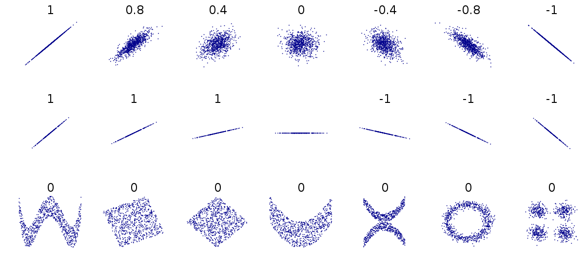

# Data insights {#sec-insights}


```{r, echo = F, warning = F, message = F}
library(tidyverse)
library(janitor)
library(here)
source("R/booktem_setup.R")
source("R/my_setup.R")
penguins <- readRDS(here("files", "chapter5.RDS"))
```

For this exercise, we propose that our task is to generate insights into the relationship between **bill (culmen) length** and **bill (culmen) depth** in penguins. Our goal is to answer the question: *Is there a meaningful relationship between these two measurements?* Understanding this relationship can provide valuable insights into the physical characteristics of different penguin species and how they may vary.

:::{.callout-important}

You should be working in the script you made in the last session check it contains everything contained in {@sec-save-script} and runs without causing errors

:::

## Understanding the Variables

Before jumping into the analysis, it’s crucial to take a step back and first understand the variables we’re working with and how they might relate to each other. In this case, our key variables are:

- **Culmen Length (bill length)**: This measures the length of the penguin's bill, an important feature related to feeding.

- **Culmen Depth (bill depth)**: This measures the thickness of the penguin's bill.

## What should we consider in our analysis?

### 1. Distribution of Data Types

Understanding the type of data we’re dealing with is the first step in any analysis. Both culmen length and depth are continuous numerical variables, meaning they can take a wide range of values. However, our dataset may also include categorical variables like species and island, which will help us group the data and see how these groups influence our measurements.

Why this matters: Knowing whether a variable is numerical or categorical will influence how we visualize it and which statistical methods we use. For instance, numerical data might be plotted using histograms, while categorical data could be displayed using bar charts or boxplots.

### 2. Central Tendency
Next, we’ll want to understand the central tendency of our data. Central tendency refers to the average or most common values in a dataset. The mean, median, and mode are common measures used to describe central tendency.

- Mean: The average value (sum of all values divided by the number of values).

- Median: The middle value when data is sorted from lowest to highest, which is especially useful if the data is skewed or contains outliers.

- Mode: The most frequently occurring value in the dataset (not always relevant for continuous data).

:::{.callout-note}

## Why this matters 

Understanding the average bill length and depth helps us get a sense of what is "normal" for our penguins. Additionally, comparing these statistics across different species or islands could reveal differences in penguin populations.

:::

### 3. Relationship Between Variables

Now, we dive into the heart of our analysis: exploring the relationship between culmen length and culmen depth. To investigate this, we can use visual tools like `r glossary("scatterplots")` , which allow us to plot one variable against the other and visually check for patterns or trends.

We might also want to calculate a `r glossary("correlation coefficient")` to quantify the strength of the relationship between bill length and bill depth. If we find a strong correlation, we can say that these two measurements tend to move together — for example, as the bill length increases, so might the bill depth.

:::{.callout-note}

## Why this matters

Identifying the relationship between variables is critical to making meaningful conclusions. If bill length and depth are highly correlated, we can begin to explore why this might be the case — perhaps certain penguin species have distinct bill shapes that differ from others.

:::

### 4. Confounding Variables

While exploring the relationship between bill length and depth, we must also be aware of the potential impact of `r glossary("confounding variable")` . A confounding variable is one that influences both the dependent and independent variables, potentially leading to a false conclusion about their relationship.

In this dataset, potential confounders might include:

- Species: Different species may naturally have different bill shapes, so the relationship between culmen length and depth could vary depending on the species.

- Island or Location: Penguins from different islands might experience different environmental pressures that could affect bill size and shape.

To account for this, we can group or subset the data by species or island and re-examine the relationship between bill length and depth within those groups. This helps us determine if the observed relationship holds true across different groups, or if it is being influenced by these other variables.

Why this matters: Ignoring confounding variables could lead us to incorrect conclusions. For instance, if we see a strong relationship between bill length and depth, it could simply be due to species differences, rather than a true relationship across all penguins.

### Asking New Questions

Every step of the analysis leads to new questions. This is a natural part of the data exploration process. For example:

- After looking at the distribution of culmen length and depth, we might wonder, do certain species have longer bills than others?

- After finding a relationship between the variables, we might ask, is this relationship consistent across different islands or years?

- If we spot outliers, we might ask, why are some penguins' measurements so different from the rest?

### Data checking

Before diving into analysis, it's crucial to have a clear understanding of the structure and quality of your dataset. This step is part of the data wrangling process and ensures that your data is accurate, clean, and ready for exploration. Key tasks include:

- **The number of variables:** Know how many variables (columns) are present in the dataset. This helps in understanding the scope of the data and ensuring that all necessary information is available.

- **The data format of each variable:** Check whether each variable is in the correct format (e.g., numeric, categorical, date). Mistakes in data types, such as a numeric variable being stored as text, can cause errors during analysis.

- **Checked for missing data:** Identify any missing values and decide how to handle them. Ignoring missing data can skew results, so it’s important to either remove, impute, or investigate why data might be missing.

- **Checked for typos, duplications, or other data errors:** Manually inspect the data or use automated tools to detect any typos, duplicate entries, or inconsistencies that could impact your analysis. For example, species names should be consistent across all rows.

- **Cleaned column or factor names:** Ensure that all column names are properly labeled and easy to understand. This includes correcting any typos or formatting issues, such as spaces or special characters in names, which could cause problems when referencing them in code.

These data checking steps provide a strong foundation for accurate and effective analysis, ensuring that your dataset is reliable and well-structured and luckily we carried this out in {@sec-dplyr}.

## Explore the distribution of categories

Understanding how your data is distributed across important grouping variables is essential for context. In this case, the Palmer Penguins dataset includes key groupings such as **species, island, and year**, which might have significant effects on the relationships we want to study (e.g., between bill length and bill depth). By summarizing and visualizing the distribution of these variables, we can ensure that our analyses account for group-level differences, leading to more robust insights.

### Frequency

By grouping the data according to the species variable, we can calculate the total count (n) of penguins within each species. This summary provides a clear understanding of how the penguins are distributed across the different species in the dataset. Knowing the sample size for each species is crucial because it informs us about the representation of each group, which affects the reliability of any comparisons or analyses we plan to perform. If one species has far fewer observations than others, for example, it may require special consideration when interpreting results, as smaller sample sizes can lead to less robust conclusions. Understanding this distribution is a foundational step for any further analysis or comparison between species.

```{r}
penguins |> 
  # calculations applied per species
  group_by(species) |> 
  # summarise the number of observations in each group
  summarise(n = n())

```

**Question** Are there 152 different penguins in our dataset? `r torf(FALSE)`

`r hide("Explanation")`

The functions above count the number of rows of data - we need to determine if these are repeated or independent measures. We should remember that there is a column called `individual_id` if we use the `n_distinct()` function we can count how many unique IDs we have

```{r}

penguins |> 
  # calculations applied per species
  group_by(species) |> 
  # summarise the number of observations in each group
  summarise(n = n_distinct(individual_id))

```

Now we can see that there are only 132 *different* Adelie penguins in our data

`r unhide()`


### Relative Frequency

In addition to counting the total number of penguins in each species, calculating the relative frequency can be a useful summary. Relative frequency shows the proportion or percentage of observations in each category relative to the total number of observations. This helps us understand not only the absolute count but also how common each species is compared to the others.


```{r}

prob_obs_species <- penguins |> 
  group_by(species) |> 
  summarise(n = n()) |> 
  # use mutate to make a new column relative frequency
  mutate(prob_obs = n/sum(n))

prob_obs_species

```
So about 44% of our sample is made up of observations from Adelie penguins. When it comes to making summaries about categorical data, that's about the best we can do, we can make observations about the most common categorical observations, and the relative proportions.

```{r}
penguins |> 
  mutate(species=fct_relevel(species, 
                             "Adelie",
                             "Gentoo",
                             "Chinstrap")) |> 
  # set as factor and provide levels
  ggplot()+
  geom_bar(aes(x=species),
           fill="steelblue",
           width=0.8)+
  labs(x="Species",
       y = "Number of observations")+
  geom_text(data=prob_obs_species,
            aes(y=(n+10),
                x=species,
                label=scales::percent(prob_obs)))+
  coord_flip()

```

This is an example of a figure we might use in a report or paper. Having cleaned up the theme, added some simple colour, made sure our labels are clear and descriptive, ordered our categories in ascending frequency order, and included some simple text of percentages to aid readability.


## Two or more categories

When investigating the distribution of observations, it’s important to consider how other variables might influence this relationship, such as sex, species or observations across years.

`r hide ("Solution")`

Understanding how frequency is broken down by island, species year and sex might be useful.

```{r}
penguins |> 
  group_by(island, year, species, sex) |> 
  summarise(n = n()) 

```


```{r, fig.width = 10}

penguins |> 
   ggplot(aes(x = species,
             fill = sex))+
   geom_bar(width=0.8,
            position = position_dodge())+
  labs(x="Species",
       y = "Number of observations")+
  facet_grid(island ~ year)
  

```

`r unhide()`

By thinking about how categories might interact, we can identify interesting patterns or potential issues that could impact our analysis or data interpretation. Careful consideration of these interactions helps us ensure the validity of our findings. For instance:

- Sex Distribution: Looking at the patterns of male and female penguins, I’m reassured that the number of males and females observed is roughly equal across species and locations. This balance is important because unequal representation of sexes could bias our results, particularly in biological traits like bill length or body mass. Since there’s no imbalance, we can confidently proceed without worrying about gender skewing our insights.

- Species Distribution by Island: There are different numbers of species on different islands, but this variation remains consistent across years. This suggests that the observed species distributions likely reflect true ecological patterns, rather than inconsistencies in data collection. If this trend were erratic across years, we might suspect sampling issues, but the consistency provides confidence in the accuracy of species representation.

- Consistency Across Years: The number of penguins observed is consistent across years, meaning we don’t see major fluctuations in sample size. This consistency is important because significant changes could suggest variations in data collection methods or environmental factors affecting penguin populations. A steady count ensures that any trends or patterns we observe are less likely to be the result of sampling inconsistencies.

- Missing Data for Sex: While there are some missing values for the sex variable, these gaps are small and don’t fit any obvious pattern. This suggests that the missing data is likely random and not linked to a particular species, location, or time period. Since the missing values are few and do not show a clear bias, we can choose to ignore these gaps in the analysis with reasonable confidence that they won’t heavily skew our results.

By reflecting on these patterns, we can be more confident in the integrity of the data and proceed with analysis, knowing that key variables are well-represented and that any missing data or inconsistencies are minimal and manageable.


## Missing data

In the previous section, we identified some missing data, particularly for the sex variable, and noted that it was relatively small and likely random, meaning we could safely remove it from calculations without concern for `r glossary("bias")` . However, when it comes to our variables of interest, such as culmen length and culmen depth, it's worth taking a closer look at the missing values to understand if they occur in any particular patterns or groupings.

We previously used functions like `skimr::skim()` and `summary()` to find that there are two missing values each for culmen length and depth. Although this small amount of missing data is unlikely to introduce significant bias, it’s still a good practice to investigate where these missing values are located in the dataset. Identifying patterns or specific groups (e.g., certain species or islands) associated with the missing values can help ensure that the missing data is not clustered in a way that could subtly affect our analysis.

```{r}
penguins |>
  # Filter rows where culmen length is NA
  filter(is.na(culmen_length_mm)) |> 
  # Group by species, sex and island
  group_by(species, sex, year, island) |>                 
  summarise(n_missing = n())    

penguins |>
  filter(is.na(culmen_depth_mm)) |>         
  group_by(species, sex, year, island) |>               
  summarise(n_missing = n())    
```

There is data missing from one Adelie penguin in 2007 on Torgersen, and one value missing from a Gentoo penguin in 2009 on Biscoe. This is true for both culmen length and depth, it is probably the same penguin in both cases, but how could we change our code to be sure?

`r hide("Solution")`

```{r}
penguins |>
  filter(is.na(culmen_length_mm)) |> 
# ADD individual id into group_by arguments
  group_by(species, sex, year, island, individual_id) |>                 
  summarise(n_missing = n())    

penguins |>
  filter(is.na(culmen_depth_mm)) |>         
  group_by(species, sex, year, island, individual_id) |>               
  summarise(n_missing = n())    


```
`r unhide()`

Again here we could safely drop these from our data and regard these as missing at random. 

### Removing rows with missing data

If we are confident that missing data is not causing bias, then there are a few different ways we can deal with missing data so that it doesn't affect our calculations:

#### `drop_na()` on everything before we start. 

Using `drop_na()` to remove rows that contain any missing values across all variables can be useful, but it also runs the risk of losing a large portion of the data.

```{r, eval = FALSE}

drop_na(penguins)

```
- Pros: It's a simple, all-in-one solution for datasets where missing values are widespread and problematic.

- Cons: This method may remove entire rows of data, even if the missing value is only in a single, unimportant column. This can lead to significant data loss if many rows have missing values in non-critical variables.

#### `drop_na()` on a particular variable. 

Another approach is to remove rows with missing data in a specific variable, such as `body_mass_g`. This is less drastic but still needs to be done thoughtfully, especially if you overwrite the original dataset with the modified version. It's often better to drop `NA`s temporarily for specific analyses or calculations.

- Pros: You retain more data because you only remove rows with missing values in the column that matters for your current analysis.

- Cons: You might still lose useful information from other columns. If you overwrite the dataset permanently (e.g., using `penguins <- penguins |> drop_na(body_mass_g))`, you can’t recover the dropped rows without reloading the data.


```{r, eval = FALSE}

penguins |>
  drop_na(body_mass_g)
  

```

#### Use arguments inside functions 

A more cautious approach is to handle missing data within summary or calculation functions, using the `na.rm = TRUE` argument. Many summary functions (like `mean()`, `median()`, or `sum()`) include this argument, which, when set to `TRUE`, excludes `NA` values from the calculation. This allows you to keep missing values in the dataset but ignore them only when performing calculations.

```{r, eval = F}
penguins |> 
  summarise(
    mean_body_mass = mean(body_mass_g, na.rm = T)
  )

```

- Pros: This is the least destructive option because it allows you to handle missing data without removing any rows from the dataset. You only exclude `NA` values during specific calculations.

- Cons: This doesn’t remove missing data, so you need to ensure that they won’t cause issues later in other analyses (e.g., regressions or visualizations).

## Continuous distributions

A continuous variable is a type of numerical variable that can take an infinite number of values within a given range. Unlike categorical variables, which represent distinct groups or categories, continuous variables can represent quantities that can be measured with fine precision. Examples include height, weight, temperature, or in the case of the Palmer Penguins dataset, culmen length and culmen depth.

### Summarizing a Continuous Variable

To summarize a continuous variable, we typically focus on two key aspects:

- `r glossary("central tendency")`  (such as the mean)

- `r glossary("variation")`  (such as standard deviation)

#### Mean (Central Tendency)

The mean is the average value of a continuous variable. It is calculated by summing all the values and then dividing by the number of observations. The mean gives us a sense of the central location of the data, or where most of the data points cluster around.

- Example: The mean culmen length of penguins gives us an average bill length, which represents the central value of the dataset.

#### Variation (Spread)

Variation describes how spread out the data points are around the mean.

This concept is critical in data analysis because every variable exhibits its own unique pattern of variation. Understanding these patterns can provide important insights into the data. For example, the variation in penguin body mass or bill length across different species may reveal ecological or biological differences that are crucial to your analysis.

The best way to explore and understand the pattern of variation is by visualizing the distribution of the variable's values. By plotting histograms, boxplots, or density plots, you can observe how the data is spread out, whether it is concentrated around a central value, or if there are any outliers. These visualizations allow you to quickly identify the extent of variation and gain insights into the behavior of the variable.

:::{.callout-important}

In the examples below I will look at the distributions of culmen length, you should modify and duplicate the code so that you check both culmen length and culmen depth.

:::


### Histograms

This is the script to plot a frequency distribution, we only specify an x variable, because we intend to plot a `r glossary("histogram")` , and the y variable is always the count of observations. Here we ask the data to be presented in 10 equally sized bins of data. In this case chopping the x axis range into 10 equal parts and counting the number of observations that fall within each one.

Histograms are helpful because they show the distribution of a single numerical variable. They divide the data into "bins" (ranges of values) and count how many data points fall into each bin. This helps you:

See the shape of the data: You can easily spot if the data is normally distributed, skewed, or has multiple peaks (modes).
Identify data spread: Histograms help you understand the spread or range of your data values.
Detect outliers: Unusually high or low values become more noticeable in a histogram.

```{r, warning = FALSE, message = FALSE}
penguins |> 
  ggplot()+
  geom_histogram(aes(x=culmen_length_mm),
                 bins=10)

```


:::{.callout-tip}

## Change the bin argument

Change the value specified to the bins argument and observe how the figure changes. It is usually a very good idea to try more than one set of bins in order to have better insights into the data

:::

### Boxplots

A `r glossary("boxplot")` is a powerful tool for visualizing the distribution of a numerical variable in a compact and easy-to-read format. They provide a wealth of information about the data, including its central tendency, spread, and presence of outliers, while also allowing for comparisons across different groups. Here’s why boxplots are particularly useful:

- Central Tendency: The middle line within the box represents the median value of the data. Unlike the mean, which can be influenced by extreme values, the median provides a robust measure of central tendency, especially for skewed data.

- Spread and Variability: The box itself shows the interquartile range (IQR), which represents the spread of the middle 50% of the data. A wider box means more variability in the data, while a narrower box indicates that the data is more tightly clustered around the median.

- Outliers: Boxplots are particularly useful for identifying `r glossary("outliers")`  — data points that fall far outside the typical range of values. These are shown as individual points beyond the "whiskers" (the lines extending from the box), making it easy to spot extreme values that could affect your analysis.

- Comparison Between Groups: One of the greatest strengths of boxplots is their ability to compare distributions across different groups. By plotting multiple boxplots side by side (e.g., for different penguin species), you can easily see how a variable's distribution changes between categories, helping to highlight differences or similarities between groups.

```{r, warning = FALSE, message = FALSE}

penguins |> 
  ggplot()+
  geom_boxplot(aes(x=culmen_length_mm))

```


## Continuous and categorical

When you have a continuous variable (like culmen length) and want to explore how its distribution varies across a categorical variable (like species), visualizing the data is the best place to start. Simple figures allow us to easily see potential patterns and relationships between the variables.

To investigate how culmen length varies between different penguin species, we can create a simple boxplot that shows the distribution of culmen lengths for each species. This will help us quickly understand whether the different species tend to have different culmen lengths and whether any species has more variability or outliers than others.

```{r, warning = FALSE, message = FALSE}

penguins |> 
    ggplot(aes(x = species,
               y = body_mass_g,
               fill = species))+
    geom_boxplot(width = 0.2)+
  coord_flip()

```

By subgrouping the data, such as looking at the distribution of culmen length by species, we can more easily identify outliers within each group. When we analyze all penguins together, outliers might be harder to spot or might seem more extreme. However, when we break the data down by species, we can see that what might have appeared as an outlier in the overall data may actually be a typical value within a specific group.

This shows us that outliers are context-specific. A value that is unusually large or small for one species might fall well within the normal range for another species. Subgrouping helps us understand that outliers are not absolute—they depend on the context of the data and the groups being compared. This insight is crucial for accurate analysis, as it helps us avoid labeling a data point as unusual without considering its appropriate context.

### Density plots

Histograms and `r glossary("density plots")` are both useful tools for visualizing the distribution of a continuous variable, but they present the information in slightly different ways.

- Histograms divide the data into bins and count how many data points fall into each bin. This gives a blocky visual representation of the data's distribution and is great for showing the frequency of data points within specific ranges. The choice of bin width can influence how smooth or rough the histogram looks, and it provides an easy way to understand how the data is spread out.

- Density plots, on the other hand, provide a smoothed estimate of the data distribution. Instead of counting data points in bins, a density plot estimates the probability density of the variable, giving a continuous curve that helps visualize the shape of the data. The area under the curve of a density plot sums to 1, making it particularly useful when comparing distributions between groups, as it normalizes the data regardless of sample size.

In summary, histograms are useful for showing the exact count of data points in specific ranges, while density plots give a smoothed representation of the data’s distribution, helping to highlight the overall shape. Both are valuable tools, and the choice between them depends on the level of detail or smoothness you want to highlight.

Below we have an example of a density plot, more useful when comparing groups of uneven sample sizes: 

```{r}

penguins |>
  ggplot(aes(fill = species))+
  geom_density(aes(x = culmen_length_mm),
                   position = "identity",
                   alpha = 0.6)

```


### GGridges

The package ggridges (Wilke (2021)) provides some excellent extra geoms to supplement ggplot. One if its most useful features is to to allow different groups to be mapped to the y axis, so that histograms are more easily viewed.

```{r}
library(ggridges)
ggplot(penguins, aes(x = culmen_length_mm, 
                     y = species)) + 
  ggridges::geom_density_ridges()

```

When a density plot shows double peaks (also known as bimodal distribution), it often suggests that the data may contain two distinct groups or underlying patterns that are not immediately visible. In such cases, subgrouping the data can help clarify these peaks. By breaking the data down into categories—such as species, gender, or location—we can explore whether the peaks correspond to meaningful subgroups within the dataset.

For example, in the Palmer Penguins dataset, a bimodal distribution of bill length might indicate that different species have distinct bill lengths, each contributing to one of the peaks. Subgrouping by species would allow us to visualize separate distributions for each species and better understand the source of the variation.

Subgrouping helps us gain clarity by revealing if the apparent double peaks are caused by the presence of multiple groups, and it allows us to analyze these groups separately, leading to more accurate insights. 

Let's see what happens when we account for sex: 

```{r}
penguins |> 
  drop_na() |> 
ggplot(aes(x = culmen_length_mm, 
                     y = species, fill = sex)) + 
    ggridges::geom_density_ridges()


```

If we still see double peaks after subgrouping the data, it suggests that there may be additional underlying factors or patterns within each subgroup that we haven’t accounted for yet. These could be caused by other variables such as age, environmental conditions, or even measurement error, depending on the context of the data.

## Normality

If our data follows a `r glossary("normal distribution")` , we can use just two key metrics — **mean** and **standard deviation** — to predict how the data is spread out and to calculate the probability of observing a specific value. The normal distribution is symmetric and bell-shaped, meaning most data points cluster around the mean, with fewer observations the farther we move from it.

### Why These Measures Matter:

- The `r glossary("mean")`  gives us a general idea of the "average" value, but the `r glossary("standard deviation")`  tells us how reliable that mean is by showing how much the data varies around it.

- Together, these two metrics help us understand the overall distribution of a continuous variable. For normally distributed data, roughly 68% of values lie within one standard deviation of the mean, which provides a good sense of the data's spread.

### QQplots

A QQ plot is a useful tool for visually assessing whether a dataset follows a particular distribution, such as the normal distribution. At first glance, QQ plots may look unfamiliar, but they are simple and powerful once you understand the concept.

In a QQ plot, your sample data is plotted on the y-axis, and the theoretical distribution (often a normal distribution) is plotted on the x-axis. If your data follows a normal distribution, the points in the QQ plot will align along a straight diagonal line. Any deviation from this line indicates that your data departs from the normal distribution, either through skewness, heavy tails, or other irregularities.

How It Works:

- Data Points on the Y-Axis: These are the actual data values from your sample.

- Theoretical Distribution on the X-Axis: These represent what the data would look like if it perfectly followed a normal distribution.

If the data aligns well with the theoretical distribution, it forms a straight line. If not, the data will curve away from the line, signaling potential departures from normality.

Watch [this video to see QQ plots explained](https://www.youtube.com/watch?v=okjYjClSjOg) in action and how they help in assessing the distribution of your data!


```{r}

library(qqplotr)
ggplot(penguins, aes(sample = culmen_length_mm))+
    stat_qq_band() +
    stat_qq_line() +
    stat_qq_point() 

```

### Shapiro test

The Shapiro-Wilk test is a commonly used statistical test to check whether a dataset follows a normal distribution. It gives a p-value that helps determine if the data significantly deviates from normality. While useful, the Shapiro test has its limitations, especially when it comes to sample size

Sensitivity to Sample Size: The Shapiro-Wilk test is sensitive to sample size. For large samples, even very small deviations from normality can result in significant p-values, leading to a rejection of normality even when the deviations are minor and practically insignificant.

```{r}
library(rstatix)

penguins |>
  shapiro_test(culmen_length_mm)
 

```

Unlike the Shapiro-Wilk test, a QQ plot provides a visual way to check for normality. It allows you to see exactly how the data deviates from a normal distribution. You can spot patterns such as skewness or heavy tails, which the Shapiro test cannot differentiate.

QQ plots are also more flexible with sample size. They work well with both large and small datasets.

### Normality in subgroups

When you analyze the entire dataset without subgrouping, you combine data from different groups, such as species, locations, or treatments. Each group may have its own unique distribution. For example, in the Palmer Penguins dataset, bill length and bill depth may differ significantly between penguin species. If you test for normality across the entire dataset, the mix of different distributions might lead to misleading results—either falsely showing non-normality or obscuring deviations that are present in specific groups.

Subgrouping allows you to test for normality within each specific group and understand whether the deviations from normality are general or isolated to certain groups. 

```{r}
library(qqplotr)
ggplot(penguins, aes(sample = culmen_length_mm))+
    stat_qq_band() +
    stat_qq_line() +
    stat_qq_point() +
  facet_wrap(~species)

```

```{r}
penguins |> 
  group_by(species) |> 
  shapiro_test(culmen_length_mm)

```

Now we can see that when splitting into species subgroups - that the qqplots are much better. The Shapiro wilk test indicates that the Gentoo population deviates from a normal distribution for bill length, but our qqplot indicates this is very minor and we can still safely use descriptive statistics of mean and standard deviation that rely on this assumption.

## Summary statistics

### Calculating mean and standard deviation

standard deviation (or s) is a measure of how dispersed the data is in relation to the mean. Low standard deviation means data are clustered around the mean, and high standard deviation indicates data are more spread out. We can calculate these easily in R with `group_by()` and `summarise()`.

```{r}
penguins |> 
  group_by(species) |> 
  summarise(mean = mean(culmen_length_mm),
            sd = sd(culmen_length_mm))

```


::: {.callout-caution collapse="true"}

## Why have I got NAs here?

There is some missing data in rows identified as Adelie and Gentoo, I need to remove NA during the calculations

```{r}
penguins |> 
  group_by(species) |> 
  summarise(mean = mean(culmen_length_mm, na.rm = T),
            sd = sd(culmen_length_mm, na.rm =T))

```

:::

### Median and quartiles

If we were dealing with variables that did not fit a normal distribution, using summary statistics like max, min, median, and interquartile range (IQR) provides a robust way to describe the data's spread and central tendency. Unlike the mean and standard deviation, which are sensitive to outliers and skewed data, the median and IQR give a more accurate representation of the distribution's center and spread in non-normal data.

- Median: This is the middle value and provides a better measure of central tendency than the mean when data is skewed.
IQR (Interquartile Range): This measures the spread of the middle 50% of the data (between the 25th and 75th percentiles) and is less affected by extreme values.

- Min and Max: These values show the range of the data, highlighting any extreme values or outliers.

These summary statistics directly correspond to the boxplot: the median is the line inside the box, the IQR defines the box's edges, and the min/max (after removing outliers) are represented by the ends of the whiskers.


```{r}
penguins |> 
  group_by(species) |> 
  summarise(median = median(culmen_length_mm, na.rm = T),
            quantile = quantile(culmen_length_mm, c(0.25, 0.5, 0.75), na.rm=TRUE),
            max = max(culmen_length_mm, na.rm = T),
            min = min(culmen_length_mm, na.rm = T)
  )

```

::: {.callout-warning}

If you ran the command above you likely received a warning in your R console

```
Warning: Returning more (or less) than 1 row per `summarise()` group was deprecated in
dplyr 1.1.0.
ℹ Please use `reframe()` instead.
```
This is because `summary()` is supposed to only supply one row per group - by asking for the different quartiles from each group it forces it to print more rows. Try doing what R asks and see what happens

[See here](https://dplyr.tidyverse.org/reference/reframe.html)

:::


## Collinearity

Collinearity occurs when two or more independent variables in a dataset are highly correlated with each other, meaning that they show a strong linear relationship. In simpler terms, it means that one variable can be almost perfectly predicted by another. Collinearity is particularly problematic in regression analysis, where you want each independent variable to provide unique information about the outcome (dependent variable).

Imagine you’re studying penguin bill characteristics in the Palmer Penguins dataset. If you include both culmen length and flipper length are highly correlated, then collinearity may occur. This would make it difficult to determine whether changes in culmen depth are due to culmen length or flipper length, or a combination of both, as they provide overlapping information.

### GGally

The R package `GGally` helps us understand the relationships between variables, by producing a pairwise matric grid made of:

- Scatterplots: The scatterplots in a pairwise matrix (created by ggpairs()) allow you to visually inspect the relationship between pairs of continuous variables. If two variables show a strong linear relationship (points forming a clear diagonal line), it suggests collinearity between those variables.

- Correlation Coefficients: In the pairwise matrix, you can also display correlation coefficients. When these values are close to 1 (positive correlation) or -1 (negative correlation), it suggests that the variables are highly correlated and might indicate collinearity.

```{r, fig.width = 12}

library(GGally)

penguins |> 
  select(species, 
         island, 
         culmen_length_mm, 
         culmen_depth_mm, 
         flipper_length_mm, 
         body_mass_g, 
         sex) |> 
  ggpairs()


```

From these pairwise plots we can see that there *is* a correlation between flipper length, body mass and the culmen length and depth variables. This is useful information to know when considering the relationship between variables for cause and effect, and will be important when build statistical models. 

#### Applying Subgroups of Color in GGally (Using ggplot2)

Since GGally builds on ggplot2, you can apply the same customisations that ggplot2 allows, including the use of color to represent different subgroups in your data. This is especially useful when exploring relationships between variables, as it helps highlight patterns or differences between categories (e.g., species, sex, or location).

```{r, fig.width = 12}
penguins |> 
  ggpairs(columns = c(
         "island", 
         "culmen_length_mm", 
         "culmen_depth_mm", 
         "flipper_length_mm", 
         "body_mass_g", 
         "sex"), 
         ggplot2::aes(colour = species))

```


Why is this useful? It means we can identify group-specific trends: Adding colour based on a categorical variable (like species) helps you quickly spot trends or patterns that may exist only within certain groups.

## Correlation

A common measure of association between two numerical variables is the correlation coefficient. The correlation metric is a numerical measure of the strength of an association

There are several measures of correlation including:

- Pearson's correlation coefficient : good for describing linear associations

- Spearman's rank correlation coefficient: a rank ordered correlation - good for when the assumptions for Pearson's correlation is not met.

Pearson's correlation coefficient `r` is designed to measure the strength of a linear (straight line) association. Pearson's takes a value between -1 and 1.

- A value of 0 means there is no linear association between the variables

- A value of 1 means there is a perfect positive association between the variables

- A value of -1 means there is a perfect negative association between the variables

A perfect association is one where we can predict the value of one variable with complete accuracy, just by knowing the value of the other variable.

We can use the `rstatix::cor_test()` function in R to calculate Pearson's correlation coefficient.

```{r}
library(rstatix)

penguins |> 
  cor_test(culmen_length_mm, 
           culmen_depth_mm)

```

This tells us two features of the association. It's sign and magnitude. The coefficient is negative, so as bill length increases, bill depth decreases. The value -0.24 indicates a weak negative relationship.

Because Pearson's coefficient is designed to summarise the strength of a linear relationship, this can be misleading if the relationship is not linear e.g. curved or humped. This is why it's always a good idea to plot the relationship first (see above).

Even when the relationship is linear, it doesn't tell us anything about the steepness of the association (see above). It only tells us how often a change in one variable can predict the change in the other not the value of that change.

```{r, eval=TRUE, echo=FALSE, out.width="80%", fig.alt= "Correlation examples"}

```

This can be difficult to understand at first, so carefully consider the figure above.

- The first row above shows differing levels of the strength of association. If we drew a perfect straight line between two variables, how closely do the data points fit around this line.

- The second row shows a series of perfect linear relationships. We can accurately predict the value of one variable just by knowing the value of the other variable, but the steepness of the relationship in each example is very different. This is important because it means a perfect association can still have a small effect.

- The third row shows a series of associations where there is clearly a relationship between the two variables, but it is also not linear so would be inappropriate for a Pearson's correlation.

### Assumptions of Pearson's correlation

- A linear relationship

- Normal distribution of the variance

In our case we have already looked at the relationship and the assumptions of normality and would conclude our data is basically fine for using Pearson's correlation.

But what should we do if the relationship between our variables is non-linear or does not follow a normal distribution? Instead of using Pearson's correlation coefficient we can calculate something called a rank correlation.

### Spearman's rank correlation

Instead of working with the raw values of our two variables we can use rank ordering instead. The idea is pretty simple if we start with the lowest vaule in a variable and order it as '1', then assign labels '2', '3' etc. as we ascend in rank order. We can see a way that this could be applied manually with the function dense_rank from dplyr below:

```{r}
library(rstatix)

penguins |>  
  cor_test(culmen_length_mm, 
           culmen_depth_mm,
           method = "spearman")

```

You can see that we get a similar *but not identical* estimate of the strength of association. Generally non-parametric tests are less powerful, but have fewer assumptions about the structure of our data.

### Graphical summaries between numeric variables

Correlation coefficients are a quick and simple way to attach a metric to the level of association between two variables. They are limited however in that a single number can never capture the every aspect of their relationship. This is why we visualise our data, and the best way to do that for two continuous variables is to make a scatterplot

```{r}
scatterplot <- ggplot(penguins, aes(x= culmen_length_mm, 
                                    y= culmen_depth_mm)) +
  geom_point()

scatterplot

```

#### Marginal plots

Marginal plots are useful when you want to explore the distribution of individual variables alongside a scatterplot of the relationship between two variables. They add histograms, density plots, or boxplots to the margins of a scatterplot, providing extra information about the distribution of each variable separately. So we would could add any of the plots we used previously to look at variance in each of our variables `culmen_length_mm` and `culmen_depth_mm`

#### How to Create Marginal Plots: Using patchwork in R

`patchwork` is an R package that makes it easy to combine multiple ggplots into a single plot layout, including creating layouts for marginal plots. While ggplot2 doesn't natively support marginal plots, patchwork allows you to combine the scatterplot with additional histograms or density plots at the top and side, creating a custom marginal plot.

```{r}

library(patchwork) # package calls should be placed at the TOP of your script

bill_depth_marginal <- penguins |> 
  ggplot()+
  geom_density(aes(x=culmen_depth_mm), fill="darkgrey")+
  theme_void()+
  coord_flip() # this graph needs to be rotated

bill_length_marginal <- penguins |> 
  ggplot()+
  geom_density(aes(x=culmen_length_mm), fill="darkgrey")+
  theme_void()

layout <- "
AA#
BBC
BBC"

# layout is easiest to organise using a text distribution, where ABC equal the three plots in order, and the grid is how much space they take up. We could easily make the main plot bigger and marginals smaller with

scatterplot <- scatterplot +
  geom_smooth(method = "lm",
              se = FALSE)

bill_length_marginal+
  scatterplot+
  bill_depth_marginal+ 
  # order of plots is important
  plot_layout(design=layout) 
# uses the layout argument defined above to arrange the size and position of plots

```

From this plot we would conclude that there is weak `r mcq(c("positive", answer = "negative"))` relationship between culmen length and culmen depth. 

## Important variables

When analyzing the correlation between two variables, it’s essential to consider important categories or grouping variables (like species, gender, location, or time) to avoid misleading results and oversimplified interpretations. Ignoring relevant categories can result in omitted variable bias, which occurs when a key variable is left out of the analysis and its influence distorts the observed relationship between the variables of interest.

Think about important categories or subgroups that should be included when considering the relationship between culment length and depth?

`r hide("Solution")`

```{r}

colours <- c("cyan",
             "darkorange",
             "purple")

scatterplot_2 <- ggplot(penguins, aes(x= culmen_length_mm, 
                     y= culmen_depth_mm,
                     colour=species)) +
    geom_point()+
  geom_smooth(method="lm",
              se=FALSE)+
  scale_colour_manual(values=colours)+
  theme_classic()+
  theme(legend.position="none")+
    labs(x="Bill length (mm)",
         y="Bill depth (mm)")

bill_depth_marginal_2 <- penguins |> 
  ggplot()+
  geom_density(aes(x=culmen_depth_mm,
                   fill=species),
               alpha=0.5)+
  scale_fill_manual(values=colours)+
  theme_void()+
  coord_flip() # this graph needs to be rotated

bill_length_marginal_2 <- penguins |> 
  ggplot()+
  geom_density(aes(x=culmen_length_mm,
                   fill=species),
               alpha=0.5)+
  scale_fill_manual(values=colours)+
  theme_void()+
  theme(legend.position="none")

layout2 <- "
AAA#
BBBC
BBBC
BBBC"

bill_length_marginal_2+scatterplot_2+bill_depth_marginal_2+ # order of plots is important
  plot_layout(design=layout2) # uses the layout argument defined above to arrange the size and position of plots
```

We now clearly see a striking **reversal** of our previous trend, that in fact within each species of penguin there is an overall positive association between bill length and depth.

This is called **Simpson's Paradox** it is a classic example of omitted variable bias, where a trend observed in different groups reverses or disappears when the data is combined. This happens when a key variable (often categorical) is not included in the analysis, leading to misleading conclusions.

This should prompt us to re-evaluate our correlation metrics:

```{r}
penguins |> 
  group_by(species) |> 
  cor_test(culmen_length_mm, 
           culmen_depth_mm)


```

We now see that all of our correlation coefficients are stronger and positive *within* each species. 

`r unhide()`


## Summary

When analysing data, it’s important to start with simple visualizations like scatterplots, boxplots, or histograms to uncover basic patterns and distributions.
Before continuing with simple visualisations of relationships and groupings. These tools help provide quick insights into your data, such as distribution, trends, or outliers.

However, it’s equally important to think carefully about the context of your data. This includes considering grouping variables (like species, sex, or location) to avoid pitfalls like omitted variable bias or Simpson’s Paradox, where important patterns may be hidden or misrepresented if key variables are ignored.

By incorporating relevant categories and ensuring you're accounting for potential confounding variables, you make sure your analysis is more accurate, insightful, and meaningful. Always take a moment to reflect on the broader context before drawing conclusions from simple data summaries

## Glossary

```{r, echo = FALSE}
glossary_table()
```

## Reading

- [A protocol for data exploration to avoid common statistical problems](https://doi.org/10.1111/j.2041-210X.2009.00001.x)
