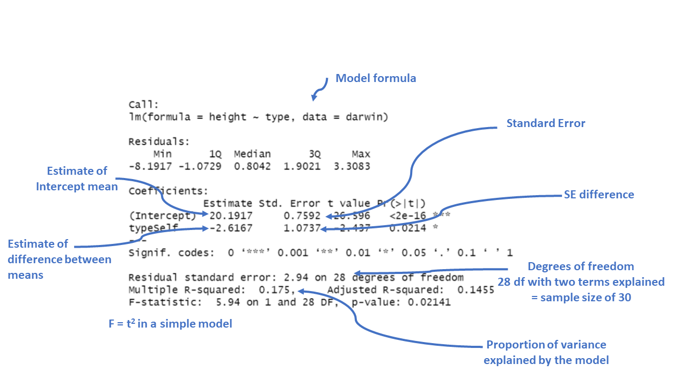

# Linear models {#sec-linear}


```{r, echo = F, warning = F, message = F}
library(tidyverse)
library(janitor)
library(here)
source("R/booktem_setup.R")
source("R/my_setup.R")

```

In the last chapter we conducted a simple analysis of Darwin's maize data using R. We worked out confidence intervals 'by hand'. This simple method allowed us to learn more about analysis, estimates, standard error and confidence. But it is also slow, and it relied on the assumptions of a *z-distribution* to assess true differences between the groups. 

We will now work through a much more efficient way to carry out comparisons, we will use the functions in R that let us perform a **linear model** analysis.

### Packages

```{r}
library(tidyverse)
library(GGally)
library(emmeans)
library(performance)
library(broom.helpers)
```

```{r, eval=TRUE, echo=FALSE}

library(tidyverse)

library(here)

darwin <- read_csv(here("files", "darwin.csv"))

```

## A linear |> model analysis for calculating means

R has a general function `lm()` for fitting linear models, this is part of base R (does not require the tidyverse packages). We will run through a few different iterations of the linear model increasing in complexity. We will often want to fit several models to our data, so a common way to work is to fit a model and assign it to a named R object, so that we can extract data from when we need it. 

In the example below I have called the model `lsmodel0`, short for "least-squares model 0", this is because the linear-model uses a technique called [least squares](https://www.youtube.com/watch?v=PaFPbb66DxQ). 

```{r}
lsmodel0 <- lm(formula = height ~ 1, data = darwin)

```

:::{.callout-tip}
You can pipe into the lm() function, but when we use functions that are "outside" of the tidyverse family we need to put a `_` where the data should go (as it is usually not the first argument).

```{r}
lsmodel0 <- darwin |> 
             lm(height ~ 1, data= _)

```

:::

The first argument of the `lm()` function is formula (we won't write this out in full in the future) - and this specifies we want to analyse a **response** variable (height) as a function of an **explanatory** variable using the *tilde* symbol (~).

The simplest possible model ignores any explanatory variables, instead the `1` indicates we just want to estimate an intercept. 

Without explanatory variables this means the formula will just estimate the overall mean height of **all** the plants in the dataset.


## Summaries for models

When you have made a linear model, we can investigate a summary of the model using the base R function `summary()`. There is also a tidyverse option provided by the package `broom`(@R-broom).

### Broom

broom summarizes key information about models in tidy `tibble()s`. broom provides three verbs to make it convenient to interact with model objects:

* `broom::tidy()` summarizes information about model components

* `broom::glance()` reports information about the entire model

* `broom::augment()` adds informations about individual observations to a dataset and it can be used to model predictions onto a new dataset.

### Model summary

::: {.panel-tabset}

## Base R

```{r}

summary(lsmodel0)

```

## Broom

```{r}

broom::tidy(lsmodel0)

```

:::


The output above is called the *table of coefficients*. The 18.9 is the *estimate of the model coefficient* (in this case it is the overall mean), together with its standard error (SEM). The first row in any R model output is always labelled the 'Intercept' and the challenge is usually to workout what that represents. In this case we can prove that this is the same as the overall mean as follows:

```{r}
mean(darwin$height)
```


This simple model allows us to understand what the `lm()` function does. 

### Compare means

What we really want is a linear model that analyses the *difference* in average plant height (`type`) as a function of pollination type. We can use the `lm()` function to fit this as a linear model as follows:

::: {.panel-tabset}

## Base R

```{r}

lsmodel1 <- lm(height ~ type, data=darwin)

# note that the following is identical

# lsmodel1 <- lm(height ~ 1 + type, data=darwin)

summary(lsmodel1)

```

## Broom

```{r}

lsmodel1 <- lm(height ~ type, data=darwin)

broom::tidy(lsmodel1)

```


```{r, echo = FALSE}
saveRDS(lsmodel1, "lsmodel1.rds")
```

:::


Now the model formula contains the pollination type in addition to an intercept.

### Coefficients

This is where the model results are reported.

- **Intercept**: This is the predicted height when the plant type is "Cross" fertilised, which is the reference category). The estimate is 20.1917, which means the average height for plants that are not self-fertilised is about 20.19 inches.

- **typeSelf:** This coefficient tells us how the height of "Self" fertilized plants **differs from the reference group** ("Cross" fertilized plants). The estimate is -2.6167, meaning "Self" fertilized plants are, on average, 2.62 units shorter than "Cross" fertilized plants.

:::{.callout-note}

You can confirm this for yourself: 

```{r}
darwin |> 
  group_by(type) |> 
  summarise(mean=mean(height))
```

:::


- **The Std. Error** for each coefficient measures the uncertainty in the estimate. Smaller values indicate more precise estimates. For example, the standard error of 1.0737 for the "typeSelf" coefficient suggests there's some variability in how much shorter the "Self" fertilized plants are, but it’s reasonably precise.

- **The t value** is the ratio of the estimate to its standard error ($\frac{Mean}{Std. Error}$). The larger the t-value (either positive or negative), the more evidence there is that the estimate is different from zero.

- **Pr(>|t|)** gives the p-value, which tells us the probability of observing a result as extreme as this, assuming that there is no real effect (i.e., the null hypothesis is true). In this case, a p-value of 0.0214 means there’s about a 2% chance that the difference in height between "Self" and "Cross" fertilized plants is due to random chance. Since this is below the typical cutoff of 0.05, it suggests that the difference is statistically significant.

- **Significance codes**: These symbols next to the p-value indicate how strong the evidence is. In this case, one star (*) indicates a p-value below 0.05, meaning the effect is considered statistically significant.


```{r, eval=TRUE, echo=FALSE, out.width="80%", fig.cap = "Annotation of the summary function output"}

```

`r hide("The t-statistic")`

The t-statistic is closely related to the z-statistic but is used in significance testing when the sample size is small or the population standard deviation is unknown.
As we almost never know the "population" standard deviation, it is always safer to use the t-distribution for significance tests. 

### The t-Distribution:

The t-distribution is similar to the normal distribution but has more spread (wider tails), especially with smaller sample sizes. As the sample size increases, the t-distribution approaches the normal distribution.

```{r, echo = F, warning = F, message = F}
x <- seq(-4, 4, length=100)
z_dist <- dnorm(x)
degf <- c(1, 3, 8, 30)
values <- tibble(x,z_dist)

# map_dfc combines values returned into a dataframe
t <- map_dfc(degf, ~dt(x, .x))
colnames(t) <- degf

combined <- cbind(values,t)

combined |> 
    pivot_longer(cols=!x, names_to="distribution") |> 
    mutate(distribution=factor(distribution, levels=c("z_dist", "1", "3", "8", "30"))) |>  
  mutate(distribution=fct_recode(distribution, "z distribution" = "z_dist", "df = 1" = "1", "df = 3" = "3", "df = 8" = "8", "df = 30" = "30")) |> 
  ggplot(aes(x=x, y=value, colour=distribution))+
  geom_line(linetype="dashed")+
  theme_classic()
```

`r unhide()`


### A simple write up

From this summary model we can make conclusions about the effect of inbreeding and produce a simple write up:

"The maize plants that have been cross pollinated had an average height (mean ±S.E.) of 20.19 (± 0.76) inches and were taller on average than the self-pollinated plants, with a mean difference in height of 2.62 (±1.07) inches (t(28) = -2.44, p = 0.02)"


## Confidence intervals

A confidence interval is a range of values that we expect to contain the true population parameter (like a mean or difference in means) with a certain level of confidence. In the case of a 95% confidence interval, this means we are 95% confident that the true parameter lies within the interval.

The confidence interval is closely tied to the standard error (SE), which measures how much variability we expect in the sample estimates due to sampling randomness. The standard error depends on the sample size and the variability in the data, and it’s computed as:

$$
Standard~Error(SE)= \frac{SD}{\sqrt(n)}
$$
For a 95% confidence interval, we use the t-distribution to determine how many standard errors away from the sample estimate we should go to capture the true population parameter with 95% confidence. In most cases:

$$
Confidence~Interval=Mean(\pm(criticial~t) \times SE)
$$
Where:

- critical t = is the critical value from the t-distribution that corresponds to a 95% confidence level

- Standard Error - the precision of the sample estimate

### Confidence intervals and p-values

A p-value and a confidence interval are inversely related, but they provide information in different ways:

- A **p-value** tells you how likely it is to observe your data (or something more extreme) if the null hypothesis is true. It’s a single number that quantifies the evidence against the null hypothesis. If the p-value is less than the significance level (typically 0.05), you reject the null hypothesis.

- A **confidence interval** provides a range of plausible values for the true parameter. If the confidence interval does not include 0 (or another hypothesized value, such as a difference of 0 between two groups), it suggests the parameter is significantly different from 0 at the corresponding confidence level (usually 95%).

Here’s how they are inversely related:

- **p-value < 0.05**: If the p-value is below 0.05, this typically means the null hypothesis (no effect or no difference) is rejected, suggesting a statistically significant result. In this case, a 95% confidence interval for the effect will not include 0, indicating the result is statistically significant.

- **p-value > 0.05**: If the p-value is greater than 0.05, this means we do not reject the null hypothesis. In this scenario, the 95% confidence interval will likely include 0, indicating that the true effect could be zero and the result is not statistically significant.

### Confidence intervals (CI) in R

With a wrapper function around our model we can generate accurate 95% confidence intervals from the SE and calculated t-distribution:

::: {.panel-tabset}

## Base R

```{r}
confint(lsmodel1)
```

## Broom

```{r}
broom::tidy(lsmodel1, conf.int=T)
```

:::

Because this follows the same layout as the table of coefficients, the output intercept row gives a 95% CI for the height of the crossed plants and the second row gives a 95% interval for the *difference in height between crossed and selfed plants*. The lower and upper bounds are the 2.5% and 97.5% of a *t*-distribution. 

It is this difference in height in which we are specifically interested. 

### Answering the question

Darwin's original hypothesis was that self-pollination would reduce fitness (using height as a proxy for this). The null hypothesis is that there is no effect of pollination type, and therefore no difference in the average heights. 

We must ask ourselves if our experiment is consistent with this null hypothesis or can we reject it? If we choose to reject the null hypothesis, with what level of confidence can we do so?

To do this, we can simply determine whether or not the predicted value of our null hypothesis (a  difference of zero) lies inside the 95% CI for the difference of the mean. 

If our confidence intervals contain zero (or no difference), then we cannot establish a difference between our sample difference in height (-2.62 inches) from the null prediction of zero difference, given the level of variability (noise) in our data. 

In this case we can see that the upper and lower bounds of the confidence intervals **do not contain zero**. The difference in height is consistent with Darwin's alternate hypothesis of inbreeding depression. 

### Plausible range of significant difference

- A 95% CI provides a range of values where the true effect (like a difference between two group means) is likely to fall. Our analysis suggests that within the 95% confidence interval the true (population) difference could be between 0.42 and 4.8 inches in height difference between crossed and selfed plants. 
- **Minimum effect size**: the value closest to zero gives a sense of the **minimum effect size** that is plausible at 95% confidence. This is important because it shows the smallest effect you might expect. Here the minimum effect size is 0.42 inches. Or that the cost of inbreeding could be as little as a 0.42 inch height difference. 

The `GGally` package has a handy `ggcoef_model()` function, that produces a graph of the estimated mean difference with an approx 95% CI. As we can see we are able to reject the null hypothesis at a 95% confidence level. 

```{r, warning=FALSE, message=FALSE, eval=T}

# Generate a coefficient plot for the linear regression model using ggcoef_model
GGally::ggcoef_model(lsmodel1,
                     show_p_values = FALSE,
                     conf.level = 0.95)

```

::: {.callout-note}
Set the confidence levels to 99%, do you think the difference between treatments is still statistically significant at an \alpha of 0.01?
:::

If we increase the level of confidence (from 95% to 99%, roughly 2 SE to 3 SE), then we may find that we cannot reject the null hypothesis at a higher threshold of confidence (p < 0.01). Try altering the `conf.level` argument above for yourself to see this in action. 

We can also include this argument in the `tidy()` function if we wish to:

```{r}
broom::tidy(lsmodel1, conf.int=T, conf.level=0.99)
```

## Estimating means

One limitation of the table of coefficients output is that it doesn't provide the mean and standard error of the *other* treatment level (only the difference between them). If we wish to calculate the "other" mean and SE then we can get R to do this.

### Changing the intercept

One way to do this is to change the levels of the type variable as a factor:

```{r}
# Perform linear regression on darwin data with Self as the intercept
darwin |> 
  # Convert 'type' column to a factor
  mutate(type = factor(type)) |>
  # Relevel 'type' column to specify the order of factor levels
  mutate(type = fct_relevel(type, c("Self", "Cross"))) |>
  # Fit linear regression model with 'height' as the response variable and 'type' as the predictor
  lm(height ~ type, data = _) |>
  # Tidy the model summary
  broom::tidy()


```

After releveling, the self treatment is now taken as the intercept, and we get the estimate for it's mean and standard error

### Emmeans

We could also use the package [`emmeans`](https://aosmith.rbind.io/2019/03/25/getting-started-with-emmeans/) and its function `emmeans()` to do a similar thing

```{r, eval=T}
# Calculate estimated marginal means (EMMs) using emmeans package
means <- emmeans::emmeans(lsmodel1, specs = ~ type)

means

```

The advantage of emmeans is that it provides the mean, standard error and 95% confidence interval estimates of all levels from the model at once (e.g. it relevels the model multiple times behind the scenes). 


`emmeans` also gives us a handy summary to include in data visuals that combine raw data and statistical inferences. These are standard `ggplot()` outputs so can be [customised as much as you want](#intro-to-grammar).

```{r}

# Convert the 'means' object to a tibble
means |>
  as_tibble() |>
  # Create a plot using ggplot
  ggplot(aes(x = type, y = emmean)) +
  # Add point estimates with error bars
  geom_pointrange(aes(ymin = lower.CL, ymax = upper.CL))


```

Notice that no matter how we calculate the estimated SE (and therefore the 95% CI) of both treatments is the same. This is because as mentioned earlier the variance is a pooled estimate, e.g. variance is not being calculate separately for each group. The only difference you should see in SE across treatments will be if there is a difference in *sample size* between groups. 

:::{.callout-tip}

Notice how the Confidence Intervals of the estimated means strongly overlap, there is a difference between the two SEMs and the SED we have calculated. So overlapping error bars cannot be used to infer significance. 

:::

Because of this pooled variance, there is an assumption that variance is equal across the groups, this and other assumptions of the linear model should be checked. We cannot trust our results if the assumptions of the model are not adequately met. 

## Summary

So remember a linear model sets one factor level as the 'intercept' estimates its mean, then draws a line from the first treatment to the second treatment, the slope of the line is the difference in means between the two treatments. 

The difference in means is always accompanied by a standard error of the difference (SED), and this can be used to calculate a 95% confidence interval. If this confidence interval does not contain the intercept value, we can reject the null hypothesis that there is 'no effect'. 

Linear models make a variety of assumptions, including that the noise (residual differences) are approximately normally distributed, with roughly equal (homogenous) variance. 

## Write-up

Can you write an Analysis section? Add calculated 95% confidence intervals on top of the summary we produced earlier

`r hide("Solution")`

The maize plants that have been cross pollinated had an average height of 20.19 inches [18.63 - 21.74] and were taller on average than the self-pollinated plants, with a mean difference in height of 2.62 [0.42, 4.82] inches (mean [95% CI]) (t(28) = -2.44, p = 0.02).

```{r, eval=T}


# Convert the 'means' object to a tibble
means |>
  as_tibble() |>
  # Create a plot using ggplot
  ggplot(aes(x = type, y = emmean, fill = type)) +
    # Add raw data
  geom_jitter(data = darwin,
              aes(x = type,
                  y = height),
              width = 0.1,
              pch = 21,
              alpha = 0.4) +
  # Add point estimates with 95% confidence error bars
  geom_pointrange(aes(ymin = lower.CL, 
                      ymax = upper.CL),
                  pch = 21) +
  labs(x = "Breeding Type",
       y = "Height (inches) ± 95% CI")
  theme_classic()+
  theme(legend.position = "none")


```

`r unhide()`

:::{.callout-note}

This will be different to your previous manual calculations on two counts. One, we are using a t-distribution for our confidence intervals. Two this example is a two-sample t-test, our previous example was closer to a paired t-test we will see how to implement a linear model with a paired design in subsequent chapters.
:::


