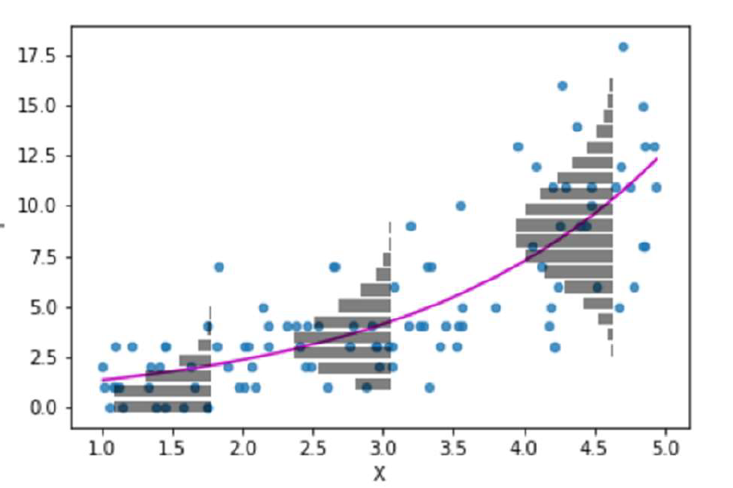
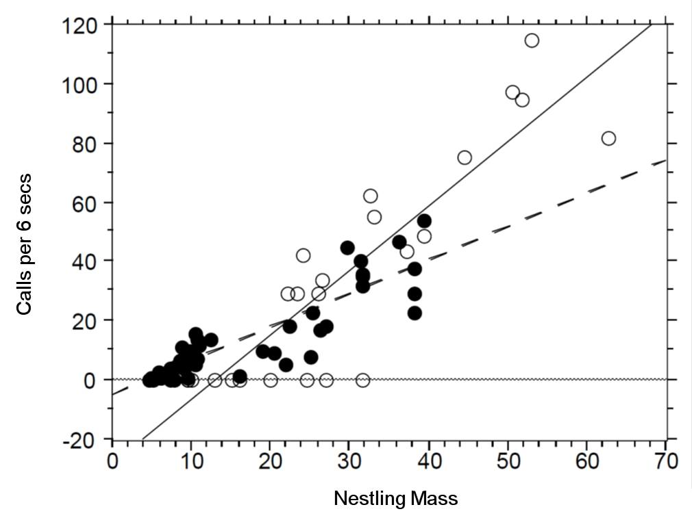

# Poisson regression (for count data or rate data)


```{r, echo = F, warning = F, message = F}
library(tidyverse)
library(janitor)
library(here)
source("R/booktem_setup.R")
source("R/my_setup.R")
```


```{r, eval=T, echo=F}
library(tidyverse)
library(rstatix)
library(performance)
library(patchwork)

```


Count or rate data are ubiquitous in the life sciences (e.g number of parasites per microlitre of blood, number of species counted in a particular area). These type of data are **discrete** and **non-negative**.
In such cases assuming our response variable to be normally distributed is not typically sensible. 
The Poisson distribution lets us model count data explicitly.

Recall the simple linear regression case (i.e a GLM with a Gaussian error structure and identity link). For the sake of clarity let's consider a single explanatory variable where $\mu$ is the mean for *Y*:

$$
\begin{aligned}
\mu & = \beta_0 + \beta_1X
\end{aligned}
$$

The mean function is **unconstrained**, i.e the value of $\beta_0 + \beta_1X$ can range from $-\infty$ to $+\infty$. If we want to model count data we therefore want to **constrain** this mean to be positive only. Mathematically we can do this by taking the **logarithm** of the mean (the log is the default link for the Poisson distribution). We then assume our count data variance to be Poisson distributed (a discrete, non-negative distribution), to obtain our Poisson regression model (to be consistent with the statistics literature we will rename $\mu$ to $\lambda$):

$$
\begin{aligned}
Y & \sim \mathcal{Pois}(\lambda) \\
\log{\lambda} & = \beta_0 + \beta_1X
\end{aligned}
$$

> Note - the relationship between the mean and the data is modelled by Poisson variance. The relationship between the predictors and the mean is modelled by a log transformation. 

The **Poisson** distribution has the following characteristics:

* **Discrete** variable, defined on the range $0, 1, \dots, \infty$.
* A single ***rate*** parameter $\lambda$, where $\lambda > 0$.
* **Mean** = $\lambda$  
* **Variance** = $\lambda$

So we model the variance as equal to the mean - as the mean increases so does the variance. 

```{r, eval = T, echo=F}
#cols <- c("#F4ABAB", "#91CDF2", "#5AA566", "#A57C42")
cols <- c("#377eb8", "#4daf4a", "#984ea3") # colorbrewer
par(mfrow = c(3, 1))
x <- 0:20
rates <- c(1, 5, 10)
barplot(dpois(x, rates[1]), col = cols[1], ylab = "Probability", xlab = "X", main = paste0("lambda = ", rates[1]), names.arg = x)
for(i in 2:length(rates)) barplot(dpois(x, rates[i]), col = cols[i], ylab = "Probability", xlab = "X", main = paste0("lambda = ", rates[i]), names.arg = x)
par(mfrow = c(1, 1))
```


```{r, eval=TRUE, echo=FALSE, out.width="80%", fig.alt= "Poisson distribution on an exponential line"}


```


So for the Poisson regression case we assume that the mean and variance are the same.
Hence, as the mean *increases*, the variance *increases* also (**heteroscedascity**).
This may or may not be a sensible assumption so watch out! Just because a Poisson distribution *usually* fits well for count data, doesn't mean that a Gaussian distribution *can't* always work.

Recall the link function between the predictors and the mean and the rules of logarithms (if $\log{\lambda} = k$(value of predictors), then $\lambda = e^k$):

$$
\begin{aligned}
\log{\lambda} & = \beta_0 + \beta_1X \\
\lambda & = e^{\beta_0 + \beta_1X }
\end{aligned}
$$
Thus we are effectively modelling the observed counts (on the original scale) using an exponential mean function.

```{r, echo = F, eval = F, fig.width = 10, fig.height = 5}
set.seed(10)
x <- rnorm(100, 0, 1)
x <- x - min(x)
lambda <- x
y <- rpois(100, lambda = exp(lambda))
y.glm <- glm(y ~ x, family = poisson)
par(mfrow = c(1, 2))
plot(x, y)
lines(seq(min(x), max(x), length = 100), exp(coef(y.glm)[1] + coef(y.glm)[2] * seq(min(x), max(x), length = 100)), 
      col='black', lwd=2)
plot(fitted(y.glm), y - fitted(y.glm), xlab = "Fitted values", ylab = "Residuals", main = "")
abline(h = 0, lty = 2)
par(mfrow = c(1, 1))
```

## Example: Cuckoos

```{r, echo=FALSE, fig.width = 10, fig.height = 5}

```

In a study by [Kilner *et al.* (1999)](http://www.nature.com/nature/journal/v397/n6721/abs/397667a0.html), the authors
studied the begging rate of nestlings in relation to total mass of the brood of **reed warbler chicks** and **cuckoo chicks**.
The question of interest is:

> How does nestling mass affect begging rates between the different species?


```{r, echo = F}
cuckoo <- read_csv(here::here("files", "cuckoo.csv"))
```
```{r, eval = TRUE, echo = FALSE}
downloadthis::download_link(
  
  link = "https://github.com/UEABIO/5023B/blob/dev/files/cuckoo.csv",
  button_label = "Download Cuckoo data as csv",
  button_type = "success",
  has_icon = TRUE,
  icon = "fa fa-save",
  self_contained = FALSE
)
```

```{r}
head(cuckoo)
```

The data columns are:

* **Mass**: nestling mass of chick in grams
* **Beg**: begging calls per 6 secs
* **Species**: Warbler or Cuckoo

```{r, eval = T, fig.height=6, fig.width=7}
ggplot(cuckoo, aes(x=Mass, y=Beg, colour=Species)) + geom_point()
```

There seem to be a relationship between mass and begging calls and it could
be different between species. It is tempting to fit a linear model to this data. 
In fact, this is what the authors
of the original paper did; **reed warbler chicks** (solid circles, dashed fitted line) and 
**cuckoo chick** (open circles, solid fitted line):

```{r, echo=FALSE, eval = T, fig.width = 10, fig.height = 5}

```

This model is inadequate. It is predicting **negative** begging calls *within* the 
range of the observed data, which clearly does not make any sense.

Let us display the model diagnostics plots for this linear model.

```{r, eval = T}
## Fit model
## There is an interaction term here, it is reasonable to think that how calling rates change with size might be different between the two species.
cuckoo_ls1 <- lm(Beg ~ Mass+Species+Mass:Species, data=cuckoo) 
```


```{r, eval = T}
performance::check_model(cuckoo_ls1, 
                         detrend = FALSE)
```

The residuals plot depicts a strong "funnelling" effect, highlighting that the model assumptions are violated.
We should therefore try a different model structure.

The response variable in this case is a classic **count data**: **discrete** and bounded below by zero (i.e we cannot have negative counts). We will therefore try a **Poisson model** using the canonical **log** link function for the mean:

$$
    \log{\lambda} = \beta_0 + \beta_1 M_i + \beta_2 S_i + \beta_3 M_i S_i
$$

where $M_i$ is nestling mass and $S_i$ a **dummy** variable

$$
S_i = \left\{\begin{array}{ll}
        1 & \mbox{if $i$ is warbler},\\
        0 & \mbox{otherwise}.
        \end{array}
        \right.
$$

The term $M_iS_i$ is an **interaction** term. Think of this as an additional explanatory variable in our model.
Effectively it lets us have **different** slopes for different species (without an interaction term we assume that
both species have the same slope for the relationship between begging rate and mass, and only the intercept differ).

The mean regression lines for the two species look like this:

* **Cuckoo** ($S_i=0$)

$$
\begin{aligned}
    \log{\lambda} & = \beta_0 + \beta_1 M_i + (\beta_2 \times 0)  + (\beta_3 \times M_i \times 0)\\
    \log{\lambda} & = \beta_0 + \beta_1 M_i
\end{aligned}
$$
    
* **Intercept** = $\beta_0$, **Gradient** = $\beta_1$

* **Warbler** ($S_i=1$)

$$
\begin{aligned}
    \log{\lambda} & = \beta_0 + \beta_1 M_i + (\beta_2 \times 1)  + (\beta_3 \times M_i \times 1)\\
    \log{\lambda} & = \beta_0 + \beta_1 M_i + \beta_2 + \beta_3M_i\\
\end{aligned}
$$


## Activity 1: Fit the model


:::{.task}
::::{.task-header}
Fit a Poisson GLM
::::
::::{.task-container}

- Fit the same model but with the `glm()` function

- Set the family to poisson

`glm(x ~ y, data = data, family = poisson)`

::::
:::


`r hide("Solution")`

```{r}
cuckoo_glm1 <- glm(Beg ~ Mass + Species + Mass:Species, data=cuckoo, family=poisson(link="log"))

summary(cuckoo_glm1)
```

> Note there appears to be a negative interaction effect for Species:Mass, indicating that Begging calls do not increase with mass as much as you would expect for Warblers as compared to Cuckoos.

`r unhide()`

## Plot the mean regression line for each species:

When we have fitted a model we can use it to generate predictions and see the fit of the regression line (on a log scale)

:::{.task}
::::{.task-header}
Plot the mean regression for each species
::::
::::{.task-container}

- Use the emmeans function to generate mean beg rates for different mass + species values


`r hide("Solution")`

```{r, eval = TRUE}

means <- emmeans::emmeans(cuckoo_glm1, 
                          specs = ~ Mass + Species + Mass:Species,
                          at = list(Mass = seq(0,40, by = 5))) |> 
  as_tibble()


ggplot(data = means, aes(x=Mass, y= emmean, colour=Species)) + 
  geom_point() +
  geom_line()+
  scale_colour_manual(values=c("green3","turquoise3"))+
  theme_minimal()

```

`r unhide()`

::::
:::

However, it can be more useful to view data on the "response" or "original" scale. Once a model has been fitted we can "back-transform" estimates to produce predicitons on a non-linear response. In this case exponentiating the log-term. 

:::{.task}
::::{.task-header}
Plot the mean regression for each species *on the response scale*
::::
::::{.task-container}

- Use the `emmeans` function to generate mean beg rates for different mass + species values

- This time include the argument `type = "response"`

- Include raw data points as well

- Use the help menu if needed


`r hide("Solution")`

```{r, eval = TRUE}


means_response <- emmeans::emmeans(cuckoo_glm1, 
                          specs = ~ Mass + Species + Mass:Species,
                          at = list(Mass = seq(0,40, by = 5)),
                          type = "response") |> 
  as_tibble()

ggplot(data = means_response, aes(x=Mass, y= rate, colour=Species)) + 
  geom_point(data = cuckoo,
             aes(y = Beg,
                 x = Mass,
                 colour = Species),
             alpha = .4) +
  geom_point() +
  geom_line()+
  scale_colour_manual(values=c("green3","turquoise3"))+
  theme_minimal()
```

`r unhide()`

::::
:::

### Model checks

Before attempting to interpret our model, we should check that it meets model assumptions and is a good fit for our data. 
Unlike with OLS linear models, we can only use visual checks - we can no longer carry out checks for normality or heterogeneity as these no longer apply. 

:::{.task}
::::{.task-header}
Discuss the model fit with a classmate
::::
::::{.task-container}

- Does the QQplot show deviance residuals are ok?

- How is the homogeneity of variance?

- Are there collinearity issues

- Are there any influential observations?

- Is dispersion appropriate for a Poisson model?

- What is the predictive check like?


```{r, eval = T}
performance::check_model(cuckoo_glm1, 
                         residual_type = "normal",
                         detrend = FALSE)

```


`r hide("Solution")`

- Does the QQplot show deviance residuals are ok?

> The QQplot is standardised "deviance" residuals - these show the residuals appear to fit well with a Poisson distribution

- How is the homogeneity of variance?

> The trend line can be misleading, while not perfect there is generally homogeneity - perhaps some clumping at low values

- Are there collinearity issues

> Technically yes - but this is because one of our terms is an interaction (a composite of main effects) and can be ignored

- Are there any influential observations?

> Yes there are four mildly influential observations - outliers can removed from models and compared to a reduced model to check "sensitivity". But outliers may resolve themselves if other issues are dealt with 

- Is dispersion appropriate for a Poisson model?

> This graph is new it looks at observed variance and whether it follows model predictions. This shows that observed variance is generally higher than predicted by the model. This may indicate our model has "overdispersion". 

- What is the predictive check like?

> Generally good - but the model appears to underpredict zeroes. 

`r unhide()`

::::
:::

### Model Summary

```{r}
summary(cuckoo_glm1)
```

A reminder of how to interpret the regression coefficients of a model with an interaction term

* Intercept = $\beta 0$ (intercept for the **reference or baseline** so here the **log** of the mean number of begging calls for **cuckoos** when mass is 0)

* Mass = $\beta1$ (slope: the change in the **log** mean count of begging calls for every gram of bodyweight for **cuckoos**)

* SpeciesWarbler = $\beta2$ (the **log** mean increase/decrease in begging call rate of the **warblers** relative to cuckoos) 

* Mass:SpeciesWarbler =$\beta3$ (the **log** mean increase/decrease in the **slope** for **warblers** relative to cuckoos)

:::{.callout-note}
Because this is a Poisson distribution where variance is fixed with the mean we are using z scores. Estimates are on a log scale because of the link function - this means so are any S.E. or confidence intervals
:::


Luckily when you tidy your models up with `broom` you can specify that you want to put model predictions on the *response* variable scale by specifying `exponentiate = T` which will remove the log transformation, and allow easy calculation of confidence intervals. 

```{r}
broom::tidy(cuckoo_glm1, 
            exponentiate = T, 
            conf.int = T)

```

### Interpretation

It is **very important** to remember whether you are describing the results on the log-link scale or the original scale. It would usually make more sense to provide answers on the original scale, but this means you must first exponentiate the relationship between response predictors as described above when writing the results. 

:::{.callout-warning}

The default coefficients from the model summary are on a log scale, and are additive as such these can be added and subtracted from each other (just like ordinary least squares regression) to work out log-estimates. 
BUT if you exponentiate the terms of the model you get values on the 'response' scale, but these are now changes in 'rate' and are multiplicative. 

Also remember that as Poisson models have 'fixed variance' z- and Chisquare distributions are used instead of t- and F.

:::

In this example we wished to infer the relationship between begging rates and mass in these two species. 

I hypothesised that the rate of begging in chicks would increase as their body size increased. Interestingly I found there was a significant interaction effect with mass and species, where Warbler chicks increased their calling rate with mass at a rate that was only 0.98 [95%CI: 0.96-0.99] that of Cuckoo chicks (Poisson GLM: $\chi^2$~1,47~ = 6.77, *P* = 0.009). This meant that while at hatching Warbler chicks start with a mean call rate that is higher than their parasitic brood mates, this quickly reverses as they grow. 

```{r}
# For a fixed  mean-variance model we use a Chisquare distribution
drop1(cuckoo_glm1, test = "Chisq")

# emmeans can be another handy function - if you specify response then here it provideds the average call rate for each species, at the average value for any continuous measures - so here the average call rate for both species at an average body mass of 20.3

emmeans::emmeans(cuckoo_glm1, specs = ~ Species:Mass, type = "response")


```

## Overdispersion

There is one **extra** check we need to apply to a Poisson model and that's for **overdispersion**

Poisson (and binomial models) assume that the variance is *equal to the mean.*

Count data often violate the strict Poisson assumption of equal mean and variance. The negative binomial model allows extra variability (“overdispersion”) via an additional dispersion parameter.

If there is **residual deviance that is bigger than the residual degrees of freedom** then there is *more* variance than we expect from the prediction of the mean by our model. 

Overdispersion in Poisson models can be diagnosed by:

$$
\hat\phi = \frac{\text{Residual Deviance}}{\text{Residual Degrees of Freedom}}
$$

Overdispersion statistic values **> 1 = Overdispersed**

Overdispersion is a result of larger than expected variance for that mean under a Poisson distribution, this is clearly an issue with our model!

| Value of 𝜙̂      | Interpretation                                                                |
| ----------------- | ----------------------------------------------------------------------------- |
| ≈ 1               | Good fit — variance consistent with Poisson assumption.                       |
| 2 to 4            | Moderate overdispersion — Quasipoisson.      |
| > 4 (e.g., 6–8.7) | Severe overdispersion — observed variability far exceeds Poisson expectation - Negative Binomial. |


Model checks that helped indicate this would be an issue was the "Misspecified dispersion" plot. We can also check whether this misspecified dispersion meets a formal threshold for overdispersion with a function: 

```{r}
# Formal test of overdispersion
check_overdispersion(cuckoo_glm1)

```

### Minor overdispersion 2-4

Luckily a simple fix is to fit a *quasi-likelihood* model which accounts for this, think of "quasi" as "sort of but not completely" Poisson. 

```{r}
cuckoo_quasi <- glm(Beg ~ Mass+Species+Mass:Species, data=cuckoo, family=quasipoisson(link="log"))

summary(cuckoo_quasi)

```

> Compare this to the first glm - Dispersion parameter was 1. (Mean and variance are assumed to be identical). Here the dispersion parameter is what? This parameter indicates by how much more variance increases over the mean. 

As you can see, while none of the estimates have changed, the standard errors (and therefore our confidence intervals) have, this accounts for the greater than expected uncertainty we saw with the deviance, and applies a more cautious estimate of uncertainty. The interaction effect appears to no longer be significant at $\alpha$ = 0.05, now that we have wider standard errors.

:::{.callout-warning}
Because we are now estimating the variance again, the test statistics have reverted to *t* distributions and anova and drop1 functions should specify the F-test again.
:::


### Severe overdispersion > 4

The initial Poisson model likely showed evidence of overdispersion (variance much greater than the mean). Using a **negative binomial (glm.nb)** allows the dispersion parameter to be estimated from the data rather than fixed at 1, providing a better fit when count variability is high.

```{r}
cuckoo_negbin <- MASS::glm.nb(Beg ~ Mass+Species+Mass:Species, data=cuckoo)

```

:::{.task}
::::{.task-header}
Check the model
::::
::::{.task-container}

Examine the dispersion ratio and residual plots in check_model(cuckoo_negbin) to confirm whether the negative binomial adequately captures that extra-Poisson variation.


`r hide("Solution")`

```{r}

check_model(cuckoo_negbin)

```


`r unhide()`

::::
:::


## Zero inflation

Look at the negative binomial model checks - in particular the Posterior Predictive Check. Are there any issues with the observations against predictions?

`r hide("Solution")`

```{r}
# We have more zeroes than expected under our model
# this is known as zero-inflation
check_zeroinflation(cuckoo_negbin)
```

`r unhide()`


The zero-inflated Poisson (ZIP) allows some zeros to arise from a separate “structural zero” process. `ziformula = ~1` specifies a constant zero-inflation probability across observations.

This can be an alternate source of overdispersion:

```{r}
library(glmmTMB)
cuckoo_zip <- glmmTMB(Beg ~ Mass+Species+Mass:Species, 
                      family = poisson, 
                      ziformula= ~1, # constant zero inflation
                      data=cuckoo)

```

```{r}

check_model(cuckoo_zip)

```


### Compare models

Compare AICs of the `cuckoo_negbin` and `cuckoo_zip`

```{r}
AIC(cuckoo_zip, cuckoo_negbin)

```


If overdispersion persists even with ZIP, it may reflect unmodeled heterogeneity rather than purely excess zeros and we can try a *zero-inflated negative binomial model*

:::{.task}
::::{.task-header}

- Make and compare a zero-inflated negative binomial

- Swap family = `poisson` for `nbinom`

::::
::::{.task-container}

```{r}
library(glmmTMB)
cuckoo_zinb <- glmmTMB::glmmTMB(Beg ~ Mass+Species+Mass:Species, family = nbinom1, ziformula= ~1, data=cuckoo)

```

```{r, eval = FALSE}

check_model(cuckoo_zinb)

```

```{r}
AIC(cuckoo_zip, cuckoo_negbin, cuckoo_zinb)

```

::::
:::


### Modelling a pattern in the zeroes

Suppose inspection of residuals or exploratory plots suggests that zeros occur more often in some species or at particular mass ranges.

So far a zinb model has produced the best model fit and AIC values. But we have assumed a constant and equal probability of generating zeroes throughout our data. 

`r hide("AIC")`

- **What it is**: A statistical method for model selection that estimates the prediction error and relative quality of different statistical models for a given dataset. 

- **How it works**: It provides a single numerical score that estimates the amount of information lost by a model. It balances the goodness of fit (how well the model fits the data) with the model's complexity (number of parameters). 

- **How to use it**: When comparing multiple models **on the same data and with the same dependent variable**, the one with the lowest AIC score is preferred because it is considered the best relative fit for the data

`r unhide()`

What if zeroes are related to our predictors?

:::{.task}
::::{.task-header}
Question
::::
::::{.task-container}

- What formula might you provide to a zero inflated model to get better predictions?

`r hide("Solution")`

```{r}

cuckoo_zip2 <- glmmTMB::glmmTMB(Beg ~ Mass+Species+Mass:Species, family = poisson, ziformula= ~Mass:Species, data=cuckoo)

cuckoo_zinb2 <- glmmTMB::glmmTMB(Beg ~ Mass+Species+Mass:Species, family = nbinom1, ziformula= ~Mass:Species, data=cuckoo)

AIC(cuckoo_zip, cuckoo_zip2, cuckoo_zinb, cuckoo_zinb2)

```

Zero inflated negbin model beats zero inflated poisson model on AIC alone.

**But** the negbin variance shape is mis-matched, the data does not increase with variance as quickly as predicted by the negbin model.


```{r}

check_model(cuckoo_zip2)


```

```{r}

check_model(cuckoo_zinb2)

```


`r unhide()`

::::
:::


## Summary 

- Begin by fitting a Poisson GLM to model count data (e.g., begging calls) using a log link, then inspect diagnostic plots to assess residuals, variance homogeneity, and dispersion.

- If the model shows overdispersion (variance > mean), refit using a quasipoisson or negative binomial model to account for excess variability.

- Examine model adequacy with `check_model()` and test for zero inflation; if extra zeros exist, fit zero-inflated Poisson or zero-inflated negative binomial models with `glmmTMB`.

- Compare model fits using AIC and, if needed, include predictors in the zero-inflation component to capture structured patterns in zero counts.
