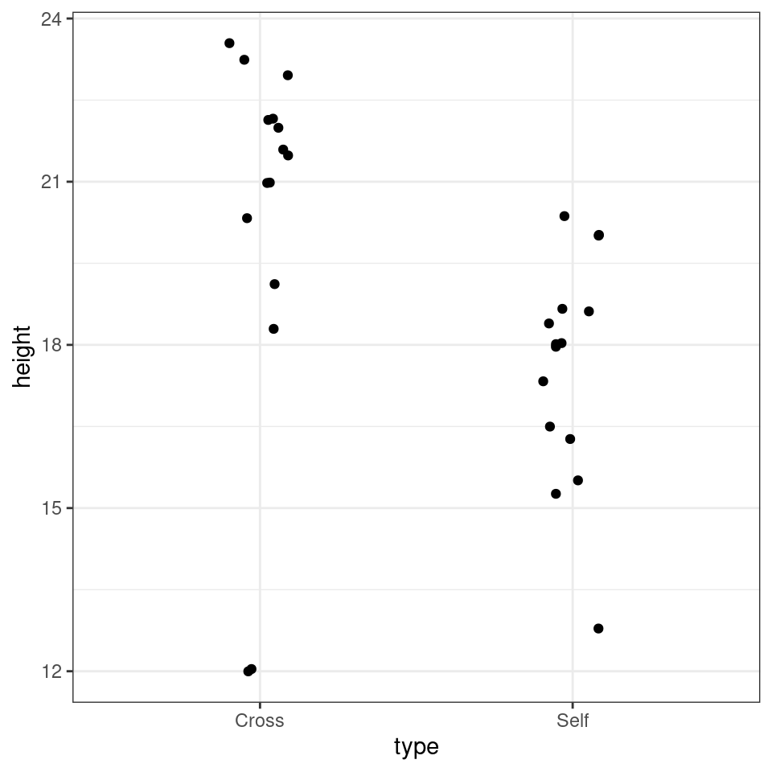

# (PART\*) Linear models {.unnumbered}

# Introduction to statistics


We have previously covered a lot of descriptive statistics. Whenever we summarized or described our data by calculating the mean, median, standard deviation, frequency/count, or distribution, we were performing descriptive statistics. These methods helped us understand our data better.

Building on this, we will develop our skills in inferential statistics. Inferential statistics allow us to make generalizations. For instance, we can take a descriptive statistic, such as the sample mean, and use it to say something about a population parameter (i.e., the population mean).

For example, we might measure the heights of some plants that have been outcrossed and inbred, summarize the data, and create figures to show an average difference in height (this is descriptive statistics). Then, we could use this data to estimate the general effect of outcrossing versus inbreeding on plant heights (this is inferential statistics).


## Darwin's maize data

Loss of genetic diversity is crucial in species conservation. Population declines due to overexploitation and habitat fragmentation lead to genetic diversity loss. Even populations restored through conservation efforts may suffer from reduced fitness due to inbreeding depression.

Charles Darwin wrote a book on this subject, *"The Effects of Cross and Self-Fertilisation in the Vegetable Kingdom."* In it, he describes producing seeds of maize (*Zea mays*) fertilized with pollen from the same individual or a different plant. The height of the resulting seedlings was measured as a proxy for their evolutionary fitness.

Darwin's **hypothesis** was that inbreeding reduced the fitness of the selfed plants. Today, we will use data from Darwin's original dataset to explore this hypothesis.


```{=html}
<a href="https://raw.githubusercontent.com/UEABIO/data-sci-v1/main/book/files/darwin.csv">
<button class="btn btn-success"><i class="fa fa-save"></i> Download Maize data as csv</button>
</a>
```


```r
library(tidyverse)

# read csv file darwin.csv and assign to object darwin
darwin <- read_csv("data/darwin.csv")
```


<div class="warning">
<p>Before you go any further - make sure your basic R project set up is
up to scratch. Do you know where the data file is saved? Have you got
separate subfolders set up within your project?</p>
<p>You should set up a script to put your work into - use this to write
instructions and store comments. Use the File &gt; New Script menu item
and select an R Script.</p>
</div>


## Activity 1: Carry out some basic exploratory data analysis

The first thing we should know by now is to always start by exploring our data. If you want to stretch yourself, see if you can perform a basic data check **without** prompts. 

<button id="displayTextunnamed-chunk-6" onclick="javascript:toggle('unnamed-chunk-6');">Show Solution</button>

<div id="toggleTextunnamed-chunk-6" style="display: none"><div class="panel panel-default"><div class="panel-heading panel-heading1"> Solution </div><div class="panel-body">

```r
# check the structure of the data
glimpse(darwin)

# check data is in a tidy format
head(darwin)

# check variable names
colnames(darwin)


# clean up column names

darwin <- janitor::clean_names(darwin)

# check for duplication
darwin %>% 
  duplicated() %>% 
  sum()

# check for typos - by looking at impossible values
darwin %>% 
  summarise(min=min(height, na.rm=TRUE), 
            max=max(height, na.rm=TRUE))

# check for typos by looking at distinct characters/values

darwin %>% 
  distinct(pair)

darwin %>% 
  distinct(type)

# missing values
darwin %>% 
  is.na() %>% 
  sum()

# quick summary

summary(darwin)


# check normality according to type

darwin %>% 
    group_split(type) %>% 
    map(~pull(.x, height) %>% 
            car::qqPlot())
# indicates two potential outliers in the outbred cross that cause deviation from a normal distribution
```
</div></div></div>

</details>

#### Visualisation

Now seems like a good time for our first data visualisation.


```r
darwin %>% 
  # set x axis to type (selfed or crossed), and y axis to continuous variable height
  ggplot(aes(x = type, y = height)) +
  # Add points to the plot
  geom_jitter(width = .1)
```



```r
# you could also substitute (or combine) other geoms including
# geom_boxplot()
# geom_violin()
# geom_histogram()
# Why not have a go and see what you can make?
```

The graph clearly shows that the average height of the 'crossed' plants is greater than that of the 'selfed' plants. But we need to investigate further to determine whether the signal (any apparent differences in mean values) is greater than the level of noise (variance within the different groups).

The variance appears to be roughly similar between the two groups, though by making a graph, we can now clearly see that in the crossed group, there are two *potential* outliers both with a value of 12.


#### Comparing groups

As we have seen previously we can use various tidy functions to determine the mean and standard deviations of our groups. 


```r
darwin %>% 
  # Group the data by 'type'
  group_by(type) %>% 
  # Calculate the mean and standard deviation of 'height' within each group
  summarise(mean = mean(height),
            sd = sd(height))
```

<div class="kable-table">

|type  |     mean|       sd|
|:-----|--------:|--------:|
|Cross | 20.19167| 3.616945|
|Self  | 17.57500| 2.051676|

</div>


<div class="info">
<p>You should (re)familiarise yourself with how (and why) we calculate
standard deviation.</p>
</div>

Summary statistics like these could be presented as figures or tables. We normally reserve tables for **very** simple sets of numbers, and this instance we could present either.


```r
# Create a new object 'darwin_summary' containing summary statistics
darwin_summary <- darwin %>% 
  group_by(type) %>% 
  summarise(mean = mean(height),
            sd = sd(height))

# Create a summary plot using ggplot
darwin_summary %>% 
  ggplot(aes(x = type, y = mean)) +
  # Add error bars representing the standard deviation
  geom_pointrange(aes(ymin = mean - sd, ymax = mean + sd)) +
  # Apply a black and white theme to the plot
  theme_bw()
```


Descriptive statistics and careful data checking are often skipped steps in the rush to answer the **big** questions. However, description is an essential part of early phase analysis. 

## Activity 2: Alternative summary descriptives

When faced with data that does not conform to a normal distribution, we might consider using alternative statistical measures instead of the mean and standard deviation. What might be a suitable alternative?


<button id="displayTextunnamed-chunk-11" onclick="javascript:toggle('unnamed-chunk-11');">Show Solution</button>

<div id="toggleTextunnamed-chunk-11" style="display: none"><div class="panel panel-default"><div class="panel-heading panel-heading1"> Solution </div><div class="panel-body">
When dealing with non-normally distributed data, boxplots are a useful tool for visualizing data distribution and identifying outliers. Reporting the interquartile range (IQR) instead of standard deviation provides a robust measure of variability, as it focuses on the middle 50% of the data and is less influenced by outliers. This approach helps ensure a more accurate representation of the spread in the data

```r
darwin %>% 
  group_by(type) %>% 
  summarise(median = median(height),
            iqr = IQR(height))

# Create a summary plot using ggplot
darwin %>% 
  ggplot(aes(x = type, y = height)) +
  # Add error bars representing the standard deviation
  geom_boxplot(outlier.shape = NA) +
  geom_jitter(width = .2) +
  # Apply a black and white theme to the plot
  theme_bw()
```

<div class="kable-table">

|type  | median|   iqr|
|:-----|------:|-----:|
|Cross |   21.5| 2.375|
|Self  |   18.0| 2.250|

</div></div></div></div>

## Estimation

In the section above we concentrated on description. But the hypothesis Darwin aimed to test was whether 'inbreeding reduced the fitness of the selfed plants'. To do this we will use the height of the plants as a proxy for fitness and explicitly address whether there is a **difference** in the mean heights of the plants between these two groups. 

Our goal is to: 

* Estimate the mean heights of the plants in these two groups

* Estimate the mean *difference* in heights between these two groups

* Quantify our *confidence* in these differences

### Standard error of the mean(s)

Remember standard deviation is a *descriptive* statistic - it measures the variance within our dataset - e.g. how closely do datapoints fit to the mean. However for *inferential* statistics we are more interested in our confidence in our estimation of the mean. This is where standard error comes in. 

$$
SE = \frac{\sigma}{\sqrt(n)}
$$

We can think of error as a standard deviation of the mean. The mean we have calculated is an estimate based on one sample of data. We would expect that if we sampled another 30 plants these would have a different sample mean. Standard error describes the variability we would expect among sample means if we repeated this experiment many times. So we can think of it as a measure of the confidence we have in our estimate of a **true population mean(s)**. 


```r
darwin %>% 
  group_by(type) %>% 
  summarise(mean=mean(height),
            sd=sd(height),
# add calculations for n and se for each group
            n = n(),
            se = sd/sqrt(n))
```

<div class="kable-table">

|type  |     mean|       sd|  n|        se|
|:-----|--------:|--------:|--:|---------:|
|Cross | 20.19167| 3.616945| 15| 0.9338912|
|Self  | 17.57500| 2.051676| 15| 0.5297405|

</div>

Here we have separately estimated the mean, and a measure of uncertainty for each mean - however this does not directly address our question about the mean *difference* between the groups.

#### Differences between groups

Darwin's data used match pairs - each pair shared one parent. So that in pair 1 the same parent plant was either 'selfed' or 'crossed' to produce offspring. This is a powerful approach to experimental design, as it means that we can look at the differences in heights across each of the 15 pairs of plants - rather than having to infer differences from two randomly derived groups. 

In order to calculate the differences in height between each pair we need to do some data wrangling with `tidyr::pivot_wider()` and calculations with `mutate`.

## Activity 3: Differences

Create a new column called difference with the height of the selfed plant in each pair subtracted from the crossed plant. 


```r
darwin_wide <- darwin %>% 
  # pivot/reshape the data from long to wide format
  pivot_wider(names_from = type, values_from = height) %>% 
  # Calculate the difference between 'Cross' and 'Self' heights for each pair
  mutate(difference = Cross - Self)
```


We now have the difference in height for each pair, we can use this to calculate the **mean difference** in heights between paired plants, and the amount of variance (as standard deviation)


```r
difference_summary <- darwin_wide %>% 
  summarise(mean=mean(difference),
            sd=sd(difference),
            n=n())

difference_summary
```

<div class="kable-table">

|     mean|       sd|  n|
|--------:|--------:|--:|
| 2.616667| 4.718047| 15|

</div>


<div class="warning">
<p>What we have just calculated is the average difference in height
between these groups of plants and the standard deviation of the
difference Moving forward we will be working a lot with estimating our
confidence in differences between groups</p>
</div>

### Standard error of the difference

Remember standard deviation is a *descriptive* statistic - it measures the variance within our dataset - e.g. how closely do datapoints fit to the mean. However for *inferential* statistics we are more interested in our confidence in our estimation of the mean. This is where standard error comes in. 

We can think of error as a standard deviation of the mean. The mean we have calculated is an estimate based on one sample of data. We would expect that if we sampled another 30 plants these would have a different sample mean. Standard error describes the variability we would expect among sample means if we repeated this experiment many times. So we can think of it as a measure of the confidence we have in our estimate of a **true population mean**. 

$$
SE = \frac{\sigma}{\sqrt(n)}
$$

As sample size increases the standard error should reduce - reflecting an increasing confidence in our estimate. 

We can calculate the standard error for our sample by applying this equation to our `difference_summary` object, can you complete this?

<button id="displayTextunnamed-chunk-16" onclick="javascript:toggle('unnamed-chunk-16');">Show Solution</button>

<div id="toggleTextunnamed-chunk-16" style="display: none"><div class="panel panel-default"><div class="panel-heading panel-heading1"> Solution </div><div class="panel-body">

```r
difference_summary %>% 
  mutate(se= sd/sqrt(n))
```

<div class="kable-table">

|     mean|       sd|  n|       se|
|--------:|--------:|--:|--------:|
| 2.616667| 4.718047| 15| 1.218195|

</div>
</div></div></div>

Our estimate of the mean is not really very useful without an accompanying measuring of *uncertainty* like the standard error, in fact estimates of averages or differences should **always** be accompanied by their measure of uncertainty. 

<div class="info">
<p>The standard error for the difference between two means is always
larger than the standard error of either mean. It quantifies
uncertainty. The uncertainty of the difference between two means is
greater than the uncertainty in either mean.</p>
</div>


## Activity 4: Communicate

With the information above, how would you present a short sentence describing the average different in height?


<button id="displayTextunnamed-chunk-18" onclick="javascript:toggle('unnamed-chunk-18');">Show Solution</button>

<div id="toggleTextunnamed-chunk-18" style="display: none"><div class="panel panel-default"><div class="panel-heading panel-heading1"> Solution </div><div class="panel-body">
*... the average difference in height was 2.62 ± 1.22 inches (mean ± SE).*</div></div></div>

## Uncertainty

With a mean and standard error of the difference in heights between inbred and crossed plants - how do we work out how much confidence we have in their being a difference between our **population means**? 

Standard error is a measure of uncertainty, the larger the standard error the more *noise* around our data and the more uncertainty we have. The smaller the standard error the more confidence we can have that our difference in means is *real*. 

* Null hypothesis - there is no difference in the mean height of self vs crossed plants

* Alternate hypothesis - inbreeding reduces the fitness of the selfed plants, observed as selfed plants on average being smaller than crossed plants


<div class="info">
<p>A statistical way of thinking about our inferences is in terms of
confidence around keeping or rejecting the null hypothesis. The
(alternate) hypothesis is simply one that contradicts the null.</p>
<p>When we decide whether we have enough confidence that a difference is
real (e.g. we could reject the null hypothesis), we cannot ever be 100%
certain that this isn’t a false positive (also known as a Type I error).
More on this later</p>
</div>

#### Normal distribution

As we should remember, the normal distribution is the bell-shaped curve. It is defined by two parameters:

* the mean

* the standard deviation

The mean determines where the centre/peak of the bell curve is, the standard deviation determines the width of the bell (how long the tails are). 

Large standard deviations produce wide bell curves, with short peaks. Small standard deviations produce narrow bell curves with tall peaks. 

The bell curve occurs frequently in nature, most circumstances where we can think of a continuous measure coming from a population e.g. human mass, penguin flipper lengths or plant heights. 

As a *probability* distribution, the area within the curve sums to the whole population (e.g. the probability that the curve contains every possible measurement is 1). Known proportions of the curve lie within certain distances from the centre e.g. 67.8% of observations should have values within one standard deviation of the mean. 95% of observations should have values within two standard deviations of the mean. This *idealized* normal distribution is presented below:


```r
# Create a sequence of 100 equally spaced numbers between -4 and 4
x <- seq(-4, 4, length = 100)

# Create a vector of values that represents the height of the probability distribution
# for each value in x using the standard normal distribution
y <- dnorm(x)

# Plot x and y as a scatterplot with connected lines (type = "l") and customize the plot
plot(x, y, type = "l", lwd = 2, axes = FALSE, xlab = "", ylab = "")

# Add an x-axis with custom labels
axis(1, at = -3:3, labels = c("-3s", "-2s", "-1s", "mean", "1s", "2s", "3s"))
```


How do we determine how likely it is to observe a difference of 2.62 inches in plant heights if the *true* difference between crossed and selfed plants is zero?

The **central limit theorem** helps us here. It states that if you take sufficiently large random samples from a population, the distribution of the sample means will be approximately normally distributed, even if the population itself is not. The standard error measures the variability around our sample mean, and we assume it follows a normal distribution (we'll revisit this assumption later).

If we center our bell curve on the mean estimate (2.62 inches), then about two-thirds of the area under the curve will be within ± 1.22 inches. 95% of it will be within ± 2 standard errors, and 99.8% will be within ± 3 standard errors.


Looking at this figure, we can ask: Where is zero on our normal distribution? If the true difference between our plant groups is zero, how surprising is it that we estimated a difference of 2.62 inches?

If zero was near the center of the bell curve, our observed mean wouldn't be surprising at all (**if the null hypothesis is true**). However, in this case, zero falls in the left-hand tail, more than two standard deviations from our estimated mean.

We can describe this in two ways:

* If we ran this experiment 100 times, over 95 of our experiments would estimate a mean difference greater than zero between our plant groups.
* This is usually the minimum threshold to *reject* a null hypothesis. The probability of estimating this mean difference, if the true mean difference was zero, is p < 0.05.

You may be familiar with a null hypothesis rejection threshold of $\alpha$ = 0.05. This is the lowest confidence level for passing a statistical test. If we require a stricter test with $\alpha$ = 0.001 or 99% confidence, we wouldn't have enough confidence to reject the null hypothesis (zero is within 3 standard deviations of our estimated mean).


### Confidence Intervals

Because ± 2 standard errors covers the central 95% of the area under the normal curve, we refer to this as our 95% confidence interval. We can calculate confidence intervals for any level, but commonly we refer to standard error (68% CI), 95% and 99%. 

We can work out the 95% confidence interval range of our estimated mean as follows:


```r
lowerCI <- 2.62-(2*1.22)

upperCI <- 2.62+(2*1.22)

lowerCI
upperCI
```

```
## [1] 0.18
## [1] 5.06
```

A common mistake it to state that we are 95% confident that the 'true' mean lies within our interval. But *technically* it refers to the fact that if we kept running this experiment again and again the intervals we calculate would capture the true mean in 95% of experiments. So really we are saying that we are confident we would capture the true mean in 95% of our experiments. 

How might we write this up?

<div class="info">
<p>The maize plants that have been cross pollinated were taller on
average than the self-pollinated plants, with a mean difference in
height of 2.62 [0.18, 5.06] inches (mean [95% CI]).</p>
</div>

> Note that because it is possible to generate multiple types of average and confidence interval, we clearly state them in our write up. The same would be true if you were presenting the standard error (± S.E.) or the standard deviation (± S.D.) or a median and interquartile range (median [± IQR]). 

The above is a good example of a simple but clear write-up because it clearly describes the *direction* of the difference, the *amount* and the *error* in our estimate. 


## Summary

Statistics is all about trying to interpret whether the signal (of a difference or trend) is stronger than the amount of noise (variability). In a sample the standard deviation is a strong choice for estimating this *within* a dataset. The standard deviation of the sampling distribution of the mean is known as the standard error. The standard error (of the mean) is a measure of the precision we have in our estimate of the mean. Thanks to the central limit theorem and normal distribution we can use the variability in our estimate to calculate confidence intervals, and decide whether our signal of an effect is strong enough to reject a null hypothesis (of no effect or no difference). 

Next time we will start working with linear models - this approach allows us to estimate means and intervals in a more sophisticated (and automated) way. 


