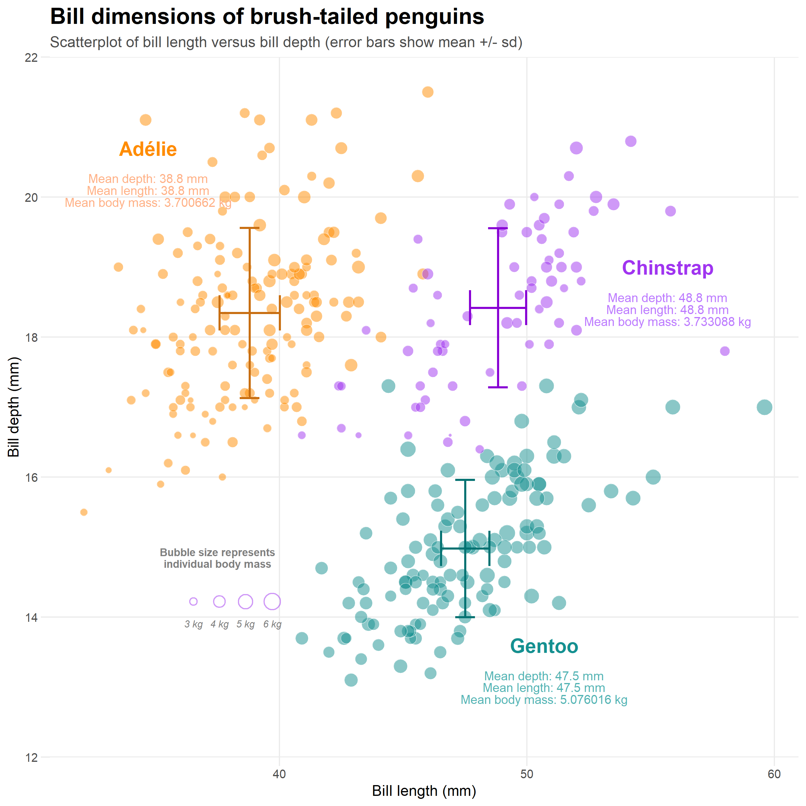
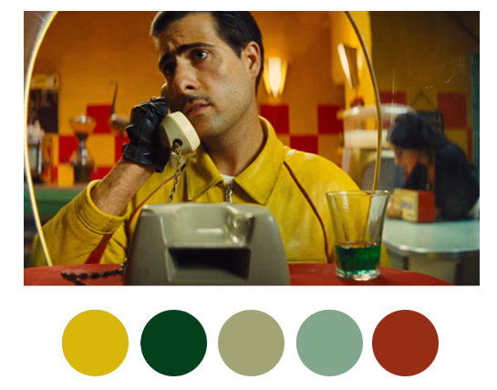
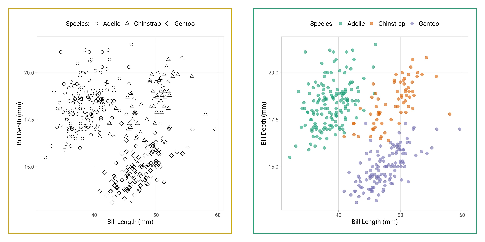

# ggplot {#sec-ggplot}

```{r, include = FALSE}
library(tidyverse)
library(here)
source("R/booktem_setup.R")
source("R/my_setup.R")
source("R/clean_penguins.R")


```

:::{.callout-important}

You need to be in your penguins R project. You will need the cleaned dataset to work with. 

If you set up a new script and run the function `source("scripts/01_import_penguins_data.R")` it will load the cleaned data into your workspace IF your script contains no errors

:::


## Intro to grammar


The `ggplot2` package is widely used and valued for its simple, consistent approach to making data visuals.

The 'grammar of graphics' relates to the different components of a plot that function like different parts of linguistic grammar. For example, all plots require axes, so the x and y axes form one part of the ‘language’ of a plot. Similarly, all plots have data represented between the axes, often as points, lines or bars. The visual way that the data is represented forms another component of the grammar of graphics. Furthermore, the colour, shape or size of points and lines can be used to encode additional information in the plot. This information is usually clarified in a key, or legend, which can also be considered part of this ‘grammar’.

The philosophy of ggplot is much better explained by the package author, Hadley Wickham (@R-ggplot2). For now, we just need to be aware that ggplots are constructed by specifying the different components that we want to display, based on underlying information in a data frame.

```{r ambitious-figure, eval=TRUE, echo=FALSE, out.width="100%",  fig.cap="An example of what we can produce in ggplot"}

```

## Building a plot

To start building the plot We are going to use the penguin data we have been working with previously. First we must specify the data frame that contains the relevant data for our plot. We can do this in two ways: 

1) Here we are ‘sending the penguins data set into the ggplot function’:

```{r, eval = F}
# Building a ggplot step by step ----
## Render a plot background ----
penguins |>  
  ggplot()
```

2) Here we are specifying the dataframe *within* the `ggplot()` function

The output is identical

```{r}
ggplot(data = penguins)
```

```{block, type = "info"}
Running this command will produce an empty grey panel. This is because we need to specify how different columns of the data frame should be represented in the plot.
```

### Aesthetics - `aes()`

We can call in different columns of data from any dataset based on their column names. Column names are given as ‘aesthetic’ elements to the ggplot function, and are wrapped in the aes() function.

Because we want a scatter plot, each point will have an x and a y coordinate. We want the x axis to represent flipper length ( x = flipper_length_mm ), and the y axis to represent the body mass ( y = body_mass_g ).

We give these specifications separated by a comma. Quotes are not required when giving variables within `aes()`.

```{block, type = "info"}
Those interested in why quotes aren’t required can read about [non-standard evaluation](https://edwinth.github.io/blog/nse/).
```


```{r}
## Set axes ----
penguins |>  
  ggplot(aes(x=flipper_length_mm, 
             y = body_mass_g))
```

So far we have the grid lines for our x and y axis. `ggplot()` knows the variables required for the plot, and thus the scale, but has no information about how to display the data points.

## Geometric representations - geom()

Given we want a scatter plot, we need to specify that the geometric representation of the data will be in point form, using geom_point(). [There are many geometric object types](https://ggplot2.tidyverse.org/reference/#geoms).

```{r img-objects-enviro, echo=FALSE, fig.cap="geom shapes"}

knitr::include_graphics("images/geoms.png")

```

Here we are adding a layer (hence the + sign) of points to the plot. We can think of this as similar to e.g. Adobe Photoshop which uses layers of images that can be reordered and modified individually. Because we add to plots layer by layer **the order** of your geoms may be important for your final aesthetic design. 

For ggplot, each layer will be added over the plot according to its position in the code. Below I first show the full breakdown of the components in a layer. Each layer requires information on

* data
* aesthetics
* geometric type
* any summary of the data
* position

```{r, eval = F}
## Add a geom ----
penguins |>  
  ggplot(aes(x=flipper_length_mm, 
             y = body_mass_g))+
  layer(                # layer inherits data and aesthetic arguments from previous
    geom="point",       # draw point objects
    stat="identity",    # each individual data point gets a geom (no summaries)
    position=position_identity()) # data points are not moved in any way e.g. we could specify jitter or dodge if we want to avoid busy overlapping data
```

This is quite a complicate way to write new layers - and it is more usual to see a simpler more compact approach

```{r}
penguins |>  
  ggplot(aes(x=flipper_length_mm, 
             y = body_mass_g))+
  geom_point() # geom_point function will always draw points, and unless specified otherwise the arguments for position and stat are both "identity".

```

Now we have the scatter plot! Each row (except for two rows of missing data) in the penguins data set now has an x coordinate, a y coordinate, and a designated geometric representation (point).

From this we can see that smaller penguins tend to have smaller flipper lengths.

### |>  and +

ggplot2, an early component of the tidyverse package, was written before the pipe was introduced. The + sign in ggplot2 functions in a similar way to the pipe in other functions in the tidyverse: by allowing code to be written from left to right.

### Colour

The colours of lines and points can be set directly using `colour="red"`, replacing “red” with a colour name. The colours of filled objects, like bars, can be set using `fill="red"`.

```{r}

penguins |>  
  ggplot(aes(x=flipper_length_mm, 
             y = body_mass_g))+
  geom_point(colour="red")


```

However the current plot could be more informative if colour was used to convey information about the species of each penguin.

In order to achieve this we need to use `aes()` again, and make the colour conditional upon a variable.

Here, the `aes()` function containing the relevant column name, is given within the `geom_point()` function.

:::{.callout-warning}

A common mistake is to get confused about when to use (or not use) `aes()`

If specifying a fixed aesthetic e.g. red for everything it DOES NOT go inside `aes()` instead specify e.g. colour = "red" or shape =21.

If you wish to modify an aethetic according to a variable in your data THEN it DOES go inside `aes()` e.g. `aes(colour = species)`

:::


```{r}

penguins |>  
  ggplot(aes(x=flipper_length_mm, 
             y = body_mass_g))+
  geom_point(aes(colour=species))


```

:::{.callout-info}
You may (or may not) have noticed that the grammar of ggplot (and tidyverse in general) accepts British/Americanization for spelling!!!
:::

With data visualisations we can start to gain insights into our data very quickly, we can see that the Gentoo penguins tend to be both larger and have longer flippers

:::{.callout-info}
Add carriage returns (new lines) after each |>  or + symbols.

In most cases, R is blind to white space and new lines, so this is simply to make our code more readable, and allow us to add readable comments.
:::

### More layers

We can see the relationship between body size and flipper length. But what if we want to model this relationship with a trend line? We can add another ‘layer’ to this plot, using a different geometric representation of the data. In this case a trend line, which is in fact a summary of the data rather than a representation of each point.

The `geom_smooth()` function draws a trend line through the data. The default behaviour is to draw a local regression line (curve) through the points, however these can be hard to interpret. We want to add a straight line based on a linear model (‘lm’) of the relationship between x and y. 


```{r}
## Add a second geom ----
penguins |>  
  ggplot(aes(x=flipper_length_mm, 
             y = body_mass_g))+
  geom_point(aes(colour=species))+
  geom_smooth(method="lm",    #add another layer of data representation.
              se=FALSE, # no error margins
              aes(colour=species)) # note layers inherit information from the top ggplot() function but not previous layers - if we want separate lines per species we need to either specify this again *or* move the color aesthetic to the top layer. 


```

In the example above we may notice that we are assigning colour to the same variable (species) in both geometric layers. This means we have the option to simplify our code. Aesthetics set in the "top layer" of `ggplot()` are inherited by all subsequent layers.

```{r}
penguins |>  
  ggplot(aes(x=flipper_length_mm, 
             y = body_mass_g,
             colour=species))+ ### now colour is set here it will be inherited by ALL layers
  geom_point()+
  geom_smooth(method="lm",    #add another layer of data representation.
              se=FALSE)
```


:::{.callout-tip}
Note - that the trend line is blocking out certain points, because it is the ‘top layer’ of the plot. The geom layers that appear early in the command are drawn first, and can be obscured by the geom layers that come after them.

What happens if you switch the order of the geom_point() and geom_smooth()
functions above? What do you notice about the trend line?
:::

## More plots

In `ggplot2`, the visual elements used to represent data—known as geometries or `geoms`—are the building blocks of any plot. Each geometry serves a specific purpose, helping to communicate different types of information. Choosing the right geometry is essential for creating a clear and impactful visualization.

This section introduces some of the most commonly used geometries in ggplot2, such as scatterplots, bar plots, box plots, and histograms. These core geometries cover many typical visualization needs in biological research, from showing relationships between variables to comparing counts across categories.

However, it’s important to note that ggplot2 offers a wide array of geometries—far more than we can cover here. Beyond the basics, there are specialized geometries for high-density data, spatial data, networks, and more, each tailored to reveal different insights. By understanding these foundational geometries, you’ll be well-prepared to explore and experiment with the many other geoms that ggplot2 has to offer as your visualization needs grow.

### Jitter

`geom_jitter` is used in `ggplot2` to add random noise, or "jitter," to the position of points, preventing them from overlapping in cases where values are identical or closely spaced. 

This technique is especially useful in scatterplots with discrete or categorical data, where it helps reveal the true distribution of points.

Compare these two plots:

```{r, echo = FALSE}

p2 <- ggplot(data = penguins, aes(x = species, 
                                  y = culmen_length_mm)) +
  geom_jitter(width = .2)

p1 <- ggplot(data = penguins, aes(x = species, 
                                  y = culmen_length_mm)) +
  geom_point()

library(patchwork)

p1/p2

```

```{r, eval = FALSE}

## geom point

ggplot(data = penguins, aes(x = species, 
                            y = culmen_length_mm)) +
  geom_point() 

## More geoms ----
ggplot(data = penguins, aes(x = species, 
                            y = culmen_length_mm)) +
  geom_jitter(width = .2) #

```


### Beeswarm

In `geom_beeswarm`, points are arranged to reflect the density of data within each category by "swarming" them horizontally. Higher densities of points cause the swarm to spread out further along the horizontal axis, creating a shape that visually resembles the distribution of the data. This arrangement allows the viewer to understand the concentration and spread of values in each category without overlapping points, making it a clear and informative alternative to box plots or jittered points, especially for datasets with a large number of identical or similar values.

```{r}
library(ggbeeswarm)

## More geoms ----
ggplot(data = penguins, aes(x = species, 
                            y = culmen_length_mm)) +
  geom_beeswarm() # 

```

### Boxplots

Box plots, or ‘box & whisker plots’ are another essential tool for data analysis. Box plots summarize the distribution of a set of values by displaying the minimum and maximum values, the median (i.e. middle-ranked value), and the range of the middle 50% of values (inter-quartile range).
The whisker line extending above and below the IQR box define Q3 + (1.5 x IQR), and Q1 - (1.5 x IQR) respectively. You can watch a short video to learn more about box plots [here](https://www.youtube.com/watch?v=fHLhBnmwUM0).

```{r, eval=TRUE, echo=FALSE, out.width="80%"}
knitr::include_graphics("images/boxplot.png")
```

To create a box plot from our data we use (no prizes here) `geom_boxplot()`

```{r}
ggplot(data = penguins, aes(x = species, 
                            y = culmen_length_mm)) +
  geom_boxplot()

```

```{block, type = "try"}
Note that when specifying colour variables using `aes()` some geometric shapes support an internal colour "fill" and an external colour "colour". Try changing the aes fill for colour in the code above, and note what happens. 

```

The points indicate outlier values [i.e., those greater than Q3 + (1.5 x IQR)].

### Combine geom layers

We can overlay a boxplot on the scatter plot for the entire dataset, to fully communicate both the raw and summary data. Here we reduce the width of the jitter points slightly.

```{r}
ggplot(data = penguins, aes(x = species, 
                            y = culmen_length_mm)) +
  geom_boxplot(outlier.shape=NA)+
  geom_jitter(width=0.2)

```

Q. Why have I now included the argument outlier.shape = NA?

```{r, echo = F}
opts_p <- c(
   "To change the color of the outliers in geom_boxplot",
    "To increase the size of the points displayed by geom_point",
   answer =  "To prevent the box plot from displaying outliers, since geom_point already shows all individual data points."
)
```

`r longmcq(opts_p)`

#### Grouped boxplot

Grouped boxplots are a powerful way to compare distributions across multiple categories within a dataset. In the example below, we use the penguins dataset to visualize the culmen length of different penguin species, further grouped by sex. By setting fill = sex, each species is split into two colored boxplots (one for each sex), making it easy to compare culmen length across both species and sex groups. This approach reveals variations within and between categories, providing a clear visual summary of the data's central tendency and spread for each subgroup.

```{r}
penguins |> 
  drop_na(sex) |> 
ggplot(aes(x = species, 
           y = culmen_length_mm)) +
  geom_boxplot(aes(fill = sex), 
              width = 0.5) # change width of boxplot


```

### Violin plots

Violin plots display the distribution of a dataset and can be created by calling geom_violin(). They are so-called because the shape they make sometimes looks something like a violin. They are essentially sideways, mirrored density plots. Note that the below code is identical to the code used to draw the boxplots above, except for the call to `geom_violin()` rather than `geom_boxplot()`.


```{r}
penguins |> 
  drop_na(sex) |> 
ggplot(aes(x = species, 
           y = culmen_length_mm)) +
  geom_violin(aes(fill = sex),
              width = 0.5)

```

### Line Plots

Line plots are ideal for visualizing trends over time, helping us see how a variable changes across different periods. In this example, we use a line plot to show the number of penguin observations for each species across several years. By mapping species to color, we can track each species individually, making it easy to compare trends across groups. The line plot provides a clear and continuous view of how the number of penguins fluctuates over time, revealing patterns or shifts that might be linked to environmental or population changes.

```{r}

penguin_summary <- penguins |> 
    group_by(species, year) |> 
    summarise(n = n())

penguin_summary |>
    ggplot(aes(x = year, 
               y = n,
               colour = species))+
    geom_line()

```


### Bar plots

Bar plots are useful for visualizing counts or frequencies of categorical data, providing an easy way to compare categories at a glance. In this example, we use a bar plot to display the number of observations for each penguin species in the dataset. By setting species as the x-axis, each bar represents a species, with the height showing the count of observations. This type of plot is effective for summarizing categorical data and identifying which categories are more or less common.

```{r}
penguins |> 
ggplot(aes(x = species)) +
  geom_bar()

```

:::{.callout-tip}
If your dataset already has the counts that you want to plot, you can set stat="identity" inside of geom_bar() to use that number instead of counting rows.
:::

### Mean and error barplots

Mean and error bar plots are excellent for displaying summary statistics, such as the mean and standard deviation, across categories. In this example, we create a bar plot showing the average culmen length for each penguin species, with error bars representing one standard deviation above and below the mean. By setting stat = "identity" in geom_bar(), each bar reflects the calculated mean instead of a count. The addition of geom_errorbar() provides a visual cue about the variability within each species, making it easy to assess the spread around the mean. This type of plot is useful for quickly conveying both the central tendency and the variation in your data across groups.

```{r}

penguin_summary <- penguins |> 
    group_by(species) |> 
    summarise(mean = mean(culmen_length_mm, na.rm =T),
              sd = sd(culmen_length_mm, na.rm=T))

penguin_summary |>
    ggplot(aes(x = species, 
               y = mean))+
    geom_bar(stat = "identity")+
    geom_errorbar(aes(ymin = mean-sd,
                  ymax = mean+sd))


```


### Histogram plots

A histogram is a type of bar plot used to display the distribution of a continuous variable by grouping data into intervals, or "bins," along the x-axis. Each bin represents a range of values, and the height of the bar shows how many observations fall within that range, providing a visual summary of the frequency distribution of the data.

In `ggplot2`, `geom_histogram()` automatically divides the x-axis into 30 bins and counts the observations in each bin, so the y-axis does not need to be specified. By default, you’ll see a message suggesting you "Pick a better value with binwidth." You can refine your histogram by specifying either the number of bins (e.g., `bins = 20`) or the width of each bin (e.g., `binwidth = 5`) as arguments in `geom_histogram()` to better represent the data’s distribution.

```{r}
penguins |>  
    ggplot(aes(x=culmen_length_mm, 
               fill=species))+
    geom_histogram(bins=50)
```

The layer system makes it easy to create new types of plots by adapting existing recipes. For example, rather than creating a histogram, we can create a smoothed density plot by calling geom_density() rather than geom_histogram(). The rest of the code remains identical.


### Density plots

Unlike histograms, which show raw counts or frequencies, density plots normalize the data so that the total area under each curve sums to 1. This allows density plots to represent the relative distribution of data, regardless of sample size, and makes it easier to compare distributions across groups.

In the example below, each penguin species' culmen length distribution is displayed as a density curve, with each curve’s area summing to 1. This is particularly useful when comparing groups with **different sample sizes**, as the density plot shows the relative shape and spread of each group rather than absolute counts, providing a clearer view of patterns in the data.

```{r}
penguins |> 
    ggplot(aes(x=culmen_length_mm, 
               fill=species))+
    geom_density(alpha = .75)

#Because the density plots are overlapping, we set alpha = 0.75 to make the geoms 75% transparent.

```

:::{.callout-important}

alpha is a very useful argument - it is used to alter the transparency of a geom, it can be used so that overlapping geoms can still be viewed clearly, or as a way to emphasise some geoms over others. 

It isn't generally advisable to use it within aes(), rather set it deliberately and manually.

:::

### Key takeaways

- Choosing the appropriate geom is essential to convey the right message with your data.

- ggplot2’s layering system allows you to add depth to a plot by combining geoms.

- Experimenting with different geoms for the same dataset can reveal new insights and highlight patterns effectively.

Think about the story you want your data to tell and select the geometry that communicates it most clearly.


## Labels and themes

### Labels

In ggplot2, labels and themes play a crucial role in making plots clear, informative, and visually appealing. Labels help viewers understand the data by adding context, such as titles, axis labels, and captions, while themes control the overall look and feel of the plot, including fonts, background colors, and gridlines. Together, they ensure your plots are easy to interpret and publication-ready.

Here’s a basic guide on how to use labels and themes to refine your ggplot2 plots.

#### Adding Labels with labs()

The `labs()` function allows you to add and customize various labels in your plot, including:

- Title: A main heading that summarizes the plot’s purpose.

- Axis Labels: Descriptive labels for the x- and y-axes.

- Caption: An optional caption to provide additional context or credit.

- Legend Title: A title for the legend if you’re using color, shape, or fill aesthetics.

```{r}

penguins |>  
  ggplot(aes(x=flipper_length_mm, 
             y = body_mass_g,
             colour=species))+ ### now colour is set here it will be inherited by ALL layers
  geom_point()+
  geom_smooth(method="lm",    #add another layer of data representation.
              se=FALSE)+
  
    labs(
    title = "Scatterplot of flipper length against body mass",
    subtitle = "Adelie, Chinstrap and Gentoo Penguins at the Palmer station",
    x = "Flipper length (mm)",
    y = "Body mass (g)",
    caption = "Source: Data were collected and made available by Dr. Kristen Gorman and the Palmer Station, Antarctica LTER, a member of the Long Term Ecological Research Network."
  )

```

### Themes

Themes control the style of your plot, including font size, background color, gridline style, and legend position. ggplot2 provides several built-in themes to start with, such as:

- `theme_minimal()`: A clean, minimalist theme without background color or borders.

- `theme_classic()`: A traditional theme with a simple, white background.

- `theme_light()`: A light theme with gray gridlines for subtle 
guidance.

You can apply a theme by adding it to your plot, and you can customize individual elements within the theme to match your publication style.

Example: Applying a Theme

```{r}
penguins |>  
  ggplot(aes(x=flipper_length_mm, 
             y = body_mass_g,
             colour=species))+ ### now colour is set here it will be inherited by ALL layers
  geom_point()+
  geom_smooth(method="lm",    #add another layer of data representation.
              se=FALSE)+
  
    labs(
    title = "Scatterplot of flipper length against body mass",
    subtitle = "Adelie, Chinstrap and Gentoo Penguins at the Palmer station",
    x = "Flipper length (mm)",
    y = "Body mass (g)",
    caption = "Source: Data were collected and made available by Dr. Kristen Gorman and the Palmer Station, Antarctica LTER, a member of the Long Term Ecological Research Network."
  ) +
  theme_minimal() +
  theme(
    plot.title = element_text(hjust = 0.5, size = 14, face = "bold"),
    axis.title = element_text(size = 12),
    axis.text = element_text(size = 10),
    legend.position = "top"
  )

```

In this example, we apply `theme_minimal()` for a clean look and then customize specific elements:

Center-align the title (`hjust = 0.5`), set the title size to `14`, and make it bold.

Adjust axis title size to 12 and axis text size to 10 for readability.

Put axis legend at the top of the figure


### Task: Take any plot you have made so far and improve it by refining the labels and theme to make it look better


# Scales and Ordering

## Scales

ggplot will automatically pick the scale for each axis, and the type of coordinate space. Most plots are in Cartesian (linear X vs linear Y) coordinate space.

You might have observed that depending on how your data is distributed and the portion of the plot visible, the axis values can vary. Sometimes, we prefer to keep these values consistent. To achieve this, we've already used functions to control axis scaling in previous sections of this paper – specifically, the "scale_*" functions.

Now, we'll use `scale_x_continuous()` and `scale_y_continuous()` for setting our desired values on the axes. The key parameters in both functions are "limits" (defined as `limits = c(value, value)`) and "breaks" (which represent the tick marks, specified as "breaks = value:value"). It's important to note that "limits" comprise only two values (the minimum and maximum), while "breaks" consists of a range of values (for instance, from 0 to 100).

For this plot, let’s say we want the x and y origin to be set at 0. To do this we can add in `xlim()` and `ylim()` functions, which define the limits of the axes:

```{r}
penguins |>  
  ggplot(aes(x=flipper_length_mm, 
             y = body_mass_g,
             colour=species))+ ### now colour is set here it will be inherited by ALL layers
  geom_point()+
  geom_smooth(method="lm",    #add another layer of data representation.
              se=FALSE)+
  scale_x_continuous(limits = c(0,240))+
  scale_y_continuous(limits = c(0,7000), breaks = c(0, 
                                                   987,
                                                   2123,
                                                   3456,
                                                   3999,
                                                   5000,
                                                   6000,
                                                   7000)) # manually set breakpoints

```


### Transforming scales

#### When to Use Transformed Scales and How to Present Them Clearly

Transformed scales, like log or square root scales, are helpful for visualizing data that spans a wide range of values or grows non-linearly.

For example, exponential growth: Log scales are ideal for displaying data with exponential growth patterns, such as bacterial populations, or viral spread rates. A log scale allows us to see early growth patterns and later stages on the same axis.

:::{.callout-warning}
While transformed scales can improve interpretability, they can also be misleading if not communicated clearly. Viewers may interpret values linearly without realizing they’re on a log or other transformed scale. Always include:

Axis Labels: Indicate the transformation used (e.g., "Log-Scaled Bacterial Count" or "Square Root of Population").

Legend or Caption: Explain why a transformation was applied and how it affects data interpretation.

Clear communication helps ensure that readers interpret the transformed data accurately and understand why it enhances the visualization.
:::


In this example we take some bacterial plates with colony forming units (CFU) grown on them. Looking at number of colonies as a measure of the frequency of antibiotic resistance.

```{r, include = FALSE}
LData <- read_csv("files/LD-assay data.csv", na = "-")

```

```{r, eval = TRUE, echo = FALSE}
downloadthis::download_link(
  link = "https://raw.githubusercontent.com/UEABIO/physalia-intro-stats/refs/heads/2025/files/LD-assay%20data.csv",
  button_label = "Download LD bacteria data as csv",
  button_type = "success",
  has_icon = TRUE,
  icon = "fa fa-save",
  self_contained = FALSE
)
```


```{r, eval = FALSE}

LData <- read_csv("data/LD-assay data.csv", na = "-")

```

```{r}

# Data tidying
LData_long <- LData |> 
  pivot_longer(cols = WT:`Mut H`) 

```


#### Linear scale

When we first make this plot it is difficult to see the scale of difference between WT and MutS strains, because the difference between them and the other two strains is so big. However because bacteria grow exponentially - it might make more sense to compare the differences on a log scale (the inverse of exponential growth):


```{r}

# Data visualisation
bacteria_plot <- LData_long |> 
  ggplot(aes(x = name,
             y = value+1))+
  geom_boxplot(width = .1,
               position = position_nudge(x= .2),
               outlier.shape = NA,
               fill = "lightblue")+
  geom_beeswarm(shape = 21,
                fill = "lightblue",
                colour = "black",
                cex = .5)+
  theme_minimal()+
  labs(x = "Bacterial Strain + plasmid pRB318",
       y = "Colony Forming Units+1")

bacteria_plot
```

#### Log scale

A log scale is very effective for visualizing data that grows exponentially, such as population increases or certain biological processes, as it allows both small and large values to be displayed clearly on the same axis. In a log scale, each step represents a multiplicative increase (e.g., by 10x), making exponential growth patterns easier to interpret.

In ggplot2, you can apply a log scale easily with `scale_x_log10()` or `scale_y_log10()`, which are shorthand for setting `trans = "log10"` in `scale_x_continuous()` or `scale_y_continuous()`. For a natural log scale (base 𝑒), you can use `scale_x_continuous(trans = log_trans(base = exp(1)))` or `scale_y_continuous(trans = log_trans(base = exp(1)))`  .

When we apply this to our data - it is much clearer that there are differences in the frequency of antibiotic mutants in the MutS strain compared to WT.

```{r}

# Data visualisation
bacteria_plot+
  scale_y_log10() +
  labs(x = "Bacterial Strain + plasmid pRB318",
       y = "Log10 Colony Forming Units+1")

```

### Pretty scales

The `scales` package provides additional tools to customize log scales, letting you format labels as standard numbers instead of scientific notation, which improves readability, especially for general audiences.

```{r}
library(scales)

# Data visualisation
bacteria_plot+
  scale_y_log10(labels = scales::label_log()) +
  labs(x = "Bacterial Strain + plasmid pRB318",
       y = "Log10 Colony Forming Units+1")

```

You can use use the argument `cut_si()` for SI labels:

```{r}

penguins |>  
  ggplot(aes(x=flipper_length_mm, 
             y = body_mass_g,
             colour=species))+ ### now colour is set here it will be inherited by ALL layers
  geom_point()+
  geom_smooth(method="lm",    #add another layer of data representation.
              se=FALSE)+
  scale_x_continuous(labels = label_number(scale_cut = cut_si("mm")))+
  scale_y_continuous(labels = label_number(scale_cut = cut_si("g")))


```


## Axis ordering

Axis ordering plays a crucial role in helping viewers interpret data quickly and accurately. Proper ordering, whether alphabetical, numerical, or by a specific criterion (like size or frequency), creates a logical flow that guides the viewer’s eye and reveals patterns that might otherwise be missed. For example, ordering categories by value can emphasize trends, such as showing which groups have the highest or lowest measurements, while random or inconsistent ordering can make comparisons confusing and obscure key insights. Thoughtful axis ordering improves readability, enhances pattern recognition, and ensures that the data tells a clear, compelling story.

By default R will order categories along the axis in alphabetical order: 

```{r}
penguins |> 
ggplot(aes(x = species)) +
  geom_bar()

```
We can improve this by using `factors` either setting orders manually:

```{r}
penguins |> 
  mutate(species = factor(species, levels = c("Adelie", "Gentoo", "Chinstrap"))) |> 
  ggplot(aes(x = species)) +
  geom_bar()
```

Or by using features in the `forcats` package such as `forcats::fct_infreq()` we can automate ordering by frequency

```{r}
penguins |> 
  mutate(species = forcats::fct_infreq(species)) |> 
  ggplot(aes(x = species)) +
  geom_bar()
```


# Facets, multiple plots, marginal plots

Adding combinations of different aesthetics allows you to layer more information onto a 2D plot, sometimes though things will just become too busy. At the point where it becomes difficult to see the trends or differences in your plot then we want to break up a single plot into sub-plots; this is called ‘faceting’. Facets are commonly used when there is too much data to display clearly in a single plot. We will revisit faceting below, however for now, let’s try to facet the plot according to sex.

To do this we use the tilde symbol ‘~’ to indicate the column name that will form each facet.

## Facetting

```{r}
penguins |> 
  drop_na(sex) |> 
  ggplot(aes(x=flipper_length_mm, 
             y = body_mass_g,
             colour=species))+ 
  geom_point()+
  geom_smooth(method="lm",    
              se=FALSE)+
  scale_color_brewer(palette="Set1")+
  facet_wrap(~sex)
```

## Patchwork

There are many times you might want to combine separate figures into multi-panel plots. Probably the easiest way to do this is with the `patchwork` package.

```{r}
library(patchwork)

p1 <- penguins |> 
  ggplot(aes(x=flipper_length_mm, 
             y = culmen_length_mm))+
  geom_point(aes(colour=species))

p2 <- penguins |> 
  ggplot(aes(x=culmen_depth_mm, 
             y = culmen_length_mm))+
  geom_point(aes(colour=species))


p3 <- penguins |>     
     drop_na(sex) |> 
     ggplot(aes(x=species, 
                fill = sex)) + 
    geom_bar(width = .8,
             position = position_dodge(width = .85))

 (p1+p2)/p3+
  plot_layout(guides = "collect") 
```

## Marginal plots

Marginal plots are a great addition to scatterplots, as they display the distributions of each variable along the x- and y-axes using histograms, density plots, or box plots. By adding these marginal plots, you get a deeper understanding of each variable’s spread, skewness, or central tendency, while also seeing how the two variables relate to each other in the main scatterplot. This dual perspective is especially useful for identifying patterns, clusters, or outliers that may not be immediately obvious in the scatterplot alone. Marginal plots provide a quick and efficient way to enrich your data visualization with extra context about each variable's distribution.

```{r}

# density plot of thorax length by treatment
marginal_1 <- penguins |>  
  ggplot()+
  geom_density(aes(x = flipper_length_mm, fill = species),
               alpha = 0.5)+
  theme_void()+
  theme(legend.position = "none")

# density plot of longevity by treatment
marginal_2 <- penguins |>  
  ggplot()+
  geom_density(aes(x = body_mass_g, fill = species),
               alpha = 0.5)+
  theme_void()+
  theme(legend.position = "none")+
  coord_flip()


scatterplot <- penguins |>  
  ggplot(aes(x=flipper_length_mm, 
             y = body_mass_g,
             colour=species))+ ### now colour is set here it will be inherited by ALL layers
  geom_point()+
  geom_smooth(method="lm",    #add another layer of data representation.
              se=FALSE)+
  theme(legend.position = "bottom")

# Layout allows us to have total customisation over the position of our plots

layout <- "
AAA#
BBBC
BBBC
BBBC"


marginal_1+scatterplot+marginal_2 +plot_layout(design = layout)

```

# Colour and Accessibility in Biological Visualisations

There are two main differences when it comes to colors in `ggplot2`. Both arguments, color and fill, can be specified as single colour or assigned to variables.

As you have already seen in this tutorial, variables that are inside the aesthetics are encoded by variables and those that are outside are properties that are unrelated to the variables.

```{r}
penguins |> 
    ggplot(aes(x=culmen_length_mm))+
    geom_histogram(bins=50, 
                   aes(y=..density..,
                       fill=species), 
                   position = "identity",
                   colour="black")

```

### Choosing and using colour palettes

You can specify what colours you want to assign to variables in a number of different ways. 

In ggplot2, colors that are assigned to variables are modified via the scale_color_* and the scale_fill_* functions. In order to use color with your data, most importantly you need to know if you are dealing with a categorical or continuous variable. The color palette should be chosen depending on type of the variable:

* **sequential or diverging** color palettes being used for continuous variables 

* **qualitative** color palettes for (unordered) categorical variables:

```{r, eval=TRUE, echo=FALSE, out.width="80%"}
knitr::include_graphics("images/palette.png")
```

You can pick your own sets of colours and assign them to a categorical variable. The number of specified colours **has** to match the number of categories. You can use a wide number of preset colour [names](https://www.datanovia.com/en/blog/awesome-list-of-657-r-color-names/) or you can use [hexadecimals](https://www.datanovia.com/en/blog/awesome-list-of-hexadecimal-colors-you-should-have/). 


```{r}
## Custom colours ----

pal <- c(
  "Adelie" = "#FF8C00", 
  "Chinstrap" = "#A034F0", 
  "Gentoo" = "#159090")

penguins |> 
  ggplot(aes(x=flipper_length_mm, 
             y = body_mass_g))+
  geom_point(aes(colour=species))+
  scale_color_manual(values=pal)+
  theme_minimal()

```

You can also use a range of inbuilt colour palettes: 

```{r}
penguins |> 
  ggplot(aes(x=flipper_length_mm, 
             y = body_mass_g))+
  geom_point(aes(colour=species))+
  scale_color_brewer(palette="Set1")+
  theme_minimal()

```


:::{.callout-info}
You can explore all schemes available with the command `RColorBrewer::display.brewer.all()`
:::

There are also many, many extensions that provide additional colour palettes. Some of my favourite packages include [ggsci](https://cran.r-project.org/web/packages/ggsci/vignettes/ggsci.html) and [wesanderson](https://github.com/karthik/wesanderson)

```{r, eval=TRUE, echo=FALSE, out.width="80%"}

```

### Redundant aesthetics

Specifications made using `aes()` are inherited from the top layer of a ggplot by default. This means that if you set an aesthetic mapping at the beginning of your ggplot, it will apply to all subsequent layers *unless you explicitly override it in a specific layer*. This inheritance simplifies the process of maintaining consistent aesthetics throughout your plot.

```{r}
penguins |> 
  ggplot(aes(x=flipper_length_mm, 
             y = body_mass_g))+
  geom_point(aes(colour=species))+
  geom_smooth(aes(colour = species), # both geoms use aes(colour = species)
              method = "lm", se = FALSE) +
  scale_color_brewer(palette="Set1")+
  theme_minimal()

```

```{r}
penguins |> 
  ggplot(aes(x=flipper_length_mm, 
             y = body_mass_g,
             colour = species))+ # this can be set at the ggplot layer
  geom_point()+
  geom_smooth(method = "lm", se  = FALSE) +
  scale_color_brewer(palette="Set1")+
  theme_minimal()

```

### Accessible colours

It's very easy to get carried away with colour palettes, but you should remember at all times that your figures must be accessible. One way to check how accessible your figures are is to use a colour blindness checker [colorBlindness](https://cran.r-project.org/web/packages/colorBlindness/vignettes/colorBlindness.html)

```{r}
## Check accessibility ----

library(colorBlindness)
colorBlindness::cvdPlot() # will automatically run on the last plot you made

```


#### Guides to visual accessibility 

Using colours to tell categories apart can be useful, but as we can see in the example above, you should choose carefully. Other aesthetics which you can access in your geoms include `shape`, and `size` - you can combine these in complimentary ways to enhance the accessibility of your plots. Here is a hierarchy of "interpretability" for different types of data 

```{r, eval=TRUE, echo=FALSE, out.width="80%"}
knitr::include_graphics("images/list.png")

```


```{r, eval=TRUE, echo=FALSE, out.width="80%"}


```


## Add labels to plots

Adding labels to plots enhances accessibility by ensuring that all viewers, including those with visual impairments or cognitive challenges, can understand the data clearly. Labels on axes, titles, and legends provide essential context, helping viewers interpret what each axis represents and what the data points mean. Clear, descriptive labels reduce reliance on color alone, which benefits colorblind viewers, and minimize ambiguity by directly guiding the viewer’s attention to important elements. Accessible labeling not only makes plots more inclusive but also improves overall readability.

### Geom text path

```{r}
library(geomtextpath)

penguins |> 
  ggplot(aes(x=flipper_length_mm, 
             y = body_mass_g,
             colour = species))+ # this can be set at the ggplot layer
  geom_point(alpha = .4)+
  geomtextpath::geom_labelsmooth(aes(label = species),
                                  vjust = -.5,
                                method = "lm", se  = FALSE) +
  scale_color_brewer(palette="Set1")+
  theme_minimal()+
  theme(legend.position = "none")


```

### Geom text

```{r}
library(ggtext)

penguin_end <-tibble(species = unique(penguins$species), 
       flipper_length_mm = c(215, 233, 220),
       body_mass_g = c(4500, 6000, 4200))
  
  
penguins |> 
  ggplot(aes(x=flipper_length_mm, 
             y = body_mass_g,
             colour = species))+ # this can be set at the ggplot layer
  geom_point(alpha = .4)+
  geom_smooth(method = "lm", se  = FALSE) +
  geom_text(data = penguin_end,
             aes(label = species),
            size = 8)+
  scale_color_brewer(palette="Set1")+
  theme_minimal()+
  theme(legend.position = "none")+
  scale_x_continuous(limits = c(160,250))


```

## Add labels to bars

Adding labels to bar plots directly on the bars (showing values or percentages) makes it easy for viewers to quickly interpret the data without needing to estimate values from the axis. This is especially helpful when exact values are important, as it removes guesswork and reduces the cognitive load for the viewer. Labels also enhance clarity when bar heights are close in value, providing precise information that might otherwise be missed or misinterpreted. Overall, labels improve the bar plot’s readability, accuracy, and impact, ensuring viewers can understand key insights at a glance.

```{r}

penguins |> 
ggplot(aes(x = species)) +
  geom_bar()


```

Compare the difference between the plot above and below:

```{r}

penguins_perc <- penguins |> 
    group_by(species) |> 
    summarise(n = n())  |> 
    mutate(percentage = paste0(round((n / sum(n)) * 100, 2),"%"))

penguins |> 
  mutate(species = fct_infreq(species)) |> 
ggplot(aes(x = species)) +
  geom_bar()+
  geom_label(data = penguins_perc,
             aes(x = species,
                 y = n,
                 label = percentage))+
  coord_flip()

```


# Activity: Replicate this figure

How close can you get to replicating the figure below?

```{r, echo = FALSE}


pal <- c("#FF8C00", "#A034F0", "#159090")

penguins |> 
  ggplot(aes(x = species,
             y = body_mass_g,
             fill = species,
             colour = species))+
  geom_violin(alpha = 0.2)+
  geom_boxplot(width = 0.4,
               alpha = 0.6)+
  scale_fill_manual(values = pal)+
  scale_colour_manual(values = pal)+
  theme_classic()+
  theme(legend.position = "none")+
    labs(
    x = "",
    y = "Body mass (g)",
    title = "Body mass of brush-tailed penguins",
    subtitle = "Box and violin plot of body mass by species")

```

`r hide("Solution")`

```{r, eval = FALSE}


pal <- c("#FF8C00", "#A034F0", "#159090")

penguins |> 
  ggplot(aes(x = species,
             y = body_mass_g,
             fill = species,
             colour = species))+
  geom_violin(alpha = 0.2)+
  geom_boxplot(width = 0.4,
               alpha = 0.6)+
  scale_fill_manual(values = pal)+
  scale_colour_manual(values = pal)+
  theme_classic()+
  theme(legend.position = "none")+
    labs(
    x = "",
    y = "Body mass (g)",
    title = "Body mass of brush-tailed penguins",
    subtitle = "Box and violin plot of body mass by species")


```

`r unhide()`


# Refining Plots for Publication Standard

## Background

In scientific publications, a plot must be both aesthetically pleasing and scientifically informative. Clear, readable visuals are essential to ensure that the message in your data is conveyed effectively to readers. Refining a plot for publication involves careful attention to scaling, labeling, and annotation, all of which help make data more accessible and the figure easier to interpret. Good design elements—like clean axes, appropriate scaling, minimal but helpful gridlines, and informative captions—allow readers to focus on the data rather than unnecessary elements.

This section covers the core principles of refining plots for publication standards, ensuring they are clean, well-labeled, and capable of standing alone within a scientific paper.

### Best Practices for Publication-Ready Plots

- Clarity and Simplicity:

    Focus on simplicity and remove unnecessary elements that don’t convey useful information. Every component of the graph should serve a purpose, supporting the main message.

    Avoid decorative effects (such as 3D elements) that detract from readability and clarity.

- Effective Use of Color:

     Use color thoughtfully, as it can quickly communicate information but also mislead or confuse if overused. Limit color to highlight key distinctions.

     Ensure accessibility by choosing colorblind-friendly palettes and testing for readability in grayscale if necessary.
     
- Choosing the Right Graph Type:

    Select the graph type that best represents your data and message. Scatterplots, line graphs, bar charts, and box plots each have strengths for specific data types and questions.

    Avoid using overly complex or unusual graph types that may be difficult for readers to interpret without adding value.

- Clear and Descriptive Labels:

    Use self-explanatory axis labels that include units (e.g., "Body Size (cm)").

    Avoid abbreviations where possible, unless they are universally understood in your field.

- Use of axes:

    Ensure that axes use the correct scale (e.g., linear, log, or custom) to represent the data accurately.

    Avoid unnecessary distortion—choose scales that highlight the data patterns without exaggeration.
    
    Ensure that axis limits and intervals are set to show data clearly, without truncating or misrepresenting information.
    
    Order categories along an axis to aid readability

- Minimalist Themes:

    Use minimal gridlines to guide the eye without overwhelming the data.
    
    Avoid distracting backgrounds or decorative elements.

    Opt for `theme_minimal()` or `theme_classic()` in `ggplot2`, which offer a clean, professional look.

- Annotations:

    Add annotations to highlight important points, trends, or outliers in the data.

    Use concise text and arrows or markers to draw attention to specific aspects without cluttering the plot.

- Informative Captions:

    Write a detailed caption that summarizes the plot’s main insights and context.

    The caption should make the figure understandable without requiring additional context from the text.


- Consistency Across Figures:

    Maintain a consistent style across figures in terms of font, size, color, and design to create a cohesive look throughout a publication.
    
    This consistency makes figures easier to compare and keeps readers focused on the data.


## Saving

One of the easiest ways to save a figure you have made is with the `ggsave()` function. By default it will save the last plot you made on the screen. 

If have assigned the plot to an R object, then you can also provide this as the first argument for `ggsave()` in order to save a particular plot

You should specify the output path to your **figures** folder, then provide a file name. Here I have decided to call my plot *plot* (imaginative!) and I want to save it as a .PNG image file. I can also specify the resolution (dpi 300 is good enough for most computer screens).

```{r, eval = F}
# OUTPUT FIGURE TO FILE

ggsave("outputs/YYYYMMDD_ggplot_workshop_final_plot.png", dpi=300)

# ggsave(plot,"outputs/YYYYMMDD_ggplot_workshop_final_plot.png", dpi=300)

```


## Further Reading, Guides and tips on data visualisation

Check out @sec-advanced-ggplot for extra data visualisation resources

* [R Cheat Sheets](https://www.rstudio.com/resources/cheatsheets/)

* [Fundamentals of Data Visualization](https://clauswilke.com/dataviz/): this book tells you everything you need to know about presenting your figures for accessbility and clarity

* [Beautiful Plotting in R](https://www.cedricscherer.com/2019/08/05/a-ggplot2-tutorial-for-beautiful-plotting-in-r/): an incredibly handy ggplot guide for how to build and improve your figures

*[Why Scientist's need to be better at Data Visualisation](https://knowablemagazine.org/content/article/mind/2019/science-data-visualization)

* [The ggplot2 book](https://ggplot2-book.org/): the original Hadley Wickham book on ggplot2
