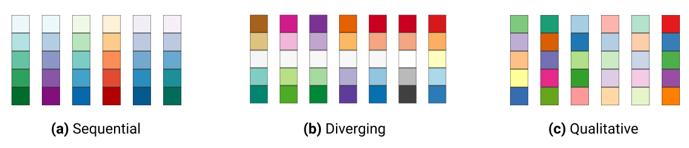
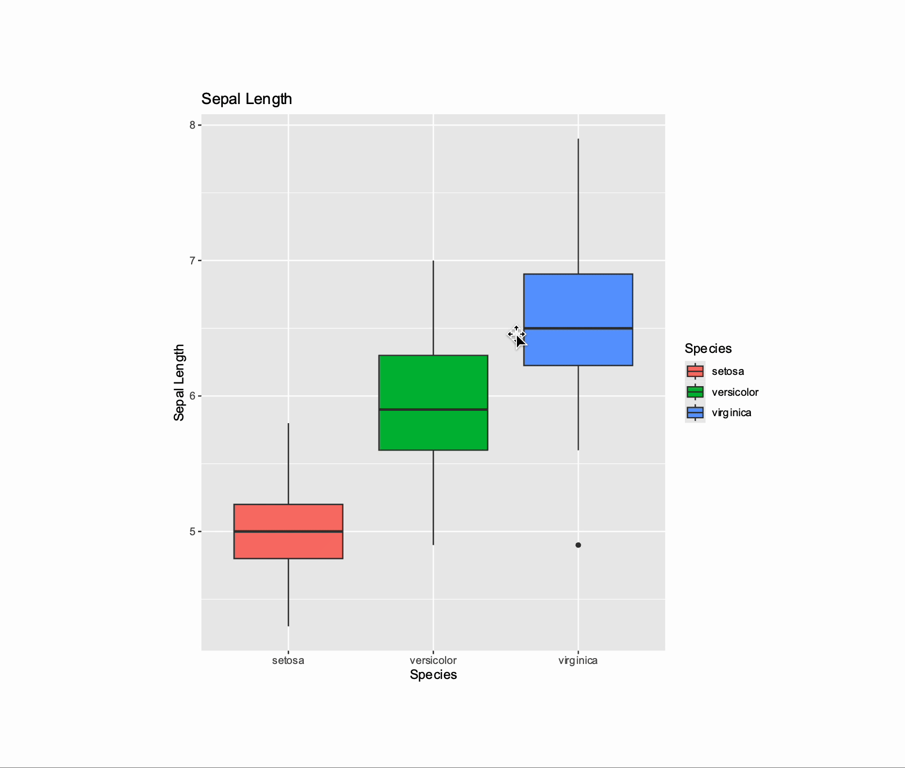

# ggplot2 {#sec-ggplot2}

```{r, include = FALSE}
library(tidyverse)
library(here)
source("R/booktem_setup.R")
source("R/my_setup.R")

penguins <- readRDS(here("files", "chapter5.RDS"))


```


## Learning Objectives

By the end of this chapter, you will be able to:

- Prepare and summarise data for advanced plotting.

- Control aesthetics and grouping behaviour in multilayered plots.

- Use and combine a broad range of geoms, including line, text, and label.

- Customise and extend colours, palettes, scales, axes, and legends.

- Use facets effectively for multi-dimensional comparisons.

- Arrange and enhance plots using patchwork and marginal plots.

- Export and enhance visualisations with camcorder and plotly.


## Colours, palettes and extensions

Colour is one of the most powerful visual cues we can use in data visualisation.
In `ggplot2`, colours can communicate categories, highlight relationships, and guide the viewer’s attention.
However, it’s also one of the most common sources of confusion and inaccessibility.

### How colour works in `ggplot2`

`ggplot2` applies colour in two main ways:

- Mapped colour — controlled by a variable in `aes()`, such as `colour = species` or `fill = species`.

- Fixed colour — set manually outside `aes()`, e.g. geom_point(`colour = "blue"`).

```{r}
penguins |> 
  ggplot(aes(x=flipper_length_mm, 
             y = body_mass_g,
             colour=species))+ 
  geom_point()

```

:::{.task}
::::{.task-header}
Your turn
::::
::::{.task-container}

All other layers remain exactly the same as in other plots. Try adding layers to make the plot above prettier:

* [ ] Try colouring all points blue.

`r hide("Solution")`

```{r}

penguins |> 
  ggplot(aes(x=flipper_length_mm, 
             y = body_mass_g))+ 
  geom_point(colour = "blue")

```

> Colour argument needs to go *inside* the relevant `geom()` as only `aes` is inherited across layers


`r unhide()`

::::
:::


## Choosing Effective Palettes

Colour choices can make or break your plot.
Good palettes emphasise contrast, group differences, and remain readable for all audiences.

In `ggplot2`, colours that are assigned to variables are modified via the `scale_colour_*` and the `scale_fill_*` functions. In order to use colour with your data, most importantly you need to know if you are dealing with a categorical or continuous variable. The color palette should be chosen depending on type of the variable:

- sequential or diverging color palettes being used for continuous variables

- qualitative color palettes for (unordered) categorical variables:

```{r, eval=TRUE, echo=FALSE, out.width="100%", fig.alt= "Colour palettes"}

```

You can pick your own sets of colours and assign them to a categorical variable. The number of specified colours has to match the number of categories. You can use a wide number of preset [colour](https://www.datanovia.com/en/blog/awesome-list-of-657-r-color-names/) names or you can use [hexadecimals](https://www.datanovia.com/en/blog/awesome-list-of-hexadecimal-colors-you-should-have/).

```{r}

ggplot(penguins, aes(x = body_mass_g, fill = species)) +
geom_histogram(bins = 20, 
               alpha = 0.7, 
               position = "identity") +
scale_fill_manual(values = c("Adelie" = "#1b9e77", 
                             "Chinstrap" = "#d95f02", 
                             "Gentoo" = "#7570b3")) +
theme_minimal()
```

### Using Predefined Palettes from colorspace

The `colorspace` @R-colorspace package offers curated, perceptually balanced palettes designed for clarity and accessibility.

You can select qualitative, sequential, or diverging palettes using `scale_*_discrete_qualitative(palette = "*")` or similar functions.

```{r}
library(colorspace)

ggplot(penguins, aes(x = body_mass_g, fill = species)) +
geom_histogram(bins = 20, alpha = 0.7, position = "identity") +
scale_fill_discrete_qualitative() +
theme_minimal()

```

:::{.task}
::::{.task-header}
Your turn
::::
::::{.task-container}

All other layers remain exactly the same as in other plots. Try adding layers to make the plot above prettier:

* [ ] Run the command `hcl_palettes(plot = TRUE)`

* [ ] Choose an appropriate palette and try it for our plot


`r hide("Solution")`

```{r}
library(colorspace)

ggplot(penguins, aes(x = body_mass_g, fill = species)) +
geom_histogram(bins = 20, alpha = 0.7, position = "identity") +
scale_fill_discrete_qualitative(palette = "Dark2") +
theme_minimal()
```

`r unhide()`

::::
:::


### Other palettes

- [Generate a palette](https://mycolor.space/)

- [Wes Anderson palettes](https://github.com/karthik/wesanderson)

- [ggokabeito](https://malcolmbarrett.github.io/ggokabeito/)

- [scico](https://malcolmbarrett.github.io/ggokabeito/)


### Accessibility

It’s very easy to get carried away with colour palettes, but you should remember at all times that your figures must be accessible. One way to check how accessible your figures are is to use a colour blindness checker `colorBlindness` @R-colorBlindness

```{r}
## Check accessibility ----

library(colorBlindness)
colorBlindness::cvdPlot() # will automatically run on the last plot you
```

### Guides to visual accessibility

Using colours to tell categories apart can be useful, but as we can see in the example above, you should choose carefully. Other aesthetics which you can access in your geoms include shape, and size - you can combine these in complimentary ways to enhance the accessibility of your plots. Here is a hierarchy of “interpretability” for different types of data

```{r, eval=TRUE, echo=FALSE, out.width="100%", fig.alt= "Colour palettes"}
knitr::include_graphics("images/list.png")
```

:::{.panel-tabset}

## Shape

```{r}
penguins |> 
  ggplot(aes(x=flipper_length_mm, 
             y = body_mass_g,
             shape=species))+ 
  geom_point() +
  scale_shape_manual(values = c(21,22,23))

```

## Colour

```{r}
penguins |> 
  ggplot(aes(x=flipper_length_mm, 
             y = body_mass_g,
             colour=species))+ 
  geom_point() +
  scale_colour_manual(values = c("Adelie" = "#1b9e77", 
                             "Chinstrap" = "#d95f02", 
                             "Gentoo" = "#7570b3")) 
```

### Colour Redundancy

```{r}
penguins |> 
  ggplot(aes(x=flipper_length_mm, 
             y = body_mass_g,
             colour=species,
             shape = species))+ 
  geom_point() +
  scale_colour_manual(values = c("Adelie" = "#1b9e77", 
                             "Chinstrap" = "#d95f02", 
                             "Gentoo" = "#7570b3")) 

```

:::


## Scales, Axes and Ordering

### Axes limits

Now, we'll use `scale_x_continuous()` and `scale_y_continuous()` for setting our desired values on the axes. 

The key parameters in both functions are:

- "limits" (defined as `limits = c(value, value)`) 

- "breaks" (which represent the tick marks, specified as `breaks = value:value`). 

It's important to note that "limits" comprise only two values (the minimum and maximum), while "breaks" consists of a range of values (for instance, from 0 to 100).

```{r}
## Set axis limits ----
penguins |> 
  ggplot(aes(x=flipper_length_mm, 
             y = body_mass_g,
             colour=species))+ 
  geom_point()+
  scale_colour_manual(values = c("Adelie" = "#1b9e77", 
                             "Chinstrap" = "#d95f02", 
                             "Gentoo" = "#7570b3")) +
  scale_x_continuous(limits = c(0,240), 
                     breaks = seq(20,240,by = 20))+
  scale_y_continuous(limits = c(0,7000), 
                     breaks = seq(0,7000,by = 10))
 

```

:::{.task}
::::{.task-header}
Your turn
::::
::::{.task-container}

Pick a more appropriate set of axis breaks:


`r hide("Solution")`
R chooses the limits and breaks for you automatically. But it is useful to know how to override this when needed

```{r}
## Set axis limits ----
penguins |> 
  ggplot(aes(x=flipper_length_mm, 
             y = body_mass_g,
             colour=species))+ 
  geom_point()+
  scale_colour_manual(values = c("Adelie" = "#1b9e77", 
                             "Chinstrap" = "#d95f02", 
                             "Gentoo" = "#7570b3")) +
  scale_x_continuous(limits = c(160,240), 
                     breaks = seq(160,240,by = 20))+
  scale_y_continuous(limits = c(2500,6500), 
                     breaks = seq(2500,6500,by = 500))

```

`r unhide()`

::::
:::


### Zooming in and out

We have seen how we can set the parameters for the axes for both continuous and discrete scales.

It can be very beneficial to be able to zoom in and out of figures, mainly to focus the frame on a given section. 

One function we can use to do this is the `coord_cartesian()`, in ggplot2. 

- Set the limits on the x-axis `(xlim = c(value, value))`

- Set the limits on the y-axis `(ylim = c(value, value))`

- Set whether to add a small expansion to those limits or not `(expand = TRUE/FALSE)`.

```{r}
penguins |> 
  ggplot(aes(x=flipper_length_mm, 
             y = body_mass_g,
             colour=species))+ 
  geom_point()+
  scale_colour_manual(values = c("Adelie" = "#1b9e77", 
                             "Chinstrap" = "#d95f02", 
                             "Gentoo" = "#7570b3")) +
  coord_cartesian(xlim = c(180,210), 
                  ylim = c(3000,4000), 
                  expand = FALSE)
  
```

:::{.callout-important collapse = "true"}
## Limits vs co-ords

This IS different to setting the axis limits. `coord_cartesian` is like a *zoom*, while `scale` sets the plotting range. 

Below we use a shortcut to scale with `xlim` and `ylim` - the trendline is now calculated only according to the visible/plotted points.

```{r}
penguins |> 
  ggplot(aes(x=flipper_length_mm, 
             y = body_mass_g,
             colour=species))+ 
  geom_point()+
  scale_colour_manual(values = c("Adelie" = "#1b9e77", 
                             "Chinstrap" = "#d95f02", 
                             "Gentoo" = "#7570b3")) +
  xlim(180,210) +
  ylim(3000,4000)
```
:::


## Facets

At the point where it becomes difficult to see the trends or differences in your plot then we want to break up a single plot into sub-plots; this is called ‘faceting’. Facets are commonly used when there is too much data to display clearly in a single plot

### Cluttered plots

In the example below it is hard to see the exact distribution of each histogram:

```{r}
penguins |> 
  ggplot(aes(body_mass_g,
             fill = species))+
  geom_histogram()+
  scale_fill_manual(values = c("darkorange", "purple", "cyan"))

```
By making facetted panels side-by-side comparisons are made easier: 

```{r}

penguins |> 
  ggplot(aes(body_mass_g,
             fill = species))+
  geom_histogram()+
  scale_fill_manual(values = c("darkorange", "purple", "cyan"))+
  facet_wrap(~species) # make facets by species

```


### Nested Facets

The `ggh4x::facet_nested()` function in the `ggh4x` @R-ggh4x package is used for creating nested or hierarchical faceting in `ggplot2` plots. 
Nested faceting allows you to further subdivide these panels into smaller panels, creating a hierarchy of facets.

```{r, warning = F}
library(ggh4x)

penguins |> 
  mutate(Nester = ifelse(species=="Gentoo", "Crustaceans", "Fish & Krill")) |> 
  ggplot(aes(x = culmen_length_mm,
             y = culmen_depth_mm,
             colour = species))+
  geom_point()+
  facet_nested(~ Nester + species)+
  scale_colour_manual(values = c("darkorange", "purple", "cyan"))+
  theme(legend.position = "none")

```


## Theme

A theme controls the non-data elements of a plot:

- background colour

- gridlines

- axis lines and text

- legend appearance

- font size and family

Using themes effectively helps make plots readable, professional, and publication-ready, without changing the data or statistical mappings.

### Applying a pre-defined theme

ggplot2 provides several built-in themes. The most common include:

- `theme_minimal()` — clean, uncluttered

- `theme_classic()` — simple axes, no gridlines

- `theme_light()` / `theme_dark()` — alternative backgrounds for contrast

- `theme_bw()` — white background, strong gridlines

```{r}
ggplot(penguins, aes(x = species, y = body_mass_g, fill = species)) +
  geom_boxplot() +
  theme_minimal()

```

### Customising a theme

Customising elements with `theme()`

Themes are modular. You can override individual elements using `theme()`:

- `axis.text` — axis tick labels

- `axis.title` — axis labels

- `panel.background` — plot background

- `panel.grid.major` / `panel.grid.minor` — gridlines

- `legend.position` — move or remove the legend

- `plot.title` — customise title font, size, or alignment

A common workflow is to **start with a pre-defined theme**. Then modify specific elements for clarity or aesthetics.


```{r}
ggplot(penguins, aes(x = species, y = body_mass_g, fill = species)) +
  geom_boxplot() +
  theme_minimal() +
  theme(
    axis.text.x = element_text(angle = 45, hjust = 1), # angle x axis text
    legend.position = "none", # remove redundant legend
    plot.title = element_text(size = 16, face = "bold", hjust = 0.5) #  add a large title in bold fontface
  ) +
  labs(title = "Body Mass Across Penguin Species")

```


:::{.task}
::::{.task-header}
Your turn
::::
::::{.task-container}

Have a play with different theme elements until you think your figure is optimal

::::
:::

## Patchwork

Sometimes, one plot can’t tell the whole story.
`patchwork` @R-patchwork lets you combine multiple ggplots — side by side or stacked — without exporting to another program.

It’s quick, simple, and keeps everything reproducible inside R

- Use `/` to stack plots vertically

- Use `+` to align plots horizontally

```{r}
library(patchwork)

p1 <- penguins |> 
  ggplot(aes(x=flipper_length_mm, 
             y = culmen_length_mm))+
  geom_point(aes(colour=species))+
  scale_colour_manual(values = c("darkorange", "purple", "cyan"))

p2 <- penguins |> 
  ggplot(aes(x=culmen_depth_mm, 
             y = culmen_length_mm))+
  geom_point(aes(colour=species))+
  scale_colour_manual(values = c("darkorange", "purple", "cyan"))


p3 <- penguins |>     
     drop_na(sex) |> 
     ggplot(aes(x=species, 
                fill = sex)) + 
    geom_bar(width = .8,
             position = position_dodge(width = .85))+
  scale_fill_discrete_diverging()

 (p1+p2)/p3+
  plot_layout(guides = "collect") 

```
You can add overall titles and adjust layouts easily.

```{r}

 (p1+p2)/p3+
  plot_layout(guides = "collect") +
plot_annotation(
title = "Penguin Bill and Body Measurements",
subtitle = "Comparing relationships across species"
)

```

#### Marginal plots

A *marginal plot* augments a two-dimensional plot (usually a scatterplot) with one-dimensional summaries along its margins—typically histograms, density curves, or boxplots.

They let readers inspect the joint relationship and each variable’s distribution simultaneously.

Conceptually:

- The main panel shows how x and y relate.

- The marginal panels show the univariate spread of each variable.

```{r}

pal <- c("darkorange", "purple", "cyan")

# density plot of flipper length
marginal_1 <- penguins |>  
  ggplot()+
  geom_density(aes(x = flipper_length_mm, fill = species),
               alpha = 0.5)+
  scale_fill_manual(values = pal)+
  theme_void()+
  theme(legend.position = "none")

# density plot of body mass
marginal_2 <- penguins |>  
  ggplot()+
  geom_density(aes(x = body_mass_g, fill = species),
               alpha = 0.5)+
  scale_fill_manual(values = pal)+
  theme_void()+
  theme(legend.position = "none")+
  coord_flip()


scatterplot <- penguins |>  
  ggplot(aes(x=flipper_length_mm, 
             y = body_mass_g,
             colour=species))+ ### now colour is set here it will be inherited by ALL layers
  geom_point()+
  geom_smooth(method="lm",    #add another layer of data representation.
              se=FALSE)+
  scale_colour_manual(values = pal)+
  theme(legend.position = "bottom")

# Layout allows us to have total customisation over the position of our plots

layout <- "
AAA#
BBBC
BBBC
BBBC"


marginal_1+scatterplot+marginal_2 +plot_layout(design = layout)

```


## Exporting safely


### `ggsave`

One of the easiest ways to save a figure you have made is with the `ggsave()` function. By default it will save the last plot you made on the screen.

You should specify the output path to your figures folder, then provide a file name. Here I have decided to call my plot `plot` (imaginative!) and I want to save it as a .PNG image file. I can also specify the resolution (dpi 300 is good enough for most computer screens).

```{r, eval = F}
# OUTPUT FIGURE TO FILE


ggsave("outputs/figures/YYYYMMDD_ggplot_workshop_final_plot.png", dpi=300)
```

### `svg`

Not exactly programmatic, but occasionally a lifesaver. If you save your ggplot image in .svg format then it becomes vectorised. 

What does this mean?

Open your image in a programme like powerpoint and each element of the plot can be edited, resized or moved!

```{r, eval = F}
ggsave("outputs/files/test-file.svg")
```

```{r, eval=TRUE, echo=FALSE, out.width="100%", fig.alt= "svg format"}

```


