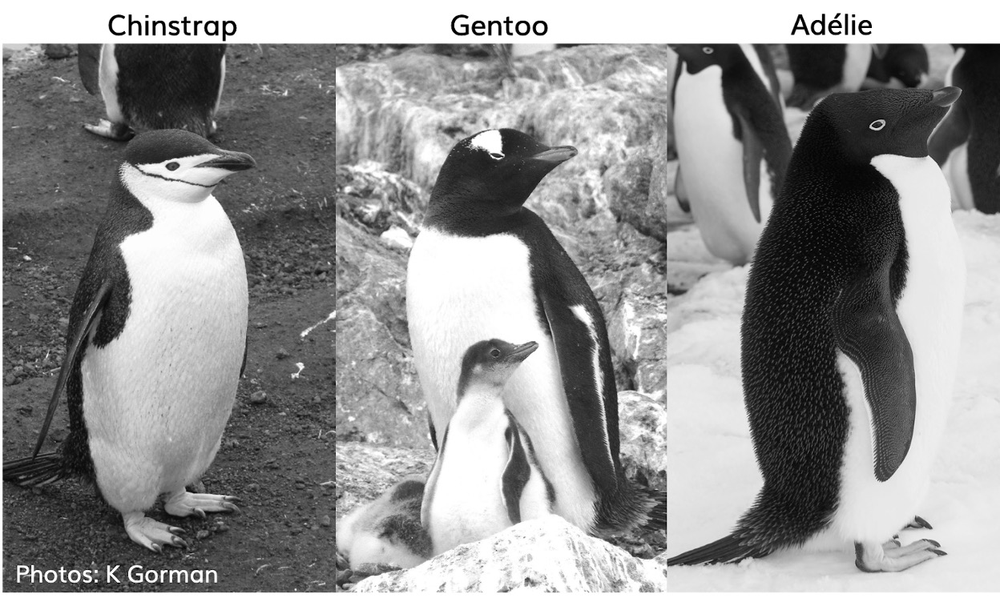
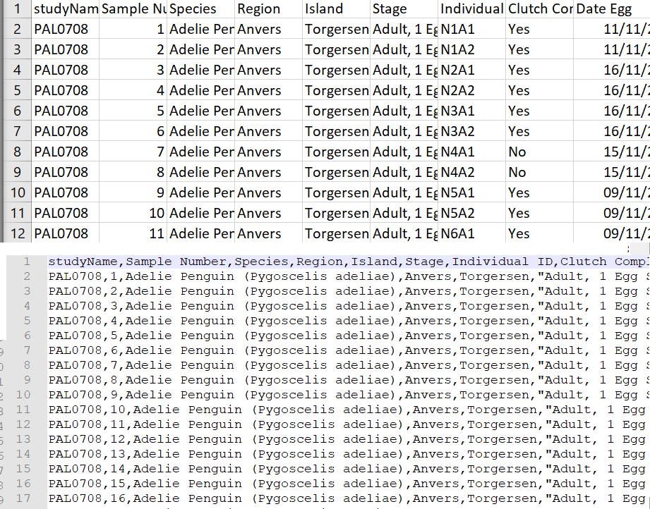
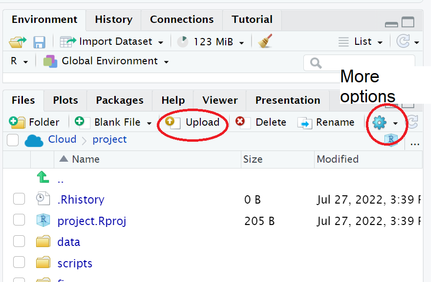

#  Import penguins data {#sec-meet-penguins}

```{r, include = FALSE}
source("R/booktem_setup.R")
source("R/my_setup.R")
library(tidyverse)
library(here)
penguins_raw <- read_csv(here("files", "penguins_raw.csv"))
```


## Learning Objectives

- This chapter covers an ideal workflow for importing data into R


## Access our data

Now that we have a project workspace, we are ready to import some data.

* Use the link below to open a page in your browser with the data open

* Right-click Save As to download in csv format to your computer (Make a note of **where** the file is being downloaded to e.g. Downloads)


```{r, eval = TRUE, echo = FALSE}
downloadthis::download_link(
  link = "https://raw.githubusercontent.com/UEABIO/data-sci-v1/main/book/files/penguins_raw.csv",
  button_label = "Download penguin data as csv",
  button_type = "success",
  has_icon = TRUE,
  icon = "fa fa-save",
  self_contained = FALSE
)
```

## Meet the Penguins

```{r, eval=TRUE, echo=FALSE, out.width="80%", fig.alt= "Photo of three penguin species, Chinstrap, Gentoo, Adelie"}

```

This data, taken from the `palmerpenguins` package was originally published by @Antarctic.

The palmer penguins data contains size measurements, clutch observations, and blood isotope ratios for three penguin species observed on three islands in the Palmer Archipelago, Antarctica over a study period of three years.

```{r, eval=TRUE, echo=FALSE, out.width="80%", fig.alt= "excel view, csv view", fig.cap = "Top image: Penguins data viewed in Excel, Bottom image: Penguins data in native csv format"}

```

In raw format, each line of a CSV is separated by commas for different values. When you open this in a spreadsheet program like Excel it automatically converts those comma-separated values into tables and columns. 


## Make sure our data is in the correct directory

* The data is now in your Downloads folder on your computer (by default)

* Move/copy/save it to the `data/raw` sub directory of your RStudio Project.


```{r, eval=TRUE, echo=FALSE, out.width="80%", fig.alt= "File tab", fig.cap = "Highlighted the buttons to upload files, and more options"}

```


## Make a script

Let's now create a new R script file in which we will write instructions and store comments for manipulating data, developing tables and figures. 

:::{.task}
::::{.task-header}
Your turn
::::
::::{.task-container}

Set your Rstudio theme to something that works for you: 

* [ ] Use the `File > New Script` menu item and select an R Script. 

* [ ] Add the following:

```{r}
#___________________________----
# SET UP ----
# An analysis of the bill dimensions of male and female 
# Adelie, Gentoo and Chinstrap penguins

# Data first published in  Gorman, KB, TD Williams, and WR Fraser. 
# 2014. 
# “Ecological Sexual Dimorphism and Environmental Variability 
# Within a Community of Antarctic Penguins (Genus Pygoscelis).” 
# PLos One 9 (3): e90081.
# https://doi.org/10.1371/journal.pone.0090081. 
#__________________________----

```

::::
:::

:::{.callout-tip collapse = "true"}
# Organising a script

Why do we need scripts to be organised?

Scripts are a human readable record of our analysis - we need them to be organised, consistent, and well-documented. See @sec-save-script for general tips on how to do this. 

Well organised scripts are useful in that provide a reference for what you did - think of them as the analysis equivalent of a lab notebook. The more detail provided in the form of comments, the more context we have. The more organised they are, the easier it is to find the sections we need to review. Just like a lab notebook they should be written as though someone else will be reading them. 

:::

## Add Packages

Next load the following add-on package to the R script, just underneath these comments. Tidyverse isn't actually one package, but a bundle of many different packages that play well together - for example it *includes* `ggplot2` a package for making figures (@R-tidyverse).

:::{.task}
::::{.task-header}
Your turn
::::
::::{.task-container}


* [ ] Add the following to your script:

> Note you may need to run `install.packages()` to download and set up packages the first time you make a new project.

```{r, eval = F}
# PACKAGES ----
library(tidyverse) # tidy data packages
library(here) # organised file paths
library(janitor) # cleans variable names
#__________________________----
```

* [ ] Save this file inside the **scripts** folder and call it `01_import_penguins_data.R`

::::
:::

:::{.callout-tip}
Click on the document outline button (top right of script pane). This will show you how the use of the visual outline

Allows us to build a series of headers and subheaders, this is very useful when using longer scripts.

:::

## Read in data

Now we can read in the data. To do this we will use the function `readr::read_csv()` that allows us to read in .csv files. There are also functions that allow you to read in .xlsx files and other formats like .json, however in this course we will only use .csv files.

We are also using `here::here()`, @R-here. The here package helps you load and save files in your project without worrying about changing your working directory, by always starting from the project’s main folder. 

* First, we will create an object called `penguins_raw` that contains the data in the `penguins_raw.csv` file. 

:::{.task}
::::{.task-header}
Your turn
::::
::::{.task-container}

* [ ] Add the following to your script, and check the document outline:

```{r, eval = F}
# IMPORT DATA ----

penguins_raw <- read_csv(here("data", "raw", "penguins_raw.csv"))

# check the data has loaded
penguins_raw
#__________________________----
```


```{r, echo = FALSE}

# check the data has loaded
head(penguins_raw)

```

* [ ] Check your script

`r hide("Solution")`

```{r, eval = F}

#___________________________----
# SET UP ----
# An analysis of the bill dimensions of male and female 
# Adelie, Gentoo and Chinstrap penguins

# Data first published in  Gorman, KB, TD Williams, and WR Fraser. 
# 2014. 
# “Ecological Sexual Dimorphism and Environmental Variability 
# Within a Community of Antarctic Penguins (Genus Pygoscelis).” 
# PLos One 9 (3): e90081.
# https://doi.org/10.1371/journal.pone.0090081. 
#__________________________----

# PACKAGES ----
library(tidyverse) # tidy data packages
library(here) # organised file paths
library(janitor) # cleans variable names
#__________________________----

# IMPORT DATA ----
penguins_raw <- read_csv(here("data", "raw", "penguins_raw.csv"))

# check the data has loaded, prints first 10 rows of dataframe
penguins_raw
#__________________________----

```

`r unhide()`

::::
:::

## Running a script from console

Now that we have made a very simple script, we can check our blank slates set-up and that our script runs without errors:

:::{.task}
::::{.task-header}
Your turn
::::
::::{.task-container}

* [ ] Restart your R session - (does your Environment clear?)

* [ ] Using the `source()` function in your console type the filepath of your script and hit `enter`.

`r hide("Solution")`

```{r, eval = F}
source("scripts/01_import_penguins_data.R") # must specify dir

# source(here::here("scripts", "01_import_penguins_data.R"))
# using here 

```

`r unhide()`

::::
:::

## Summary

In this chapter we have:

- Set up our raw data in an organised subdirectory

- Made safe filepaths to our data

- Imported into R

- Checked basic data import
