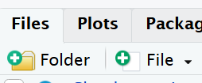
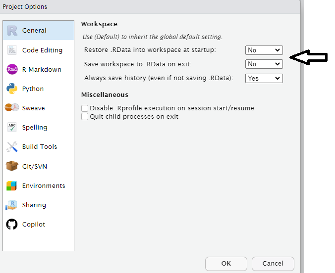

#  Project workflows {#sec-workflow}


```{r, include = FALSE}
source("R/booktem_setup.R")
source("R/my_setup.R")
library(tidyverse)
library(here)
```


## Learning Objectives

By the end of this chapter, you will be able to:

- Explain why tidy, well-structured projects make your R work more reproducible and easier to share.

- Use the `fs` @R-fs package to create and navigate folders within an R project.

- Set up a basic project structure with directories for data, scripts, and outputs.

- Set project settings for a script-oriented workflow

:::{.callout-tip}

## **Question:** How do you organise your R workflow?

- Do your different analyses sit in different organised folders?

- Do you *actively* use R projects or know what they are for?

:::


In RStudio, a project is a way to organize your work . It's a fundamental concept designed to enhance your workflow by providing a structured and efficient means of managing your R-related tasks and files. 

## Why R projects are useful:

**1. Organized File Structure:** R projects encourage you to maintain a well-organized file structure for your work. Instead of having scattered R scripts, data files, and figures, you create a dedicated folder for each project. This folder typically contains all project-related materials, including data, code, figures, notes, and any other relevant files.

**2. Working Directory Management:** When you open an R project in RStudio, it automatically sets the working directory to the project's folder. This ensures that all file paths are relative to the project's location. This working directory intentionality eliminates the need for setting working directories manually or using absolute paths in your code.

**3. Portability and Collaboration:** R projects make your work more portable and collaborative. Since all paths are relative to the project folder, the project can be easily shared with others. It ensures that the code works consistently across different computers and for other users, promoting collaboration and reproducibility.

**4. RStudio Integration:** RStudio integrates project management seamlessly. You can designate a folder as an R project, and RStudio leaves a `.Rproj` file in that folder to store project-specific settings. When you double-click on this file, it opens a fresh instance of RStudio with the project's working directory and file browser pointed at the project folder.

**5. Efficient Workflow:** RStudio provides various menu options and keyboard shortcuts for managing projects. This includes the ability to open existing projects, switch between projects, and even launch multiple instances of RStudio for different projects.


## Setting up a new project

You should start a new R project when you begin working on a distinct task, research project, or analysis. This ensures that your work is well-organized, and it's especially beneficial when you need to collaborate, share, or revisit the project later.


:::{.task}
::::{.task-header}
Your turn
::::
::::{.task-container}

Set up our first R Project: 

* [ ] 1. Go to "File" in the RStudio menu.

* [ ] 2. Select "New Project..."

* [ ] 3. Choose a project type or create a new directory for the project.

* [ ] 4. Click "Create Project."

* [ ] 5. Give it a name "Penguins"

The new project will be created with a .Rproj file. You can open it by double-clicking on this file or by using the "File" menu in RStudio.

::::
:::

:::{.callout-warning}

It is very important to NEVER to move the .Rproj file, this may prevent your workspace from opening properly. 

:::

More on projects can be found in the [R4DS](https://r4ds.had.co.nz/workflow-projects.html) book. 


## Build a Project Structure

Let's create a clean folder structure - we can do this in several ways:

```{r, eval=TRUE, echo=FALSE, out.width="80%", fig.cap = "An example of a typical R project set-up"}
knitr::include_graphics("images/project.png")
```


:::{.panel-tabset}

## IDE

* Create the following folders using the + New Folder button in the Files tab

  * data/raw
  * data/clean
  * scripts
  * outputs


```{r, eval=TRUE, echo=FALSE, out.width="80%", fig.cap = "Making folders"}

```

:::{.callout-warning}
R is case-sensitive and whitespace-sensitive so type everything EXACTLY as printed here
:::

## Base R

```{r, eval = F}

# dir.create makes directories
# unless specified it is not "recursive"

dir.create("data/raw",
           recursive = TRUE) 

dir.create("data/clean",
           recursive = TRUE)

dir.create("scripts")

dir.create("outputs") 

```


## `fs`

```{r, eval = F}
# Load the package
library(fs)

# Create standard folders
dir_create("data", c("raw", "clean"))   # creates dir recursively as standard
dir_create("scripts")       # for your R code
dir_create("outputs")    # for figures and plots

```

Run `fs::dir_tree()` to generate a nicely formatted directory tree and is a great sanity check before and after file manipulation

The `fs` @R-fs package is a great OS agnostic package and one that works safely (it will not overwrite files or folders unless explicitly asked).

:::

Having these separate subfolders within our project helps keep things tidy, means it's harder to lose things, and lets you easily tell R exactly where to go to retrieve data.  

You might want also want to keep any information (wider reading) you have gathered that is relevant to your project.


:::{.task}
::::{.task-header}
Your turn
::::
::::{.task-container}

Try creating subdirectories for the outputs folder

`r hide("Solution")`

```{r, eval = FALSE}

subdir <- c("figures", "talks", "reports")

fs::dir_create("outputs", subdir)

```

`r unhide()`

::::
:::

## Blank slates

When working on data analysis and coding projects in R, it's crucial to ensure that your analysis remains clean, reproducible, and free from hidden dependencies. 

Hidden dependencies are elements in your R session that might not be immediately apparent but can significantly impact the reliability and predictability of your work.

For example many data analysis scripts start with the command `rm(list = ls())`. While this command clears user-created objects from the workspace, it leaves hidden dependencies as it does not reset the R session, and can cause issues such as: 

- **Hidden Dependencies:** Users might unintentionally rely on packages or settings applied in the current session.

- **Incomplete Reset:** Package attachments made with `library()` persist, and customized options remain set.

- **Working Directory:** The working directory is not affected, potentially causing path-related problems in future scripts.

:::{.task}
::::{.task-header}
Your turn
::::
::::{.task-container}

* [ ] Run some simple R code in your console:

```{r}
library(tidyverse)

b <- 3
c <- 2

a <- b + c

```

> You should see messages indicating tidyverse has loaded as a package (if installed).

> You should see a, b and c in your "Environment" Pane you can also run the command `ls()` in your console


* [ ] Type the command `rm(list =ls())` in your console

> You should see your Environment pane is now empty

* [ ] Re-run the command `library(tidyverse)` or check the Packages pane

> You should see that this did nothing to the state of your packages

::::
:::

### Restart R sessions

RStudio projects can handle a clean workspace automatically.

- Go to **Tools - Project Options - General**

- Under *Workspace* set all .RData options to **No**

- Selection Session - Restart R (Ctrl + Shift + F10)

```{r, eval=TRUE, echo=FALSE, out.width="80%",}

```

:::{.task}
::::{.task-header}
Question
::::
::::{.task-container}

Which feels safer and more reproducible for long-term work?

* `rm(list=ls())`

* Setting up a Blank Slate R Environment


::::
:::
