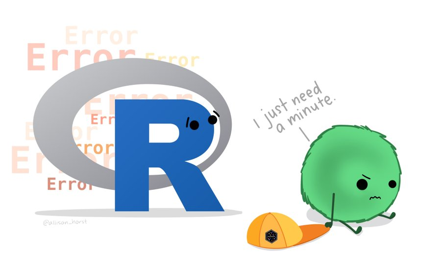
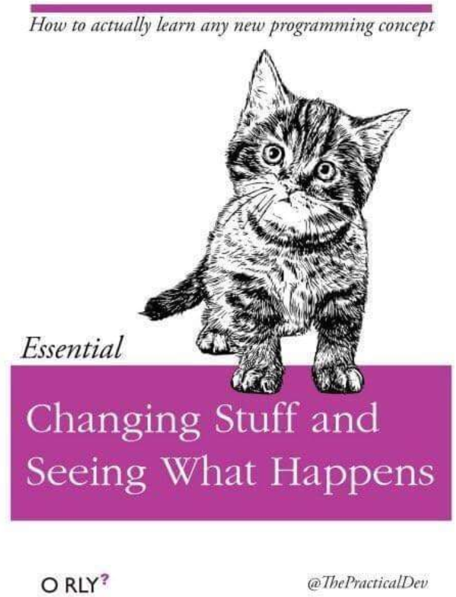

#  R Basics {#sec-basicr}


```{r, include = FALSE}
source("R/booktem_setup.R")
source("R/my_setup.R")
library(tidyverse)
library(here)
```

**R** is a programming language and environment for statistical computing and graphics. **RStudio** is an Integrated Development Environment (IDE) that makes using R easier by providing a user-friendly interface with helpful features (like a script editor, console, environment viewer, etc.). In other words, you write and run R code, and RStudio helps you organize and execute that code more conveniently. For this course, we can use RStudio (via Posit Cloud) to write and run R code, but remember that R and RStudio are two separate pieces of software – R is the engine under the hood, and RStudio is the dashboard and controls. Both R and RStudio may have their own updates, so keep an eye on updating them separately when working on your personal computer. 

Tip: R and RStudio are free to download. You can install R from the CRAN website (Comprehensive R Archive Network) and RStudio from the Posit (formerly RStudio) website. In our classroom environment on Posit Cloud, these are already set up for you.


## The RStudio Interface at a Glance


```{r img-rstudio, echo=FALSE, fig.cap="RStudio interface"}

knitr::include_graphics("images/rstudio.png")

```

When you open RStudio, the interface is typically divided into four panes (windows), each serving a different purpose:

- Script Editor (top-left): This is where you write, edit, and save your R code scripts. You can open a new script via File > New File > R Script. Writing code in a script allows you to save it and rerun it later.

- Console (bottom-left): This is where R actually executes your commands. You can type R commands directly into the console at the > prompt and press Enter to run them. The console will also display output from your code and any error messages or warnings.

- Environment/History (top-right): The Environment tab shows the objects (variables, data, functions, etc.) that you have created in your R session and their values or summary. This helps you keep track of what data you have loaded or what variables you have defined. The History tab (usually behind Environment) shows a log of commands you have executed.

- Files/Plots/Packages/Help (bottom-right): This pane has multiple tabs:
    
    - Files: A file browser for your working directory (useful to navigate files on your computer or cloud project).
    - Plots: Displays any plots/graphs you generate. You can also export plots from here.
    - Packages: Lists all R packages installed on your system and indicates which are currently loaded. You can load or update packages from here.
    - Help: Shows documentation for R functions and packages. If you use the help command (e.g., ?mean), the documentation will appear here. You can also search for help topics in this tab.


**Customizing RStudio:** You can personalize the appearance of RStudio. For example, under *Tools > Global Options > Appearance*, you can choose a different editor theme (light or dark mode, font preferences, etc.) to make the coding environment comfortable for you. Customizing the interface does not change how R works, but it can make your experience more pleasant.

You can [personalise the RStudio GUI](https://support.rstudio.com/hc/en-us/articles/115011846747-Using-Themes-in-the-RStudio-IDE) as much as you like. 

```{r themed, echo=FALSE, fig.show = "hold", out.width = "50%"}

knitr::include_graphics(c("images/dark_mode.png", "images/classic_mode.png"))

```

**Running code:** To run code from the script editor, you have a few options:

- Click the **Run** button while your cursor is on a line of code (or after selecting multiple lines) to execute it in the console.

- Use the keyboard shortcut Ctrl + Enter (Windows/Linux) or Cmd + Enter (Mac) to run the current line (or selected lines) of code from the script editor.

- You can also copy a command and paste it into the console, then press Enter.

As you run commands, you’ll see them executed in the console and results (or errors) will be displayed there. The History will log these commands, and the Environment will update with any new variables/objects created.


### Consoles vs. scripts

Directly typing into the console is fine for quick, one-off calculations or testing something out, but it’s transient (once you quit R, the console history might be lost unless saved). In contrast, using a script allows you to save your work. Think of the script as your "source of truth" – you can always re-run a script to reproduce your analysis. A good workflow is to write and edit code in the script editor and use the console mostly to observe outputs or test small things.

* The *script* window is the place to enter and run code so that it is easily edited and saved for future use. Usually the Script Window is shown at the top left in RStudio. If this window is not shown, it will be visible *if* you open a previously saved R script, *or* if you create a new R Script. You create new R Script by clicking on File > New File > R Script in the RStudio menu bar.

* To execute your code in the R script, you can either highlight the code and click on Run, or you can highlight the code and press CTRL + Enter on your keyboard.

* The *console*: you can enter code directly in the Console Window and click Enter. The commands that you run will be shown in the History Window on the top right of RStudio. Though it is much more difficult to keep track of your work this way.

**Interrupting and clearing**: If you start writing a command in the console and see a + prompt, it means R is waiting for you to finish the command (perhaps you opened a quote or parenthesis and haven’t closed it). You can either finish the command or press Esc (or Ctrl+C in some environments) to cancel it and return to the > prompt. You can clear the console (in RStudio) by pressing Ctrl+L (this only clears the display, not the history or the variables). 

**Using History**: You can press the up and down arrow keys in the console to scroll through your previous commands. This is handy if you want to reuse or edit a command you ran earlier without retyping it from scratch.


## Your first R command

Let’s try some simple calculations in R to get a feel for it. You can use R as a calculator:

```{r, eval = FALSE}
# Addition
10 + 20

```

-   What answer did you get?

`r hide("Solution")`

```{r, eval = F, echo = T, results = 'asis'}
30
```

`r unhide()`

The first line shows the request you made to R, the next line is R's response

You didn't type the `>` symbol: that's just the R command prompt and isn't part of the actual command.

Here are some other basic arithmetic examples to try:

```{r, eval = FALSE}

13 - 10    # Subtraction
4 * 6      # Multiplication
12 / 3     # Division
5^4        # Exponentiation (5 to the power of 4)


```

### Perform some combos

You can combine operations, and R will follow the standard order of operations (BODMAS/BIDMAS rules: Brackets/Parentheses, Orders/Exponents, Division and Multiplication, Addition and Subtraction). For example:

```{r, eval = FALSE}
3^2 - 5/2      # R will do 3^2 = 9, then 9 - (5/2) = 9 - 2.5
(3^2 - 5) / 2  # R will do the part in parentheses first: (9 - 5) = 4, then 4/2 = 2

```


Be careful with parentheses to ensure calculations happen in the order you intend. If you omit parentheses, R might give a different result than you expect. 

Another example: If you want the square root of 16, you could compute it as 16 raised to the power of 1/2. But you must use parentheses around the fraction 1/2:

```{r, eval = FALSE}

16^1/2    # This is interpreted as (16^1) / 2, which gives 8
16^(1/2)  # This correctly computes 16^(0.5), the square root of 16, giving 4
```

The first one calculates 16 raised to the power of 1, then divided this answer by two. The second one raises 16 to the power of a half. A big difference in the output.

### Use R interactively: 

Don’t be afraid to experiment in the console. R is read-evaluate-print by nature: you type an expression, R evaluates it, and prints the result. If you type an incomplete expression, R will show a + continuation prompt, meaning it’s waiting for the rest of your input. For instance, if you type 10 + and press Enter, the console will show:

```{r, eval = FALSE}

> 10 +
+ 


```

That + indicates R expects more input (it knows the command isn’t complete). If you realize you made a mistake and want to cancel, press Esc to break out and get back to the > prompt. Otherwise, you can continue the command (type 20 and hit Enter) to complete it:

```
> 10 +
+ 20

```
```
[1] 30
```


## Understanding Operators in R

R provides a variety of **operators** for different purposes. Here are some common ones:

- Arithmetic operators: + (addition), - (subtraction), * (multiplication), / (division), ^ (exponentiation for power). There is also %% (modulus, remainder of division) and %/% (integer division).

- Assignment operators: <- is the preferred assignment operator in R (it assigns a value to a variable on its left). For example, x <- 5 assigns the value 5 to x. You can also use = for assignment in R, but <- is the conventional way and is less ambiguous in most contexts.

- Comparison (relational) operators: == (equal to), != (not equal to), < (less than), <= (less than or equal to), > (greater than), >= (greater than or equal to). These are used to compare values and yield a logical result (TRUE or FALSE).

- Logical operators: ! (NOT), & (AND), | (OR). These operators combine or invert logical values. For example, !TRUE is FALSE, and TRUE & FALSE is FALSE.

- Sequence and membership: : (colon) generates sequences of numbers (e.g., 1:5 produces 1, 2, 3, 4, 5). %in% checks membership in a set (e.g., 3 %in% c(1,3,5) returns TRUE because 3 is in the vector).

:::{.callout-note}
A note on = vs ==: It’s easy to mix these up. Remember, == is used for comparison (testing equality), while = (or <-) is used for assignment. For example, x == 3 checks if x is equal to 3, whereas x = 3 (in a script or at the console prompt) would attempt to assign 3 to x. Using = in place of == in a comparison is a common mistake and will lead to an error or unexpected behavior. Always use == for comparisons.
:::

## Working with Variables (Objects) and the Assignment Operator

In R (and programming in general), a **variable** (also known as an **object** in R terminology) is a named storage for a value or set of values. You create a variable by assigning a value to a name. We use the assignment operator <- for this. For example:

```{r}
x <- 10 + 20

```

Here we created a variable named x and assigned it the result of 10 + 20 (which is 30). This does not print 30 to the console because the result was instead stored in x. If you want to see the value, you can simply type x in the console and press Enter:

```{r}
x 

```

Typing the name of a variable and hitting Enter will print its value (this is called *auto-printing*). Alternatively, you could use the explicit print(x) function with the same result. In interactive use, auto-printing by typing the name is convenient; in scripts or functions, you might use `print()` to display interim results. 

You can use variables in calculations just like numbers. Continuing the example, since x is 30:

```{r}
x * 2    # This will give 60, since x is 30
x + 5    # This will give 35


```


You can also assign the results of these calculations to new variables:

```{r}
y <- x * 2       # y will be 60
z <- x + y + 5   # z will be 30 + 60 + 5 = 95


```

After these assignments, you will see x, y, and z listed in RStudio’s Environment pane with their values. At any time, you can inspect a variable’s value by printing it (as shown above). 

**Important**: If you assign a new value to an existing variable name, the old value is overwritten and lost. For example, if you later do:

```{r}
x <- 100
```

The name x now contains 100, and the original value 30 is gone. Be mindful of not unintentionally overwriting variables that you still need. The Environment pane can help by showing you what’s defined.

## Variable naming rules and tips

```{r, eval=TRUE, echo=FALSE, out.width="80%", fig.alt= "snake_case", fig.cap="courtesy of Allison Horst"}
knitr::include_graphics("images/snake_case.png")
```

- Use meaningful names: It’s often better to use descriptive names for variables (e.g., total_sales instead of x or var1) so that the code is self-explanatory. This helps you (and others) understand the code later.

- Be concise: While names should be meaningful, overly long names can be cumbersome. Try to strike a balance (e.g., response_time is easier to handle than the_response_time_of_the_subject).

- No spaces or special characters: Variable names cannot contain spaces. They must start with a letter or dot (.) or underscore (_), and the remaining characters can be letters, numbers, dots, or underscores. For example, currentTemperature or current_temperature are valid names, but current temperature (with a space) is not. Also, avoid using symbols like +, -, *, etc., in names.


- Case sensitivity: R is case-sensitive. This means Variable, variable, and VARIABLE would be three different names. Be consistent in your naming to avoid confusion.

- Recommended conventions: Many R programmers use either snake_case or camelCase for multi-word names. Snake case uses underscores (e.g., total_cost), while camel case capitalizes each word after the first (e.g., totalCost). Choose one style and stick with it. This makes your code more readable. (For example, my_data is easier to read than mydata or MyData at a glance.)

:::{.callout-warning}

Avoid naming variables after existing functions or constants in R (like mean, data, T, c, etc.) because that can lead to confusion or errors. For instance, if you do mean <- 5, you won’t be able to use the mean() function until you restart R or remove that variable.

:::

## Data Types in R (Numeric, Character, Logical, etc.)

R has several basic data types (also called “atomic” classes) that you will encounter:

- Numeric: Numbers. By default, numbers in R are stored as double-precision floating point (commonly just called “numeric”). These can be integers or real numbers (decimals). For example, 3, 3.14, and -0.5 are all numeric. If you specifically want an integer type (which is rarely necessary to specify in R), you can append an L (e.g., 5L is an integer 5).

- Character (string): Text values. Anything enclosed in quotes " " (or ' ') is a character string. For example, "Hello, world" or "42" (the latter is the character two-digit string "42", not the number 42).
Logical (Boolean): TRUE or FALSE values (often the result of comparisons). In R, you can also use the shorthand T for TRUE and F for FALSE, but it’s recommended to use the full words to avoid confusion (since T and F are just variables that by default are set to TRUE/FALSE, they could theoretically be overwritten).

- Complex: Complex numbers (numbers with real and imaginary parts, like 2+3i). These are less commonly used in everyday data analysis.

- Factor: A special type for categorical data. Factors look like character vectors but have an underlying integer coding. They represent data that has categories or levels (for example, a variable Gender might be a factor with levels "Male" and "Female"). We will discuss factors more later, but be aware of them if you see them. (Historically, when importing data, strings were often automatically converted to factors, although this is no longer the default in modern R for functions like read.csv or in the tidyverse.)

You can check the type or class of any object using the class() function, and for an atomic vector, typeof() gives a more specific type. For example, class(42) will return "numeric", and class("hello") returns "character". For a factor, class() might show "factor".

## Vectors: Combining Values

A vector is the most basic data structure in R. A vector is essentially a sequence of values of the same type. Even a single number or string by itself is technically a vector of length 1. Here’s how you can create vectors in R:

Using the `c()` function (which stands for “combine” or “concatenate”):


```{r}
numeric_vector   <- c(1, 2, 3)                     # numeric vector of length 3
character_vector <- c("fruits", "vegetables", "seeds")  # character vector
logical_vector   <- c(TRUE, FALSE, TRUE, TRUE)     # logical vector


```

Using the `:` operator for sequences of integers:

```{r}
integer_vector <- 1:10   # this creates a vector c(1, 2, 3, ..., 10)


```

You can verify the type and length of these vectors with class(numeric_vector) and length(numeric_vector), for example. 

- Indexing starts at 1: It’s important to note that R uses 1-based indexing. This means the first element of a vector is accessed with index 1 (not 0, as in some other programming languages). For example, numeric_vector[1] would give 1 (the first element in the vector above), and integer_vector[3] would give 3. 

- Combining different types – coercion: A vector can only hold one type of data. If you try to combine different types, R will coerce them to a common type. The rule of thumb is that R will convert all elements to the least restrictive type necessary to accommodate all of them. Generally, the hierarchy is: logical -> integer/numeric -> character. For example:

```{r}
mixed <- c(TRUE, 2)       # logical TRUE becomes numeric 1, result is numeric vector c(1, 2)
mixed2 <- c(2.3, "a")     # numeric 2.3 becomes character "2.3", result is character vector c("2.3", "a")
mixed3 <- c("a", TRUE)    # logical TRUE becomes character "TRUE", result is character vector c("a", "TRUE")


```


### Subsetting data

```{r}
v <- c("apple", "banana", "cherry", "date")
v[2]          # gives the second element, "banana"
v[c(1, 3)]    # gives a vector of the 1st and 3rd elements: "apple" and "cherry"
v[2:4]        # gives elements 2 through 4: "banana", "cherry", "date"


```

You can also subset using logical vectors of the same length as the target vector. This will select all elements where the logical vector is TRUE:

```{r}
scores <- c(85, 92, 76, 81, 90)
scores[scores > 80]   # this returns only those scores greater than 80

```

### Vectorized operations: 

One of the strengths of R is that many operations are vectorized, meaning they operate on each element of a vector without needing an explicit loop. For example:


```{r}

x <- c(1, 2, 3)
y <- c(2, 3, 4)
x + y      # element-wise addition: result is c(3, 5, 7)
x * y      # element-wise multiplication: result is c(2, 6, 12)


```

If you use a single value with a vector, the single value will be recycled across the vector:

```{r}
x <- c(1, 2, 3)
x * 2    # equivalent to c(1*2, 2*2, 3*2) = c(2, 4, 6)


```

If two vectors of unequal length are used in an operation, R will recycle the shorter vector to match the longer vector’s length. This can be convenient, but if the lengths are not multiples of each other, R will issue a warning since the recycling will be incomplete for the last part. For example:

```{r}
a <- c(1, 2, 3)
b <- c(1, 2)
a + b
# R will recycle b as if b were c(1, 2, 1, 2, ...) to match length of a.
# The result here will be c(1+1, 2+2, 3+1) = c(2, 4, 4).
# Because 'a' length (3) is not a multiple of 'b' length (2), R gives a warning.


```

As you can see, the recycling rule can lead to unintended consequences if you’re not careful, so always check that your vectors are the expected length when doing element-wise operations.


## Matrices

Matrices can be thought of as vectors with an added dimension attribute. This dimension attribute is a two-element integer vector specifying the number of rows and columns, which defines the shape and structure of the matrix.

:::{.callout-info}
Data frames are also two-dimensional but can store columns of different data types - matrices are simpler as they consist of elements of the same data type.
:::

Matrices are constructed "columns-first" so entries start in the "upper left" and and run down columns. 

```{r}
m <- matrix(1:6, nrow = 2, ncol = 3) 
m
```

```{r}
attributes(m)
```

We can create matrices in several ways:

- Adding a `dim()` to existing vectors

- Column/row-binding vectors with `cbind()` and `rbind()`

```{r}
m <- 1:6

dim(m) <- c(2,3)

m

```

```{r}
a <- 1:2
b <- 3:4
c <- 5:6

m <- cbind(a,b,c)
m
```

You will see how in this last operation column names were added to the matrix, we can add, change or remove column and rownames on a matrix with `colnames()` and `rownames()`

```{r}
rownames(m) <- c("y","z")
m
```

## Lists

Lists are a versatile and fundamental data type in R. They set themselves apart from regular vectors by allowing you to store elements of different classes within the same list. This flexibility is what makes lists so powerful for various data structures and data manipulation tasks.

You can create lists explicitly using the `list()` function, which can take an arbitrary number of arguments. Lists, when combined with functions like the "apply" family, enable you to perform complex and versatile data manipulations and analyses in R. Lists are often used to represent heterogeneous data structures, such as datasets where different columns can have different data types and structures.

```{r}

l <- list(1, "apple", TRUE )
l
```

We can also create empty lists of set lengths with the `vector()` function, this can be useful for preallocating memory for iterations - as we will see later

```{r}
l <- vector("list", length = 3)
l
```

Lists can also have names

```{r}
names(l) <- c("apple","orange","pear")

```

## Dataframes and Tibbles

A data frame is a fundamental data structure for tabular data in R. You can think of a data frame as a table (like a spreadsheet or CSV file) where each column is a vector of values (all of the same type), and each row is an observation or record. Data frames are extremely common for storing datasets because they allow mixing types by column (e.g., one column can be numeric, another character, another logical, etc.), which is what you need for most real-world data. 

Each column in a data frame has a name, and you can also have row names (though row names are often not used for data, except perhaps as an identifier). 

Creating a data frame: You can create one using the data.frame() function, specifying the columns as arguments. For example:

```{r}
survey <- data.frame(
  "index" = c(1, 2, 3, 4, 5),
  "sex" = c("m", "m", "m", "f", "f"),
  "age" = c(99, 46, 23, 54, 23)
  )

```

This makes a data frame survey with 5 rows and 3 columns: index, sex, and age. If you print survey, you’ll see something like:

```{r}
survey
```

Each column is a vector: `survey$index` is the vector 1,2,3,4,5; `survey$sex` is c("m","m","m","f","f"); `survey$age` is c(99,46,23,54,23). 

Because each column is a vector, they all must be the same length (here length 5) – which they are.


### Accessing columns and rows: 

You can access columns of a data frame in several ways:

Using the $ operator: survey$age will pull out the age column as a vector.

Using square brackets: survey[["age"]] does the same as above. You can also use numeric indices for columns, e.g., survey[[3]] would give the third column (age) as a vector.

If you use single square bracket with a column index or name, e.g., survey["age"] or survey[3], it will return a data frame containing that single column (not a vector). This is a subtlety: single [] on a data frame always returns a data frame (unless you select both row and column like df[1,2] which returns a single value).

Using the matrix-style indexing: survey[2, ] would give the second row (as a one-row data frame); survey[ , "sex"] would give the sex column as a vector. In general, dataframe[row_index, col_index] lets you subset by rows and columns simultaneously.

For example, survey[1:3, c("sex","age")] would give a smaller data frame with first 3 rows and only the columns sex and age. 

Adding and removing columns: It’s easy to add a new column to a data frame by assigning to a new $ name or using cbind():

```{r}

survey$follow_up <- c(TRUE, FALSE, TRUE, FALSE, FALSE)


```

This would add a new column named follow_up to the survey data frame with the specified logical values. 
Just ensure the vector you assign is the correct length (here 5, to match the number of rows). If you need to change a column name, you can do:

```{r}
names(survey)[1] <- "ID"


```

This renames the first column (which was "index") to "ID". You could also use colnames(survey) <- c("ID","sex","age","follow_up") to rename all columns at once.

```{r}

mean(survey$age)

```

We can also use the `$` to add new vectors to a dataframe

```{r}

survey$follow_up <- c(T,F,T,F,F)
survey

```

Changing column names is easy with a combination of `names()` and indexing

```{r}

names(survey)[1] <- "ID"

survey

```


### Tibbles

“Tibbles” are a new modern data frame. It keeps many important features of the original data frame

- A tibble never changes the input type.

- A tibble can have columns that are lists.

- A tibble can have non-standard variable names.
    - can start with a number or contain spaces.
    - to use this refer to these in a backtick.
    
- Tibbles only print the first 10 rows and all the columns that fit on a screen. - Each column displays its data type

The way we make tibbles is very similar to making dataframes

```{r}
library(tibble)

survey_tibble <- tibble(
  "index" = c(1, 2, 3, 4, 5),
  "sex" = c("m", "m", "m", "f", "f"),
  "age" = c(99, 46, 23, 54, 23)
  )

```


If you print survey_tibble, you’ll get an output like:

```{r}
survey_tibble

```

Notice it shows the type of each column under the name (<dbl> for doubles/numerics, <chr> for character). 

For the most part, you can use tibbles and data frames interchangeably with R functions, especially within the tidyverse. Many users prefer tibbles for their nicer printing and stricter subsetting (which can prevent some accidental simplifications).

#### Useful functions for inspecting data frames/tibbles:

```{r, eval = F}
# Some R functions for looking at tibbles and dataframes

head(survey_tibble, n=2)
tail(survey_tibble, n=1)
nrow(survey_tibble)
ncol(survey_tibble)
colnames(survey_tibble)
view(survey_tibble)
glimpse(survey_tibble)
str(survey_tibble)

```


## Functions

Functions are the tools of R. Each one helps us to do a different task.

Calling a function: You call (execute) a function by writing its name followed by parentheses (). Inside the parentheses, you provide arguments – these are the inputs the function needs. For example, consider the function round() which rounds numbers. Its usage (as shown by ?round in the Help) is:

```{r, eval = FALSE}
round(x, digits = 0)
```

This means round() takes an argument x (the number or vector to round) and an argument digits (how many decimal places to round to, which defaults to 0 if not specified). Each argument can be provided in the form name = value. For example:

```{r}
round(x = 2.432678, digits = 2)


```

This will round 2.432678 to 2 decimal places, giving 2.43. You could also call it by position without naming the arguments:

```{r}
round(2.432678, 2)


```

R knows the first argument is x and the second is digits by their positions. However, be careful: if you don’t name arguments, you must provide them in the exact order the function expects. If you accidentally swap them, you’ll get an incorrect result or an error. For instance, round(2, 2.432678) is not doing the same thing – it tries to round the number 2 to 2.432678 decimal places (which doesn’t make sense, and will likely just return 2, since digits must be an integer and will be truncated in this case). 

If you name the arguments, order doesn’t matter:

```{r}

round(digits = 2, x = 2.432678)


```

This will still correctly round the number to 2 decimal places. 

Getting help for functions: If you’re not sure how to use a function or what arguments it takes, use R’s help system:

- ?function_name (e.g., ?round) will bring up the help page for that function.

- The help page will usually show the usage, a description of each argument, details, examples, and more.

- You can also search for functions by keyword using ??keyword or help.search("keyword"). For example, ??rounding might show all help pages that mention rounding.


**Return values**: Most functions return a value that you can then use or store. For example, rounded_value <- round(2.432678, 2) will store the value 2.43 in the variable rounded_value. If a function produces output to the console (like print() or plotting functions that create a plot), the return value might be something simple (often NULL or the object itself). When writing scripts, it’s common to save important results into variables so you can use them later. 

**Printing vs returning**: In interactive use, you often rely on auto-printing to see results. Inside a script or a function you write, simply calling a value won’t automatically print it in the console when the script is run (except at the end of a script or if explicitly printed). For clarity, if you want to ensure something is shown, use print(). However, when writing an R Markdown or working interactively, just writing the expression in a code chunk or console will display it.


## Packages

One of the biggest strengths of R is its rich ecosystem of packages. A package is a bundle of functions, data, and documentation, developed by the community, that extends R’s capabilities. Base R comes with a standard set of functions, but for specialized tasks (data visualization, advanced stats, machine learning, etc.), there are thousands of packages available. 

Installing packages: To use a package that doesn’t come with base R, you need to install it (typically from CRAN, the Comprehensive R Archive Network). For example, to install the tidyverse package (which actually is a meta-package that includes ggplot2, dplyr, and others commonly used for data science):

```{r, eval = FALSE}
install.packages("tidyverse")

```

You only need to install a package once on your system (or per R installation). In RStudio Cloud or a managed environment, many common packages might already be installed. Important: It’s a good practice not to include install.packages() calls in your analysis script that you will run frequently. Installing is a one-time operation and can be time-consuming; including it in a script could also accidentally update a package to a newer version that might not be backwards compatible. Usually, you install packages manually (or in a setup script), not every time you run an analysis.


**Loading packages**: After installing, to use the package in any given R session, you must load it using library() or require(). The common practice is to put all your library(packageName) calls at the top of your script, so it’s clear which packages are needed. For example

```{r}
library(tidyverse)

```


This will load the core packages in the tidyverse suite (ggplot2, dplyr, readr, etc.). When you load a package, you often see messages in the console about what functions are being made available, and sometimes warnings about package conflicts (more on that in a moment). Reading these messages can be useful, as they might inform you of masked functions or other important notes. 

Once a package is loaded, you can use its functions in your session as if they were native functions.

Using functions from packages without loading entire package: You can call a function from a package using the syntax packageName::functionName(). For instance, dplyr::filter() will call the filter function from dplyr even if you haven’t loaded dplyr with library(dplyr). This is useful if you need just one or two functions from a package or to avoid conflicts. It also makes it clear which package a function comes from. In a script, you might see something like pkg::func(x, y) to explicitly denote which package’s func is being used. 

Package conflicts: Sometimes two packages have functions with the same name. For example, the dplyr package and the older MASS package both have a function named select(). If you load dplyr and then MASS, the second package loaded will mask the function from the first (R will use the most recently loaded version of a function if there’s a name conflict). R will typically print a message when this happens, e.g., “The following object is masked from ‘package:dplyr’: select”. This is telling you that if you call select(), it will use the one from MASS now, not the one from dplyr. 

To avoid confusion, you can do either of:

- Load packages in an order that avoids masking the specific function you need. (For instance, load MASS first, then dplyr, if you want dplyr’s select to remain active).

- Use the :: notation to specify which one you want, e.g., use dplyr::select() or MASS::select() explicitly in your code.

- If masking happens and you want to see which functions are masked, read the startup messages or use conflicts() to identify conflicts.


Keeping packages updated: You can update packages via update.packages() or using RStudio’s Packages pane. However, be cautious with updates in the middle of a project, as new package versions can sometimes change behavior. It’s often fine, but in a production or research analysis context, you might want to stick to a version that you know works with your code (for reproducibility). Tools like renv (for environment management) can lock package versions for a project if needed, but that’s more advanced. 

The tidyverse: The tidyverse is a collection of packages (ggplot2, dplyr, tidyr, readr, purrr, tibble, etc.) that work well together for data manipulation and visualization. Loading library(tidyverse) loads the core ones. It’s very popular for data science workflows. Throughout the course, we will use many tidyverse functions. Remember to load the tidyverse (or specific packages from it) at the start of your session.


## Handling Errors and Debugging

As you write and run R code, you will undoubtedly encounter errors (and warnings). This is normal – even experienced programmers run into errors frequently. What’s important is learning how to read error messages and troubleshoot the problem. Here are some tips:


```{r, eval=TRUE, echo=FALSE, out.width="80%", fig.alt= "R Error", fig.cap="courtesy of Allison Horst"}

```

- Read the error message: R’s error messages can sometimes be cryptic, but they often give a clue about what went wrong and where. If R says “unexpected ’}’ in …” then you likely have a mismatched brace. If it says “object not found”, you probably misspelled a variable name or forgot to create it. If it says “x must be numeric”, maybe you passed a string where a number was expected.

- Common causes: The most common causes of errors for beginners are:

    -Typos in names or syntax: e.g., spelling a function or variable name incorrectly, or using ( without a matching ). Remember, R is case-sensitive (Data is different from data).

    - Missing commas or quotes: In a function call, forgetting a comma between arguments, or not closing a quote or parenthesis will lead to + in console or an error.

    - Wrong context or object not available: Using a variable that doesn’t exist in the current environment, or calling a function from a package that hasn’t been loaded. 


## Help and additional resources

```{r img-kitteh, echo=FALSE, fig.cap="The truth about programming"}



```

Getting good at programming really means getting good trying stuff out,  searching for help online, and finding examples of code to copy. If you are having difficulty with any of the exercises contained in this book then you can ask for help on Teams, however, learning to problem-solve effectively is a key skill that you need to develop throughout this course. 

* Use the help documentation. If you're struggling to understand how a function works, remember the `?function` and `help()` command.

* If you get an error message, copy and paste it in to Google - it's very likely someone else has had the same problem.

* If you are struggling to produce a particular output or process - try organising your google searches to include key terms such as "in R" or "tidyverse". - e.g. *"how to change character strings into NA values with tidyverse"*

* You can also use Generative AI tools for help - make sure to structure your query clearly, and check all of the suggested outputs for mistakes.

*  The official [Cheatsheets](https://posit.co/resources/cheatsheets/) are a great resource to keep bookmarked. 

* Finally, don’t hesitate to ask for help from peers or instructors when you’re stuck. Sometimes a quick pointer from someone more experienced can save you hours of frustration. As you gain experience, you’ll become better at debugging and finding answers, and you’ll also build a personal toolkit of coding strategies.

* In addition to these course materials there are a number of excellent resources for learning R:
  * [StackOverflow](https://stackoverflow.com/)
  * [R for Data Science](https://r4ds.had.co.nz/)
  
## How to cite R and RStudio

You may be some way off writing a scientific report where you have to cite and reference R, however, when the time comes it is important to do so to the people who built it (most of them for free!) credit. You should provide separate citations for R, RStudio, and the packages you use.

To get the citation for the version of R you are using, simply run the `citation()` function which will always provide you with he most recent citation.

```{r citation}
citation()
```

To generate the citation for any packages you are using, you can also use the `citation()` function with the name of the package you wish to cite.

```{r cite-tidy}
citation("tidyverse")
```

To generate the citation for the version of RStudio you are using, you can use the `RStudio.Version()` function:

```{r eval = FALSE}
RStudio.Version()
```

Finally, here's an example of how that might look in the write-up of your method section:

> Analysis was conducted using R ver 4.0.0 (R Core Team, 2020), RStudio (Rstudio Team, 2020), and the tidyverse range of packages (Wickham, 2017).

As noted, you may not have to do this for a while, but come back to this when you do as it's important to give the open-source community credit for their work.


## Additional tips

Lastly, here are a few fundamental R concepts that are sometimes overlooked but useful to know from the start:

- Comments in code: Anything you write after a # symbol in your R script (on that line) is a comment. R will ignore it when running the code. Use comments to explain what your code is doing, denote section headers, or temporarily disable code. For example:

```{r}
x <- 42  # assign 42 to x (this is a comment explaining the action)
# print(x)  (this line won’t run because it’s commented out)
```

Good commenting can make your code much easier to understand for yourself and others later on.

- Working Directory: R has the concept of a current working directory – basically, the default folder where it reads and saves files if you don’t specify a full path. You can check what your current working directory is with getwd(). You can change it with setwd("path/to/folder"), but a better practice in RStudio is to use Projects or to use relative paths and not change the working directory in code. When you use RStudio Projects (or Posit Cloud projects), the project directory is set as the working directory by default. This matters when loading data (with functions like read.csv("data/myfile.csv") – this path is relative to the working directory).

- Factors: As mentioned, factors are a data type for categorical data. They can be a source of confusion. A factor looks like a character vector, but under the hood, each unique value is stored as an integer level. If you see something like Factor w/ 3 levels "High","Low","Medium": 2 3 1 ..., it means the factor has 3 possible categories and the data is stored as those categories. You can convert a factor to a character with as.character(), and to numeric with caution (you’d typically convert to character first, then numeric, to get the actual numbers represented rather than the underlying codes). Modern data import functions (like read_csv from readr) do not automatically create factors, which helps avoid some confusion. If you need to create a factor (for example, to specify an order of categories), you can use factor() and specify levels. Just be aware that many modeling functions in R treat factor variables specially (as categorical dummy variables).

## Activity: Test yourself

**Question 1.** Why should you never include the code `install.packages()` in your analysis scripts? `r mcq(c("You should use library() instead", "Packages are already part of Base R", answer = "You (or someone else) may accidentally install a package update that stops your code working", "You already have the latest version of the package"))` 


`r hide("Explain This Answer")`
```{r, echo = FALSE, results='asis'}
cat("Remember, when you run `install.packages()` it will always install the latest version of the package and it will overwrite any older versions of the package you may have installed.")
```
`r unhide()` 
<br>
**Question 2.** What will the following code produce?
  
```{r, eval = FALSE}

rnorm(6, 50, 10)

```

`r mcq(c("A dataset with 10 numbers that has a mean of 6 and an SD of 50",answer = "A dataset with 6 numbers that has a mean of 50 and an SD of 10", "A dataset with 50 numbers that has a mean of 10 and an SD of 6", "A dataset with 50 numbers that has a mean of 10 and an SD of 6"))`  

`r hide("Explain This Answer")`
```{r, echo = FALSE, results='asis'}
cat("The default form for `rnorm()` is `rnorm(n, mean, sd)`. If you need help remembering what each argument of a function does, look up the help documentation by running `?rnorm`")
```
`r unhide()`  
<br>
**Question 3.** If you have two packages that have functions with the same name and you want to specify exactly which package to use, what code would you use? 

`r mcq(c(answer = "package::function", "function::package", "library(package)", "install.packages(package)"))`  

`r hide("Explain This Answer")`
```{r, echo = FALSE, results='asis'}
cat("You should use the form `package::function`, for example `dplyr::select`. Remember that when you first load your packages R will warn you if any functions have the same name - remember to look out for this!")
```
`r unhide()`  

**Question 4.** Which of the following is most likely to be an argument? `r mcq(sample(c("read_csv()", answer = "35", "<-")))`

**Question 5.** An easy way to spot functions is to look for `r mcq(sample(c(answer = "brackets", "numbers", "computers")))`.

**Question 6.** The job of `<-` is to send the output from the function to a/an `r mcq(sample(c("assignment", "argument", answer = "object")))`.

**Question 7.** A vector must always contain elements of the same data type (e.g logical, character, numeric) `r mcq(sample(c(answer = "TRUE", "FALSE")))`.

**Question 8.** A dataframe/tibble must always contain elements of the same data t
